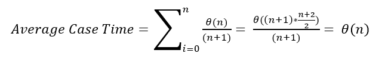
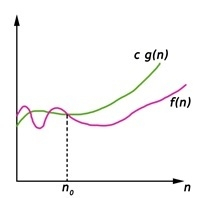
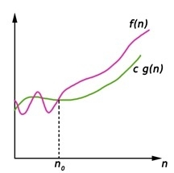
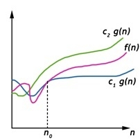
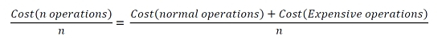

### How to measure Time and Space Complexity of an Algorithm?
   
#### Introduction

Measurement of time complexity is the process of measuring the time it takes to execute a certain algorithm and the measurement of space complexity is the process of measuring the space it takes to execute a certain algorithm or rather say the analysis of algorithms that are used to solve a problem.  

But we are going to say this part as the analysis of algorithms that are used to solve a problem.

#### Understanding Time Complexity and Space Complexity

In order to understand the time complexity and space complexity of an algorithm, we can take a situation and analyze it.    

*Q. Imagine a classroom of 100 students in which you gave your pen to one person. You have to find that pen without knowing to whom you gave it.*    

Here are some ways to find the pen and what the O order is.  

> **O(n2):** You go and ask the first person of the class, if he has the pen. Also, you ask this person about other 99 people in the classroom if they have that pen and so on, This is what we call O(n2).         
> **O(n):** Going and asking each student individually is O(N).         
> **O(log n):** Now I divide the class into two groups, then ask: “Is it on the left side, or the right side of the classroom?” Then I take that group and divide it into two and ask again, and so on. Repeat the process till you are left with one student who has your pen. This is what you mean by O(log n).       

**NOTE:** *The above O -> is called Big – Oh which is an asymptotic notation. There are other asymptotic notations like theta and Omega*.

*So we are trying to find here when the algorithm give us worst time complexity when the 'N' Number of test cases is given in our case we will take 'N Student'*

So **What is meant by Time Complexity of an Algorithm?**->  Instead of measuring actual time required in executing each statement in the code, Time Complexity considers how many times each statement executes. 

So **What is meant by Space Complexity of an Algorithm?**->  Space Complexity of an algorithm is the total space taken by the algorithm with respect to the input size.

In order to get more information about the time complexity and space complexity of an algorithm, we can take a look at the following resources: 
> [Understanding Time Complexity with Simple Examples](https://www.geeksforgeeks.org/understanding-time-complexity-simple-examples/)
> [Time Complexity and Space Complexity](https://www.geeksforgeeks.org/time-complexity-and-space-complexity/) 
> [Big–Ω (Big- Omega) Notation](https://www.geeksforgeeks.org/analysis-of-algorithms-big-%cf%89-big-omega-notation/) 
> [What does ‘Space Complexity’ mean?](https://www.geeksforgeeks.org/g-fact-86/)

#### Analysis of Algorithms | Set 1 (Asymptotic Analysis)

**Given two algorithms for a task, how do we find out which one is better?**  
> One naive way of doing this is – implement both the algorithms and run the two programs on your computer for different inputs and see which one takes less time. There are many problems with this approach for analysis of algorithms.   
> 1) It might be possible that for some inputs, first algorithm performs better than the second. And for some inputs second performs better.
> 2) It might also be possible that for some inputs, first algorithm perform better on one machine and the second works better on other machine for some other inputs.

[Asymptotic Analysis](https://www.geeksforgeeks.org/analysis-of-algorithms-set-1-asymptotic-analysis) is the big idea that handles above issues in analyzing algorithms. In Asymptotic Analysis, we evaluate the performance of an algorithm in terms of input size (we don’t measure the actual running time). We calculate, how the time (or space) taken by an algorithm increases with the input size.   

For Example: Take Two Machine **A B** and **Machine A** is Faster than **Machine B**. So, both **Machine A** & **Machine B** has a constant *A*. Let’s say the constant for *A* is *0.2* and the constant for *B* is *1000* which means that *A is 5000 times more powerful than B*. 

*Here are some running times for this example:*   
> Linear Search running time in seconds on A: 0.2 * n   
> Binary Search running time in seconds on B: 1000*log(n)   

    ------------------------------------------------
    |n      | Running time on A | Running time on B |
    -------------------------------------------------
    |10     | 2 sec             | ~ 1 h             |
    -------------------------------------------------
    |100    | 20 sec            | ~ 1.8 h           |
    -------------------------------------------------
    |10^6   | ~ 55.5 h          | ~ 5.5 h           |
    -------------------------------------------------
    |10^9   | ~ 6.3 years       | ~ 8.3 h           |
    -------------------------------------------------          

But this **not the best way to find the efficiency of an algorithm** because 
1. Asymptotic analysis considers machine constraints in case when the both the machine is same it will fails.    
2. Asymptotic analysis considers the input sizes larger than a constant value. It might be possible that those large inputs are never given to your software and an algorithm which is asymptotically slower, always performs better for your particular situation. So, you may end up choosing an algorithm that is Asymptotically slower but faster for your software.    

#### Analysis of Algorithms | Set 2 (Worst, Average and Best Cases)

We can have three cases to analyze an algorithm: 
1) The Worst Case 
2) Average Case 
3) Best Case

Lets take the following implementation of Linear Search. 
```cpp
    for (i = 0; i < n; i++) {
        if (arr[i] == x)
            return i;
    }
```

> **Worst Case Analysis (Usually Done):** In the worst-case analysis, we calculate the upper bound on the running time of an algorithm. We say that the running time of an algorithm is upper bounded by the running time of the worst case. The worst case is the case in which the algorithm takes the maximum amount of time to execute. So, the worst-case time complexity of linear search would be Θ(n) when element is not found or at the last of the array.               
> **Average Case Analysis (Sometimes done):** In average case analysis, we take all possible inputs and calculate computing time for all of the inputs. Sum all the calculated values and divide the sum by the total number of inputs. We must know (or predict) the distribution of cases. For the linear search problem, let us assume that all cases are uniformly distributed (including the case of x not being present in the array). So we sum all the cases and divide the sum by (n+1). Following is the value of average-case time complexity.         
            
> **Best Case Analysis (Bogus):** In the best case analysis, we calculate the lower bound on the running time of an algorithm, that is not helpful as it lower bound does not tell us anything about the efficiency of the algorithm.        

##### Which case to use for analysis of algorithms? 
Answer is: *Use the worst case analysis* as the worst case analysis gives us at what extent the algorithm is breaking so that we improve the efficiency of the algorithm in time of need.             

[Worst, Average and Best Cases More Brief Information](https://www.geeksforgeeks.org/analysis-of-algorithms-set-2-asymptotic-analysis)
#### Analysis of Algorithms | Set 3 (Asymptotic Notations)     

Asymptotic notations are used to represent the complexities of algorithms for asymptotic analysis. These notations are mathematical tools to represent the complexities. There are three notations that are commonly used.      

**1. Big-Oh(O) Notation:** Big-Oh (O) notation gives an upper bound for a function f(n) to within a constant factor.     
       

We write f(n) = O(g(n)), If there are positive constants n0  and c such that, to the right of n0 the f(n) always lies on or below c*g(n).   
   
    O(g(n)) = { f(n) : There exist positive constant c and n0 such that 0 ≤ f(n) ≤ c g(n), for all n ≥ n0}

**2. Big-Omega(Ω) Notation:** Big-Omega (Ω) notation gives a lower bound for a function f(n) to within a constant factor.     

     

We write f(n) = Ω(g(n)), If there are positive constantsn0  and c such that, to the right of n0 the f(n) always lies on or above c*g(n).     

    Ω(g(n)) = { f(n) : There exist positive constant c and n0 such that 0 ≤ c g(n) ≤ f(n), for all n ≥ n0}

**3. Big-Theta(Θ) Notation:** Big-Theta(Θ) notation gives bound for a function f(n) to within a constant factor.     

     

We write f(n) = Θ(g(n)), If there are positive constantsn0  and c1 and c2 such that, to the right of n0 the f(n) always lies between c1*g(n) and c2*g(n) inclusive.       

    Θ(g(n)) = {f(n) : There exist positive constant c1, c2 and n0 such that 0 ≤ c1 g(n) ≤ f(n) ≤ c2 g(n), for all n ≥ n0}   

[Asymptotic Notations More Brief Information](https://www.geeksforgeeks.org/analysis-of-algorithms-set-3asymptotic-notations)

<details>
<summary>More Resources</summary>
<ul>
<li><a href="https://www.geeksforgeeks.org/analysis-of-algorithems-little-o-and-little-omega-notations/">Little-o and Little-Omega Notations</a></li>
<li><a href="https://www.geeksforgeeks.org/lower-and-upper-bound-theory/">Lower and Upper Bound Theory</a></li>
</ul>
</details>

#### Analysis of Algorithms | Set 4 (Analysis of Loops)

- **O(1):** Time complexity of a function (or set of statements) is considered as O(1) if it *doesn’t contain loop, recursion, and call to any other non-constant time function*.             

```cpp
    void swap(int &x, int &y)
    {
        int temp = x; 
        x = y;
        y = temp;
    }
# This function has O(1) time complexity.
```            

A loop or recursion that runs a constant number of times is also considered as O(1). For example, the following loop is O(1).      

```cpp
   // Here c is a constant   
   for (int i = 1; i <= c; i++) {  
        // some O(1) expressions
   }
```

- **O(n):** Time Complexity of a loop is considered as O(n) if the loop variables are incremented/decremented by a constant amount.      

```cpp
   // Here c is a positive integer constant   
   for (int i = 1; i <= n; i += c) {  
        // some O(1) expressions
   }

   for (int i = n; i > 0; i -= c) {
        // some O(1) expressions
   }
```

- **O(n<sup>c</sup>):** Time complexity of nested loops is equal to the number of times the innermost statement is executed. For example, the following sample loops have O(n<sup>2</sup>) time complexity     

```cpp
   for (int i = 1; i <=n; i += c) {
       for (int j = 1; j <=n; j += c) {
          // some O(1) expressions
       }
   }

   for (int i = n; i > 0; i -= c) {
       for (int j = i+1; j <=n; j += c) {
          // some O(1) expressions
   }
```

- **O(Logn):** Time Complexity of a loop is considered as O(Logn) if the loop variables are divided/multiplied by a constant amount. And also for recursive call in recursive function the Time Complexity is considered as O(Logn).   

```cpp
   for (int i = 1; i <=n; i *= c) {
       // some O(1) expressions
   }
   for (int i = n; i > 0; i /= c) {
       // some O(1) expressions
   }

    //Recursive function
    void recurse(n)
    {
        if(n==0)
            return;
        else{
            // some O(1) expressions
        }
        recurse(n-1);
    }
```

For example,
```cpp
int mid = low + (high – low)/2; // mid is the middle index
i.e divide & conquer binary search
```
has O(Log n) time complexity. Let us see mathematically how it is O(Log n). The series that we get in the first loop is $1$, $c$, $c^2$, $c^3$, … $c^k$. If we put k equals to $log{_c}{n}$, we get c<sup>$log{_c}{n}$</sup> which is n.

- **O(LogLogn):** Time Complexity of a loop is considered as O(LogLogn) if the loop variables are reduced/increased exponentially by a constant amount.    

```cpp
   // Here c is a constant greater than 1   
   for (int i = 2; i <=n; i = pow(i, c)) { 
       // some O(1) expressions
   }
   //Here fun is sqrt or cuberoot or any other constant root
   for (int i = n; i > 1; i = fun(i)) { 
       // some O(1) expressions
   }
```
For Mathmetical Details of Logarithmic Time Complexity, See [Exponentially Algorithm-Expand and Shrinks](https://www.geeksforgeeks.org/time-complexity-loop-loop-variable-expands-shrinks-exponentially/).

<details>
<summary>More Resources</summary>
<ul>
<li><a href="https://www.geeksforgeeks.org/analysis-of-algorithms-set-4-analysis-of-loops">Analysis of Loops</a></li>
</ul>
</details>

#### Analysis of Algorithm | Set 4 (Solving Recurrences)

Many algorithms are recursive in nature. When we analyze them, we get a recurrence relation for time complexity. There are mainly three ways for solving recurrences.      

- **Substitution Method:**  We make a guess for the solution and then we use mathematical induction to prove the guess is correct or incorrect.    

```cpp
    For example consider the recurrence T(n) = 2T(n/2) + n

    We guess the solution as T(n) = O(nLogn). Now we use induction
    to prove our guess.

    We need to prove that T(n) <= cnLogn. We can assume that it is true
    for values smaller than n.

    T(n) = 2T(n/2) + n
        <= 2cn/2Log(n/2) + n
        =  cnLogn - cnLog2 + n
        =  cnLogn - cn + n
        <= cnLogn
```

[Substitution Method Brief Details](https://www.javatpoint.com/daa-recurrence-relation)

- **Recurrence Tree Method:** In this method, we draw a recurrence tree and calculate the time taken by every level of tree. Finally, we sum the work done at all levels. To draw the recurrence tree, we start from the given recurrence and keep drawing till we find a pattern among levels. The pattern is typically a arithmetic or geometric series.    

```cpp
    For example consider the recurrence relation 
    T(n) = T(n/4) + T(n/2) + cn2

            cn2
            /      \
        T(n/4)     T(n/2)

    If we further break down the expression T(n/4) and T(n/2), 
    we get following recursion tree.

                    cn2
            /           \      
        c(n2)/16      c(n2)/4
        /      \          /     \
    T(n/16)     T(n/8)  T(n/8)    T(n/4) 
    Breaking down further gives us following
                    cn2
                /            \      
        c(n2)/16          c(n2)/4
        /      \            /      \
    c(n2)/256   c(n2)/64  c(n2)/64    c(n2)/16
    /    \      /    \    /    \       /    \  

    To know the value of T(n), we need to calculate sum of tree 
    nodes level by level. If we sum the above tree level by level, 
    we get the following series
    T(n)  = c(n^2 + 5(n^2)/16 + 25(n^2)/256) + ....
    The above series is geometrical progression with ratio 5/16.

    To get an upper bound, we can sum the infinite series. 
    We get the sum as (n2)/(1 - 5/16) which is O(n2)
```

[Recurrence Tree Method Brief Details](https://www.javatpoint.com/daa-recursion-tree-method)

- **Master Method:** Master Method is a direct way to get the solution. The master method works only for following type of recurrences or for recurrences that can be transformed to following type.   

        T(n) = aT(n/b) + f(n) where a >= 1 and b > 1

There are following three cases: 
1. If f(n) = O(n<sup>c</sup>) where c < $Log{_b}{a}$ then T(n) = Θ(n<sup>$Log{_b}{a}$</sup>) 
2. If f(n) = Θ(n<sup>c</sup>) where c = $Log{_b}{a}$ then T(n) = Θ(n<sup>c</sup>Log n) 
3. If f(n) = Ω(n<sup>c</sup>) where c > $Log{_b}{a}$ then T(n) = Θ(f(n))

**How does this work?**      

Master method is mainly derived from recurrence tree method. If we draw recurrence tree of T(n) = aT(n/b) + f(n), we can see that the work done at root is f(n) and work done at all leaves is Θ(n<sup>c</sup>) where c is $Log{_b}{a}$. And the height of recurrence tree is $Log{_b}{n}$    

          

In recurrence tree method, we calculate total work done. If the work done at leaves is polynomially more, then leaves are the dominant part, and our result becomes the work done at leaves (Case 1). If work done at leaves and root is asymptotically same, then our result becomes height multiplied by work done at any level (Case 2). If work done at root is asymptotically more, then our result becomes work done at root (Case 3).       

[Master Method Brief Details](https://www.javatpoint.com/daa-master-method)

<details>
<summary>More Resources</summary>
<ul>
<li><a href="https://www.geeksforgeeks.org/analysis-algorithm-set-4-master-method-solving-recurrences">Solving Recurrences</a></li>
<li><a href="https://www.javatpoint.com/daa-asymptotic-analysis-of-algorithms">DAA Documentation by Javatpoint</a></li>
</ul>
</details>

#### Analysis of Algorithm | Set 5 (Amortized Analysis Introduction)

*Amortized Analysis* is used when the occasional operation is very slow, but most of the operations which are executing very frequently are faster. Data structures we need amortized analysis for Hash Tables, Disjoint Sets etc.

In the Hash-table, the most of the time the searching time complexity is O(1), but sometimes it executes O(n) operations. When we want to search or insert an element in a hash table for most of the cases it is constant time taking the task, but when a collision occurs, it needs O(n) times operations for collision resolution.

**Aggregate Method**

The aggregate method is used to find the total cost. If we want to add a bunch of data, then we need to find the amortized cost by this formula.    

For a sequence of n operations, the cost is −     


[For More Practical Big-O Implementation By Bealdung](https://www.baeldung.com/java-algorithm-complexity)

<details>
<summary>More Resources and Brief Details</summary>
<ul>
<li><a href="https://www.geeksforgeeks.org/analysis-algorithm-set-5-amortized-analysis-introduction">Amortized Analysis Introduction GFG</a></li>
<li><a href="https://www.tutorialspoint.com/Amortized-Analysis">Amortized Analysis Tutorial Points</a></li>
</ul>
</details>

#### Credits

> **Source:** *GeeksforGeeks*           
> [https://www.geeksforgeeks.org/understanding-time-complexity-simple-examples/](https://www.geeksforgeeks.org/understanding-time-complexity-simple-examples/)        
> [https://www.geeksforgeeks.org/analysis-of-algorithms-set-1-asymptotic-analysis/](https://www.geeksforgeeks.org/analysis-of-algorithms-set-1-asymptotic-analysis/)       