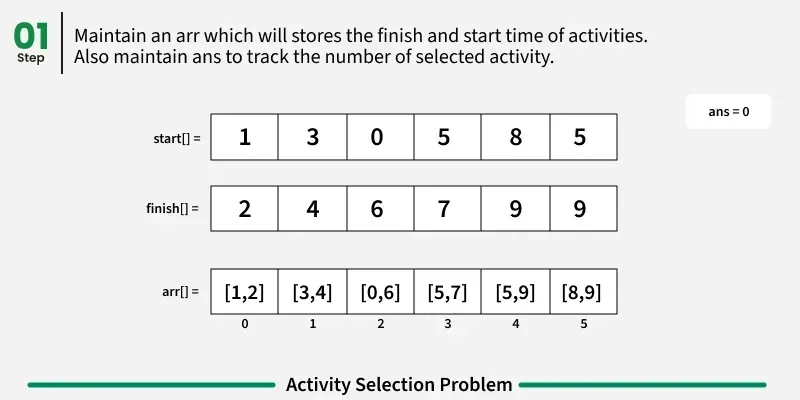
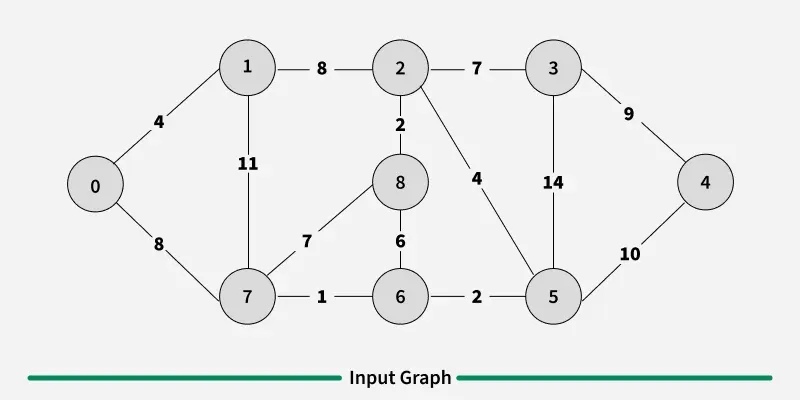

### Greedy Algorithm

A **Greedy Algorithm** is an algorithmic paradigm that builds up a solution piece by piece, always choosing the next piece that offers the most obvious and immediate benefit. It makes locally optimal choices at each stage with the hope of finding a global optimum.

**Key Properties:**
- Makes the best choice at each step (locally optimal)
- Never reconsider previous choices
- Greedy choice property: A global optimum can be arrived at by selecting a local optimum
- Optimal substructure: An optimal solution contains optimal solutions to subproblems

**When to Use Greedy:**
- Optimization problems
- Problems where local optimal leads to global optimal
- Problems with greedy choice property

### Greedy Algorithm Strategy

1. **Greedy Choice:** Make the best choice at the current moment
2. **Optimal Substructure:** Problem can be broken into subproblems
3. **No Backtracking:** Once a choice is made, it's never reconsidered

### Basic Greedy Algorithm Template

```cpp
#include <iostream>
#include <vector>
#include <algorithm>
using namespace std;

// Greedy algorithm template
vector<int> greedyAlgorithm(vector<int>& items) {
    // Step 1: Sort items based on greedy criteria
    sort(items.begin(), items.end(), [](int a, int b) {
        // Define greedy criteria (e.g., ratio, value, etc.)
        return a > b; // Example: descending order
    });
    
    vector<int> solution;
    
    // Step 2: Make greedy choices
    for (int item : items) {
        if (isValid(item, solution)) {
            solution.push_back(item);
        }
    }
    
    return solution;
}

bool isValid(int item, vector<int>& solution) {
    // Check if adding item maintains constraints
    return true; // Example
}
```

### Common Greedy Algorithm Problems

#### 1. Activity Selection Problem

Select maximum number of activities that can be performed by a single person, assuming one activity at a time.



> **Image Credit:** [GeeksforGeeks - Activity Selection Problem](https://www.geeksforgeeks.org/activity-selection-problem-greedy-algo-1/)

```cpp
#include <iostream>
#include <vector>
#include <algorithm>
using namespace std;

struct Activity {
    int start;
    int finish;
    
    Activity(int s, int f) : start(s), finish(f) {}
};

bool compare(Activity a, Activity b) {
    return a.finish < b.finish; // Sort by finish time
}

vector<Activity> activitySelection(vector<Activity>& activities) {
    // Sort activities by finish time
    sort(activities.begin(), activities.end(), compare);
    
    vector<Activity> selected;
    selected.push_back(activities[0]);
    
    int lastFinish = activities[0].finish;
    
    for (int i = 1; i < activities.size(); i++) {
        // If current activity starts after last selected finishes
        if (activities[i].start >= lastFinish) {
            selected.push_back(activities[i]);
            lastFinish = activities[i].finish;
        }
    }
    
    return selected;
}

int main() {
    vector<Activity> activities = {
        Activity(1, 2), Activity(3, 4), Activity(0, 6),
        Activity(5, 7), Activity(8, 9), Activity(5, 9)
    };
    
    vector<Activity> result = activitySelection(activities);
    
    cout << "Selected activities: " << result.size() << endl;
    for (auto& act : result) {
        cout << "(" << act.start << ", " << act.finish << ") ";
    }
    cout << endl;
    
    return 0;
}
```

**Time Complexity:** O(n log n) for sorting + O(n) for selection = O(n log n)

#### 2. Fractional Knapsack Problem

Maximize value in knapsack by taking fractions of items.

```cpp
#include <iostream>
#include <vector>
#include <algorithm>
using namespace std;

struct Item {
    int value;
    int weight;
    double ratio; // value/weight
    
    Item(int v, int w) : value(v), weight(w) {
        ratio = (double)v / w;
    }
};

bool compare(Item a, Item b) {
    return a.ratio > b.ratio; // Sort by value/weight ratio (descending)
}

double fractionalKnapsack(vector<Item>& items, int capacity) {
    // Sort items by value/weight ratio (greedy: take items with best ratio first)
    sort(items.begin(), items.end(), compare);
    
    double totalValue = 0.0;
    int remainingCapacity = capacity;
    
    for (Item& item : items) {
        if (remainingCapacity >= item.weight) {
            // Take whole item
            totalValue += item.value;
            remainingCapacity -= item.weight;
        }
        else {
            // Take fraction of item
            double fraction = (double)remainingCapacity / item.weight;
            totalValue += item.value * fraction;
            break;
        }
    }
    
    return totalValue;
}

int main() {
    vector<Item> items = {
        Item(60, 10),  // value=60, weight=10, ratio=6.0
        Item(100, 20), // value=100, weight=20, ratio=5.0
        Item(120, 30)  // value=120, weight=30, ratio=4.0
    };
    
    int capacity = 50;
    double maxValue = fractionalKnapsack(items, capacity);
    
    cout << "Maximum value: " << maxValue << endl;
    
    return 0;
}
```

**Time Complexity:** O(n log n) for sorting

#### 3. Minimum Spanning Tree (Kruskal's Algorithm)

Find minimum cost spanning tree using greedy approach.



> **Image Credit:** [GeeksforGeeks - Kruskal's Minimum Spanning Tree Algorithm](https://www.geeksforgeeks.org/kruskals-minimum-spanning-tree-algorithm-greedy-algo-2/)

```cpp
#include <iostream>
#include <vector>
#include <algorithm>
using namespace std;

struct Edge {
    int src, dest, weight;
    
    Edge(int s, int d, int w) : src(s), dest(d), weight(w) {}
};

bool compare(Edge a, Edge b) {
    return a.weight < b.weight; // Sort by weight (greedy: take smallest edges first)
}

class UnionFind {
private:
    vector<int> parent, rank;
    
public:
    UnionFind(int n) {
        parent.resize(n);
        rank.resize(n, 0);
        for (int i = 0; i < n; i++) {
            parent[i] = i;
        }
    }
    
    int find(int x) {
        if (parent[x] != x) {
            parent[x] = find(parent[x]); // Path compression
        }
        return parent[x];
    }
    
    bool unite(int x, int y) {
        int rootX = find(x);
        int rootY = find(y);
        
        if (rootX == rootY) return false; // Already connected
        
        // Union by rank
        if (rank[rootX] < rank[rootY]) {
            parent[rootX] = rootY;
        }
        else if (rank[rootX] > rank[rootY]) {
            parent[rootY] = rootX;
        }
        else {
            parent[rootY] = rootX;
            rank[rootX]++;
        }
        return true;
    }
};

vector<Edge> kruskalMST(vector<Edge>& edges, int V) {
    // Sort edges by weight (greedy: take smallest edges first)
    sort(edges.begin(), edges.end(), compare);
    
    UnionFind uf(V);
    vector<Edge> mst;
    
    for (Edge& edge : edges) {
        // If adding edge doesn't form cycle, add it to MST
        if (uf.unite(edge.src, edge.dest)) {
            mst.push_back(edge);
            if (mst.size() == V - 1) break; // MST has V-1 edges
        }
    }
    
    return mst;
}

int main() {
    int V = 4;
    vector<Edge> edges = {
        Edge(0, 1, 10), Edge(0, 2, 6),
        Edge(0, 3, 5), Edge(1, 3, 15),
        Edge(2, 3, 4)
    };
    
    vector<Edge> mst = kruskalMST(edges, V);
    
    int totalWeight = 0;
    cout << "MST Edges:" << endl;
    for (Edge& e : mst) {
        cout << e.src << " - " << e.dest << " : " << e.weight << endl;
        totalWeight += e.weight;
    }
    cout << "Total weight: " << totalWeight << endl;
    
    return 0;
}
```

**Time Complexity:** O(E log E) where E is number of edges

#### 4. Huffman Coding

Build optimal prefix code using greedy approach.

```cpp
#include <iostream>
#include <queue>
#include <unordered_map>
#include <string>
using namespace std;

struct Node {
    char ch;
    int freq;
    Node* left;
    Node* right;
    
    Node(char c, int f) : ch(c), freq(f), left(nullptr), right(nullptr) {}
    Node(int f, Node* l, Node* r) : ch('\0'), freq(f), left(l), right(r) {}
};

struct Compare {
    bool operator()(Node* a, Node* b) {
        return a->freq > b->freq; // Min heap: smaller frequency first
    }
};

void generateCodes(Node* root, string code, unordered_map<char, string>& codes) {
    if (root == nullptr) return;
    
    if (root->ch != '\0') {
        codes[root->ch] = code;
        return;
    }
    
    generateCodes(root->left, code + "0", codes);
    generateCodes(root->right, code + "1", codes);
}

unordered_map<char, string> huffmanCoding(string text) {
    // Count frequency of each character
    unordered_map<char, int> freq;
    for (char c : text) {
        freq[c]++;
    }
    
    // Create min heap (priority queue)
    priority_queue<Node*, vector<Node*>, Compare> pq;
    
    for (auto& pair : freq) {
        pq.push(new Node(pair.first, pair.second));
    }
    
    // Build Huffman tree (greedy: merge two nodes with smallest frequency)
    while (pq.size() > 1) {
        Node* left = pq.top(); pq.pop();
        Node* right = pq.top(); pq.pop();
        
        Node* merged = new Node(left->freq + right->freq, left, right);
        pq.push(merged);
    }
    
    Node* root = pq.top();
    
    // Generate codes
    unordered_map<char, string> codes;
    generateCodes(root, "", codes);
    
    return codes;
}

int main() {
    string text = "hello world";
    unordered_map<char, string> codes = huffmanCoding(text);
    
    cout << "Huffman Codes:" << endl;
    for (auto& pair : codes) {
        cout << pair.first << " : " << pair.second << endl;
    }
    
    return 0;
}
```

**Time Complexity:** O(n log n) where n is number of unique characters

#### 5. Job Sequencing Problem

Maximize profit by scheduling jobs with deadlines.

```cpp
#include <iostream>
#include <vector>
#include <algorithm>
using namespace std;

struct Job {
    int id;
    int deadline;
    int profit;
    
    Job(int i, int d, int p) : id(i), deadline(d), profit(p) {}
};

bool compare(Job a, Job b) {
    return a.profit > b.profit; // Sort by profit (descending)
}

vector<int> jobSequencing(vector<Job>& jobs) {
    // Sort jobs by profit (greedy: take highest profit jobs first)
    sort(jobs.begin(), jobs.end(), compare);
    
    int maxDeadline = 0;
    for (Job& job : jobs) {
        maxDeadline = max(maxDeadline, job.deadline);
    }
    
    vector<int> schedule(maxDeadline + 1, -1); // -1 means slot is empty
    vector<int> selectedJobs;
    int totalProfit = 0;
    
    for (Job& job : jobs) {
        // Find latest available slot before deadline
        for (int j = job.deadline; j > 0; j--) {
            if (schedule[j] == -1) {
                schedule[j] = job.id;
                selectedJobs.push_back(job.id);
                totalProfit += job.profit;
                break;
            }
        }
    }
    
    cout << "Total profit: " << totalProfit << endl;
    return selectedJobs;
}

int main() {
    vector<Job> jobs = {
        Job(1, 4, 20), Job(2, 1, 10),
        Job(3, 1, 40), Job(4, 1, 30)
    };
    
    vector<int> result = jobSequencing(jobs);
    
    cout << "Selected jobs: ";
    for (int id : result) {
        cout << id << " ";
    }
    cout << endl;
    
    return 0;
}
```

**Time Complexity:** O(n²) where n is number of jobs

### Greedy Algorithm Patterns

#### Pattern 1: Interval Scheduling
- Activity Selection
- Meeting Rooms
- Non-overlapping Intervals

#### Pattern 2: Greedy Choice Based on Ratio
- Fractional Knapsack
- Minimum Cost to Cut a Stick

#### Pattern 3: Minimum Spanning Tree
- Kruskal's Algorithm
- Prim's Algorithm

#### Pattern 4: Shortest Path
- Dijkstra's Algorithm
- Bellman-Ford (with modifications)

#### Pattern 5: Scheduling Problems
- Job Sequencing
- Task Scheduler

### Advantages of Greedy Algorithms

1. **Simple and intuitive** - Easy to understand and implement
2. **Efficient** - Often have better time complexity than other approaches
3. **No backtracking** - Once a choice is made, it's final
4. **Memory efficient** - Don't need to store all possible solutions

### Disadvantages of Greedy Algorithms

1. **Not always optimal** - May not find global optimum
2. **Hard to prove correctness** - Need to prove greedy choice property
3. **Limited applicability** - Only works for specific problem types
4. **No guarantee** - May produce suboptimal solutions

### When to Use Greedy?

✅ **Use Greedy when:**
- Problem has greedy choice property
- Optimal substructure exists
- Local optimal leads to global optimal
- Need fast solution (even if not always optimal)

❌ **Don't use Greedy when:**
- Need guaranteed optimal solution
- Problem doesn't have greedy choice property
- Need to reconsider previous choices

### Time Complexity

| Problem | Time Complexity |
|---------|----------------|
| Activity Selection | O(n log n) |
| Fractional Knapsack | O(n log n) |
| Kruskal's MST | O(E log E) |
| Huffman Coding | O(n log n) |
| Job Sequencing | O(n²) |

### Space Complexity

- **Space Complexity:** O(n) for storing items/solutions
- **Auxiliary Space:** O(1) to O(n) depending on problem

### Applications of Greedy Algorithms

1. **Network Design:** Minimum spanning trees, shortest paths
2. **Data Compression:** Huffman coding
3. **Scheduling:** Activity selection, job sequencing
4. **Resource Allocation:** Fractional knapsack
5. **Graph Algorithms:** MST, shortest path
6. **Approximation Algorithms:** When exact solution is too expensive

### References

- [GeeksforGeeks - Greedy Algorithms](https://www.geeksforgeeks.org/greedy-algorithms/)
- [GeeksforGeeks - Activity Selection Problem](https://www.geeksforgeeks.org/activity-selection-problem-greedy-algo-1/)
- [GeeksforGeeks - Fractional Knapsack](https://www.geeksforgeeks.org/fractional-knapsack-problem/)
- [GeeksforGeeks - Kruskal's Algorithm](https://www.geeksforgeeks.org/kruskals-minimum-spanning-tree-algorithm-greedy-algo-2/)
