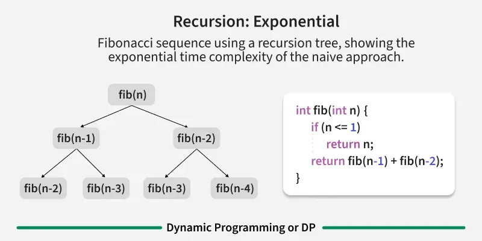
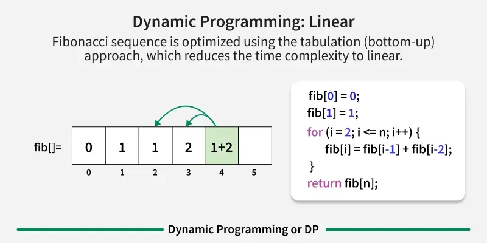

### Dynamic Programming

**Dynamic Programming (DP)** is an algorithmic technique for solving optimization problems by breaking them down into simpler subproblems and storing the results to avoid redundant calculations. It's based on the principle of optimal substructure and overlapping subproblems.





> **Image Credit:** [GeeksforGeeks - Dynamic Programming](https://www.geeksforgeeks.org/dynamic-programming/)

**Key Properties:**
- **Optimal Substructure:** Optimal solution contains optimal solutions to subproblems
- **Overlapping Subproblems:** Same subproblems are solved multiple times
- **Memoization:** Store results of subproblems to avoid recomputation
- **Tabulation:** Build solution bottom-up using table

**When to Use DP:**
- Optimization problems
- Problems with overlapping subproblems
- Problems with optimal substructure
- Counting/optimization problems

### DP Approaches

#### 1. Memoization (Top-Down)
Recursive approach with caching.

```cpp
#include <iostream>
#include <vector>
#include <climits>
using namespace std;

// Example: Fibonacci with memoization
int fibMemo(int n, vector<int>& memo) {
    if (n <= 1) return n;
    
    if (memo[n] != -1) {
        return memo[n];
    }
    
    memo[n] = fibMemo(n - 1, memo) + fibMemo(n - 2, memo);
    return memo[n];
}

int fibonacci(int n) {
    vector<int> memo(n + 1, -1);
    return fibMemo(n, memo);
}
```

#### 2. Tabulation (Bottom-Up)
Iterative approach building table.

```cpp
int fibonacci(int n) {
    if (n <= 1) return n;
    
    vector<int> dp(n + 1);
    dp[0] = 0;
    dp[1] = 1;
    
    for (int i = 2; i <= n; i++) {
        dp[i] = dp[i - 1] + dp[i - 2];
    }
    
    return dp[n];
}
```

**Time Complexity:** O(n)  
**Space Complexity:** O(n) - can be optimized to O(1)

### DP Patterns (Striver's A2Z Style)

#### Pattern 1: 1D DP

##### 1. Climbing Stairs
Count ways to reach nth stair (can take 1 or 2 steps).

```cpp
int climbStairs(int n) {
    if (n <= 2) return n;
    
    vector<int> dp(n + 1);
    dp[1] = 1;
    dp[2] = 2;
    
    for (int i = 3; i <= n; i++) {
        dp[i] = dp[i - 1] + dp[i - 2];
    }
    
    return dp[n];
}

// Space optimized
int climbStairs(int n) {
    if (n <= 2) return n;
    
    int prev2 = 1, prev1 = 2;
    for (int i = 3; i <= n; i++) {
        int curr = prev1 + prev2;
        prev2 = prev1;
        prev1 = curr;
    }
    return prev1;
}
```

##### 2. House Robber
Maximize money without robbing adjacent houses.

```cpp
int rob(vector<int>& nums) {
    int n = nums.size();
    if (n == 0) return 0;
    if (n == 1) return nums[0];
    
    vector<int> dp(n);
    dp[0] = nums[0];
    dp[1] = max(nums[0], nums[1]);
    
    for (int i = 2; i < n; i++) {
        dp[i] = max(dp[i - 1], dp[i - 2] + nums[i]);
    }
    
    return dp[n - 1];
}
```

##### 3. Coin Change (Count Ways)
Count ways to make amount using coins.

```cpp
int coinChange(vector<int>& coins, int amount) {
    vector<int> dp(amount + 1, 0);
    dp[0] = 1; // One way to make 0
    
    for (int coin : coins) {
        for (int i = coin; i <= amount; i++) {
            dp[i] += dp[i - coin];
        }
    }
    
    return dp[amount];
}
```

##### 4. Coin Change (Minimum Coins)
Minimum coins to make amount.

```cpp
int coinChange(vector<int>& coins, int amount) {
    vector<int> dp(amount + 1, amount + 1);
    dp[0] = 0;
    
    for (int i = 1; i <= amount; i++) {
        for (int coin : coins) {
            if (coin <= i) {
                dp[i] = min(dp[i], dp[i - coin] + 1);
            }
        }
    }
    
    return dp[amount] > amount ? -1 : dp[amount];
}
```

#### Pattern 2: 2D DP

##### 1. Unique Paths
Count paths from top-left to bottom-right (can move right/down).

```cpp
int uniquePaths(int m, int n) {
    vector<vector<int>> dp(m, vector<int>(n, 1));
    
    for (int i = 1; i < m; i++) {
        for (int j = 1; j < n; j++) {
            dp[i][j] = dp[i - 1][j] + dp[i][j - 1];
        }
    }
    
    return dp[m - 1][n - 1];
}
```

##### 2. Minimum Path Sum
Find minimum sum path from top-left to bottom-right.

```cpp
int minPathSum(vector<vector<int>>& grid) {
    int m = grid.size();
    int n = grid[0].size();
    
    vector<vector<int>> dp(m, vector<int>(n));
    dp[0][0] = grid[0][0];
    
    // First row
    for (int j = 1; j < n; j++) {
        dp[0][j] = dp[0][j - 1] + grid[0][j];
    }
    
    // First column
    for (int i = 1; i < m; i++) {
        dp[i][0] = dp[i - 1][0] + grid[i][0];
    }
    
    // Fill rest
    for (int i = 1; i < m; i++) {
        for (int j = 1; j < n; j++) {
            dp[i][j] = min(dp[i - 1][j], dp[i][j - 1]) + grid[i][j];
        }
    }
    
    return dp[m - 1][n - 1];
}
```

##### 3. Longest Common Subsequence (LCS)

```cpp
int longestCommonSubsequence(string text1, string text2) {
    int m = text1.length();
    int n = text2.length();
    
    vector<vector<int>> dp(m + 1, vector<int>(n + 1, 0));
    
    for (int i = 1; i <= m; i++) {
        for (int j = 1; j <= n; j++) {
            if (text1[i - 1] == text2[j - 1]) {
                dp[i][j] = dp[i - 1][j - 1] + 1;
            }
            else {
                dp[i][j] = max(dp[i - 1][j], dp[i][j - 1]);
            }
        }
    }
    
    return dp[m][n];
}
```

**Time Complexity:** O(m × n)  
**Space Complexity:** O(m × n) - can be optimized to O(min(m, n))

##### 4. Edit Distance
Minimum operations to convert string1 to string2.

```cpp
int minDistance(string word1, string word2) {
    int m = word1.length();
    int n = word2.length();
    
    vector<vector<int>> dp(m + 1, vector<int>(n + 1));
    
    // Base cases
    for (int i = 0; i <= m; i++) dp[i][0] = i;
    for (int j = 0; j <= n; j++) dp[0][j] = j;
    
    for (int i = 1; i <= m; i++) {
        for (int j = 1; j <= n; j++) {
            if (word1[i - 1] == word2[j - 1]) {
                dp[i][j] = dp[i - 1][j - 1];
            }
            else {
                dp[i][j] = 1 + min({
                    dp[i - 1][j],     // Delete
                    dp[i][j - 1],     // Insert
                    dp[i - 1][j - 1]  // Replace
                });
            }
        }
    }
    
    return dp[m][n];
}
```

#### Pattern 3: DP on Strings

##### 1. Longest Palindromic Subsequence

```cpp
int longestPalindromeSubseq(string s) {
    int n = s.length();
    vector<vector<int>> dp(n, vector<int>(n, 0));
    
    // Every single character is palindrome
    for (int i = 0; i < n; i++) {
        dp[i][i] = 1;
    }
    
    for (int len = 2; len <= n; len++) {
        for (int i = 0; i <= n - len; i++) {
            int j = i + len - 1;
            
            if (s[i] == s[j]) {
                dp[i][j] = 2 + dp[i + 1][j - 1];
            }
            else {
                dp[i][j] = max(dp[i + 1][j], dp[i][j - 1]);
            }
        }
    }
    
    return dp[0][n - 1];
}
```

##### 2. Longest Palindromic Substring

```cpp
string longestPalindrome(string s) {
    int n = s.length();
    vector<vector<bool>> dp(n, vector<bool>(n, false));
    
    int start = 0, maxLen = 1;
    
    // Single character palindromes
    for (int i = 0; i < n; i++) {
        dp[i][i] = true;
    }
    
    // Two character palindromes
    for (int i = 0; i < n - 1; i++) {
        if (s[i] == s[i + 1]) {
            dp[i][i + 1] = true;
            start = i;
            maxLen = 2;
        }
    }
    
    // Palindromes of length 3 and more
    for (int len = 3; len <= n; len++) {
        for (int i = 0; i <= n - len; i++) {
            int j = i + len - 1;
            
            if (s[i] == s[j] && dp[i + 1][j - 1]) {
                dp[i][j] = true;
                start = i;
                maxLen = len;
            }
        }
    }
    
    return s.substr(start, maxLen);
}
```

#### Pattern 4: DP on Stocks

##### 1. Best Time to Buy and Sell Stock (One Transaction)

```cpp
int maxProfit(vector<int>& prices) {
    int minPrice = INT_MAX;
    int maxProfit = 0;
    
    for (int price : prices) {
        minPrice = min(minPrice, price);
        maxProfit = max(maxProfit, price - minPrice);
    }
    
    return maxProfit;
}
```

##### 2. Best Time to Buy and Sell Stock (Multiple Transactions)

```cpp
int maxProfit(vector<int>& prices) {
    int profit = 0;
    
    for (int i = 1; i < prices.size(); i++) {
        if (prices[i] > prices[i - 1]) {
            profit += prices[i] - prices[i - 1];
        }
    }
    
    return profit;
}
```

##### 3. Best Time to Buy and Sell Stock (At Most K Transactions)

```cpp
int maxProfit(int k, vector<int>& prices) {
    int n = prices.size();
    if (n == 0) return 0;
    
    if (k >= n / 2) {
        // Can make unlimited transactions
        int profit = 0;
        for (int i = 1; i < n; i++) {
            if (prices[i] > prices[i - 1]) {
                profit += prices[i] - prices[i - 1];
            }
        }
        return profit;
    }
    
    vector<vector<int>> dp(k + 1, vector<int>(n));
    
    for (int i = 1; i <= k; i++) {
        int maxDiff = -prices[0];
        for (int j = 1; j < n; j++) {
            dp[i][j] = max(dp[i][j - 1], prices[j] + maxDiff);
            maxDiff = max(maxDiff, dp[i - 1][j] - prices[j]);
        }
    }
    
    return dp[k][n - 1];
}
```

#### Pattern 5: DP on Subsequences/Subsets

##### 1. Subset Sum Problem

```cpp
bool subsetSum(vector<int>& nums, int target) {
    int n = nums.size();
    vector<vector<bool>> dp(n + 1, vector<bool>(target + 1, false));
    
    // Sum 0 is always possible
    for (int i = 0; i <= n; i++) {
        dp[i][0] = true;
    }
    
    for (int i = 1; i <= n; i++) {
        for (int j = 1; j <= target; j++) {
            if (nums[i - 1] > j) {
                dp[i][j] = dp[i - 1][j];
            }
            else {
                dp[i][j] = dp[i - 1][j] || dp[i - 1][j - nums[i - 1]];
            }
        }
    }
    
    return dp[n][target];
}
```

##### 2. Partition Equal Subset Sum

```cpp
bool canPartition(vector<int>& nums) {
    int sum = 0;
    for (int num : nums) sum += num;
    
    if (sum % 2 != 0) return false;
    
    int target = sum / 2;
    return subsetSum(nums, target);
}
```

#### Pattern 6: DP on Trees

##### Maximum Path Sum in Binary Tree

```cpp
struct TreeNode {
    int val;
    TreeNode* left;
    TreeNode* right;
    TreeNode(int x) : val(x), left(nullptr), right(nullptr) {}
};

int maxPathSum(TreeNode* root) {
    int maxSum = INT_MIN;
    
    function<int(TreeNode*)> dfs = [&](TreeNode* node) -> int {
        if (!node) return 0;
        
        int left = max(0, dfs(node->left));
        int right = max(0, dfs(node->right));
        
        maxSum = max(maxSum, node->val + left + right);
        
        return node->val + max(left, right);
    };
    
    dfs(root);
    return maxSum;
}
```

### DP Optimization Techniques

#### 1. Space Optimization
Reduce space from O(n²) to O(n) or O(1).

```cpp
// Before: O(n²) space
vector<vector<int>> dp(n, vector<int>(m));

// After: O(n) space (if only previous row needed)
vector<int> prev(m), curr(m);
```

#### 2. State Reduction
Reduce number of states.

#### 3. Sliding Window
For problems where only recent states matter.

### Common DP Problems (Striver's A2Z - 56 Problems)

#### Easy:
1. Fibonacci
2. Climbing Stairs
3. House Robber
4. Coin Change
5. Unique Paths

#### Medium:
6. Longest Common Subsequence
7. Edit Distance
8. Longest Palindromic Subsequence
9. Best Time to Buy/Sell Stock
10. Subset Sum
11. Partition Equal Subset Sum
12. Word Break
13. Combination Sum
14. Decode Ways
15. Unique Paths II

#### Hard:
16. Regular Expression Matching
17. Wildcard Matching
18. Burst Balloons
19. Palindrome Partitioning
20. Scramble String

### Time Complexity

| Problem Type | Time Complexity |
|--------------|----------------|
| 1D DP | O(n) |
| 2D DP | O(n × m) |
| DP on Strings | O(n²) |
| DP on Trees | O(n) |

### Space Complexity

- **Space Complexity:** O(n) to O(n²) depending on problem
- **Can often be optimized** to O(1) or O(n)

### Advantages of DP

1. **Avoids redundant calculations** - Memoization saves time
2. **Optimal solutions** - Guarantees optimal answer
3. **Systematic approach** - Clear pattern to follow
4. **Wide applicability** - Many problems can use DP

### Disadvantages of DP

1. **Space overhead** - May require significant memory
2. **Hard to identify** - Not always obvious when to use
3. **State definition** - Choosing right state is crucial
4. **Complexity** - Can be complex for some problems

### When to Use DP?

✅ **Use DP when:**
- Problem has overlapping subproblems
- Problem has optimal substructure
- Need optimal solution
- Counting/optimization problems

❌ **Don't use DP when:**
- Simple greedy solution exists
- No overlapping subproblems
- Space is very limited

### References

- [GeeksforGeeks - Dynamic Programming](https://www.geeksforgeeks.org/dynamic-programming/)
- [GeeksforGeeks - DP Patterns](https://www.geeksforgeeks.org/dynamic-programming-patterns/)
