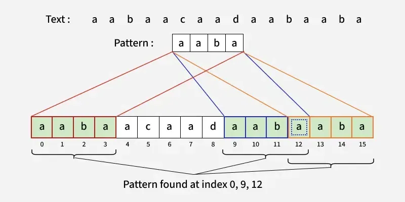

# Pattern Searching

**Pattern Searching** algorithms are used to find occurrences of a pattern (substring) within a text (string). These algorithms are fundamental in text processing, search engines, and bioinformatics.

**Key Concepts:**
- **Text:** The string in which we search
- **Pattern:** The substring we're looking for
- **Match:** Occurrence of pattern in text

### Basic Pattern Searching Algorithms

#### 1. Naive Pattern Searching

Check all positions in text for pattern match.

```cpp
#include <iostream>
#include <string>
#include <vector>
using namespace std;

vector<int> naiveSearch(string text, string pattern) {
    vector<int> result;
    int n = text.length();
    int m = pattern.length();
    
    for (int i = 0; i <= n - m; i++) {
        int j;
        for (j = 0; j < m; j++) {
            if (text[i + j] != pattern[j]) {
                break;
            }
        }
        if (j == m) {
            result.push_back(i); // Pattern found at index i
        }
    }
    
    return result;
}

int main() {
    string text = "AABAACAADAABAABA";
    string pattern = "AABA";
    
    vector<int> indices = naiveSearch(text, pattern);
    
    cout << "Pattern found at indices: ";
    for (int idx : indices) {
        cout << idx << " ";
    }
    cout << endl;
    
    return 0;
}
```

**Time Complexity:** O(n × m) where n = text length, m = pattern length  
**Space Complexity:** O(1)

#### 2. KMP (Knuth-Morris-Pratt) Algorithm

Efficient pattern searching using failure function (LPS array).



> **Image Credit:** [GeeksforGeeks - KMP Algorithm for Pattern Searching](https://www.geeksforgeeks.org/kmp-algorithm-for-pattern-searching/)

```cpp
#include <iostream>
#include <string>
#include <vector>
using namespace std;

class KMP {
private:
    // Build Longest Proper Prefix which is also Suffix (LPS) array
    vector<int> buildLPS(string pattern) {
        int m = pattern.length();
        vector<int> lps(m, 0);
        int len = 0; // Length of previous longest prefix suffix
        int i = 1;
        
        while (i < m) {
            if (pattern[i] == pattern[len]) {
                len++;
                lps[i] = len;
                i++;
            }
            else {
                if (len != 0) {
                    len = lps[len - 1];
                }
                else {
                    lps[i] = 0;
                    i++;
                }
            }
        }
        
        return lps;
    }
    
public:
    vector<int> search(string text, string pattern) {
        int n = text.length();
        int m = pattern.length();
        vector<int> result;
        
        if (m == 0) return result;
        
        vector<int> lps = buildLPS(pattern);
        
        int i = 0; // Index for text
        int j = 0; // Index for pattern
        
        while (i < n) {
            if (text[i] == pattern[j]) {
                i++;
                j++;
            }
            
            if (j == m) {
                result.push_back(i - j); // Pattern found
                j = lps[j - 1];
            }
            else if (i < n && text[i] != pattern[j]) {
                if (j != 0) {
                    j = lps[j - 1];
                }
                else {
                    i++;
                }
            }
        }
        
        return result;
    }
};

int main() {
    KMP kmp;
    string text = "ABABDABACDABABCABCABAB";
    string pattern = "ABABCABAB";
    
    vector<int> indices = kmp.search(text, pattern);
    
    cout << "Pattern found at indices: ";
    for (int idx : indices) {
        cout << idx << " ";
    }
    cout << endl;
    
    return 0;
}
```

**Time Complexity:** O(n + m)  
**Space Complexity:** O(m) for LPS array

#### 3. Rabin-Karp Algorithm

Uses rolling hash to find pattern.

```cpp
#include <iostream>
#include <string>
#include <vector>
using namespace std;

class RabinKarp {
private:
    const int base = 256;
    const int mod = 101;
    
    int calculateHash(string str, int len) {
        int hash = 0;
        for (int i = 0; i < len; i++) {
            hash = (hash * base + str[i]) % mod;
        }
        return hash;
    }
    
    int recalculateHash(int oldHash, char oldChar, char newChar, int len) {
        int newHash = (oldHash - oldChar * pow(base, len - 1)) % mod;
        newHash = (newHash * base + newChar) % mod;
        return (newHash + mod) % mod; // Handle negative
    }
    
public:
    vector<int> search(string text, string pattern) {
        vector<int> result;
        int n = text.length();
        int m = pattern.length();
        
        if (m > n) return result;
        
        int patternHash = calculateHash(pattern, m);
        int textHash = calculateHash(text, m);
        
        for (int i = 0; i <= n - m; i++) {
            if (patternHash == textHash) {
                // Verify (handle hash collisions)
                bool match = true;
                for (int j = 0; j < m; j++) {
                    if (text[i + j] != pattern[j]) {
                        match = false;
                        break;
                    }
                }
                if (match) {
                    result.push_back(i);
                }
            }
            
            if (i < n - m) {
                textHash = recalculateHash(textHash, text[i], text[i + m], m);
            }
        }
        
        return result;
    }
};
```

**Time Complexity:** O(n + m) average, O(n × m) worst case  
**Space Complexity:** O(1)

#### 4. Z Algorithm

Uses Z-array to find pattern.

```cpp
#include <iostream>
#include <string>
#include <vector>
using namespace std;

class ZAlgorithm {
private:
    vector<int> buildZArray(string str) {
        int n = str.length();
        vector<int> z(n, 0);
        int l = 0, r = 0;
        
        for (int i = 1; i < n; i++) {
            if (i <= r) {
                z[i] = min(r - i + 1, z[i - l]);
            }
            
            while (i + z[i] < n && str[z[i]] == str[i + z[i]]) {
                z[i]++;
            }
            
            if (i + z[i] - 1 > r) {
                l = i;
                r = i + z[i] - 1;
            }
        }
        
        return z;
    }
    
public:
    vector<int> search(string text, string pattern) {
        string combined = pattern + "$" + text;
        vector<int> z = buildZArray(combined);
        vector<int> result;
        
        int m = pattern.length();
        for (int i = m + 1; i < combined.length(); i++) {
            if (z[i] == m) {
                result.push_back(i - m - 1);
            }
        }
        
        return result;
    }
};
```

**Time Complexity:** O(n + m)  
**Space Complexity:** O(n + m)

### Pattern Searching Applications

1. **Text Editors:** Find and replace
2. **Search Engines:** Indexing and searching
3. **Bioinformatics:** DNA/RNA sequence matching
4. **Data Mining:** Pattern recognition
5. **Network Security:** Intrusion detection

### Time Complexity Comparison

| Algorithm | Time Complexity | Space Complexity |
|-----------|----------------|------------------|
| Naive | O(n × m) | O(1) |
| KMP | O(n + m) | O(m) |
| Rabin-Karp | O(n + m) avg, O(n × m) worst | O(1) |
| Z Algorithm | O(n + m) | O(n + m) |

### References

- [GeeksforGeeks - Pattern Searching](https://www.geeksforgeeks.org/algorithms-gq/pattern-searching/)
- [GeeksforGeeks - KMP Algorithm](https://www.geeksforgeeks.org/kmp-algorithm-for-pattern-searching/)
- [GeeksforGeeks - Rabin-Karp Algorithm](https://www.geeksforgeeks.org/rabin-karp-algorithm-for-pattern-searching/)
