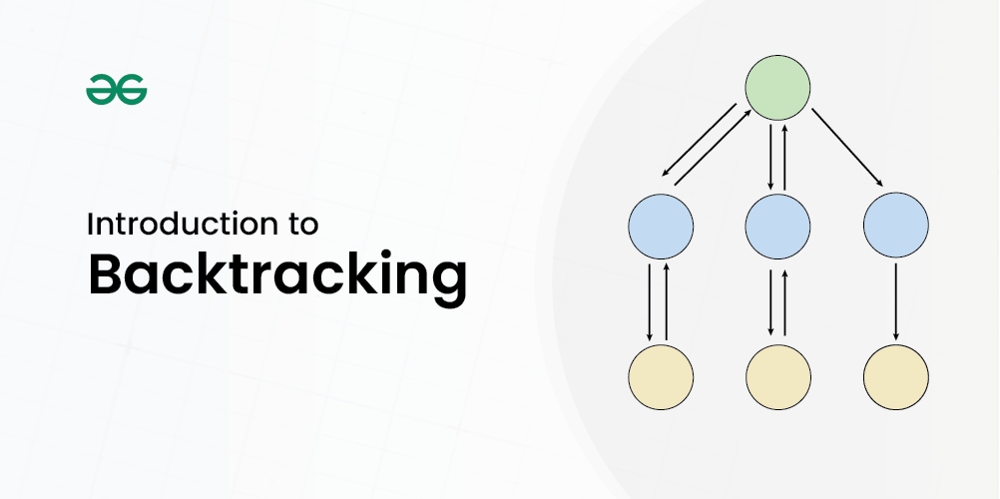

# Backtracking

**Backtracking** is an algorithmic technique for solving problems recursively by trying to build a solution incrementally, removing solutions that fail to satisfy the constraints of the problem at any point in time.



> **Image Credit:** [GeeksforGeeks - Backtracking Algorithms](https://www.geeksforgeeks.org/backtracking-algorithms/)

**Key Properties:**
- **Incremental construction:** Builds solution step by step
- **Constraint checking:** Checks if current partial solution can lead to valid solution
- **Backtrack:** Abandons partial solution if it cannot lead to valid solution
- **Systematic search:** Explores all possible solutions

**When to Use Backtracking:**
- Constraint satisfaction problems
- Combinatorial problems
- Optimization problems
- Problems requiring exhaustive search

### Backtracking Template

```cpp
void backtrack(currentState, constraints) {
    // Base case: solution found
    if (isSolution(currentState)) {
        processSolution(currentState);
        return;
    }
    
    // Generate candidates
    for (candidate : generateCandidates(currentState)) {
        // Check constraint
        if (isValid(candidate, constraints)) {
            // Make choice
            makeMove(currentState, candidate);
            
            // Recurse
            backtrack(currentState, constraints);
            
            // Undo choice (backtrack)
            undoMove(currentState, candidate);
        }
    }
}
```

### Classic Backtracking Problems

#### 1. N-Queens Problem

Place N queens on N×N chessboard such that no two queens attack each other.

```cpp
#include <iostream>
#include <vector>
using namespace std;

class NQueens {
private:
    int n;
    vector<vector<string>> solutions;
    
    bool isValid(vector<string>& board, int row, int col) {
        // Check column
        for (int i = 0; i < row; i++) {
            if (board[i][col] == 'Q') return false;
        }
        
        // Check diagonal (top-left to bottom-right)
        for (int i = row - 1, j = col - 1; i >= 0 && j >= 0; i--, j--) {
            if (board[i][j] == 'Q') return false;
        }
        
        // Check diagonal (top-right to bottom-left)
        for (int i = row - 1, j = col + 1; i >= 0 && j < n; i--, j++) {
            if (board[i][j] == 'Q') return false;
        }
        
        return true;
    }
    
    void solve(vector<string>& board, int row) {
        if (row == n) {
            solutions.push_back(board);
            return;
        }
        
        for (int col = 0; col < n; col++) {
            if (isValid(board, row, col)) {
                board[row][col] = 'Q'; // Make choice
                solve(board, row + 1); // Recurse
                board[row][col] = '.'; // Backtrack
            }
        }
    }
    
public:
    vector<vector<string>> solveNQueens(int N) {
        n = N;
        vector<string> board(n, string(n, '.'));
        solve(board, 0);
        return solutions;
    }
};

int main() {
    NQueens nq;
    vector<vector<string>> solutions = nq.solveNQueens(4);
    
    cout << "Number of solutions: " << solutions.size() << endl;
    for (auto& sol : solutions) {
        for (string row : sol) {
            cout << row << endl;
        }
        cout << endl;
    }
    
    return 0;
}
```

**Time Complexity:** O(N!) in worst case  
**Space Complexity:** O(N²) for board

#### 2. Sudoku Solver

```cpp
#include <iostream>
#include <vector>
using namespace std;

class SudokuSolver {
private:
    bool isValid(vector<vector<char>>& board, int row, int col, char num) {
        // Check row
        for (int j = 0; j < 9; j++) {
            if (board[row][j] == num) return false;
        }
        
        // Check column
        for (int i = 0; i < 9; i++) {
            if (board[i][col] == num) return false;
        }
        
        // Check 3x3 box
        int boxRow = (row / 3) * 3;
        int boxCol = (col / 3) * 3;
        for (int i = boxRow; i < boxRow + 3; i++) {
            for (int j = boxCol; j < boxCol + 3; j++) {
                if (board[i][j] == num) return false;
            }
        }
        
        return true;
    }
    
    bool solve(vector<vector<char>>& board) {
        for (int i = 0; i < 9; i++) {
            for (int j = 0; j < 9; j++) {
                if (board[i][j] == '.') {
                    for (char num = '1'; num <= '9'; num++) {
                        if (isValid(board, i, j, num)) {
                            board[i][j] = num; // Make choice
                            if (solve(board)) return true; // Recurse
                            board[i][j] = '.'; // Backtrack
                        }
                    }
                    return false; // No valid number found
                }
            }
        }
        return true; // All cells filled
    }
    
public:
    void solveSudoku(vector<vector<char>>& board) {
        solve(board);
    }
};
```

**Time Complexity:** O(9^(empty cells))  
**Space Complexity:** O(1) excluding recursion stack

#### 3. Rat in a Maze

Find path from source to destination in a maze.

```cpp
#include <iostream>
#include <vector>
#include <string>
using namespace std;

class RatInMaze {
private:
    int n;
    vector<string> result;
    
    void solve(vector<vector<int>>& maze, int row, int col, string path, 
               vector<vector<bool>>& visited) {
        if (row < 0 || row >= n || col < 0 || col >= n || 
            maze[row][col] == 0 || visited[row][col]) {
            return;
        }
        
        if (row == n - 1 && col == n - 1) {
            result.push_back(path);
            return;
        }
        
        visited[row][col] = true;
        
        // Try all 4 directions
        solve(maze, row + 1, col, path + "D", visited); // Down
        solve(maze, row - 1, col, path + "U", visited); // Up
        solve(maze, row, col + 1, path + "R", visited); // Right
        solve(maze, row, col - 1, path + "L", visited); // Left
        
        visited[row][col] = false; // Backtrack
    }
    
public:
    vector<string> findPath(vector<vector<int>>& maze) {
        n = maze.size();
        vector<vector<bool>> visited(n, vector<bool>(n, false));
        solve(maze, 0, 0, "", visited);
        return result;
    }
};
```

#### 4. Word Search

Find if word exists in 2D grid.

```cpp
#include <iostream>
#include <vector>
using namespace std;

class WordSearch {
private:
    bool search(vector<vector<char>>& board, string word, int index, 
                int row, int col, vector<vector<bool>>& visited) {
        if (index == word.length()) return true;
        
        if (row < 0 || row >= board.size() || col < 0 || 
            col >= board[0].size() || visited[row][col] || 
            board[row][col] != word[index]) {
            return false;
        }
        
        visited[row][col] = true;
        
        bool found = search(board, word, index + 1, row + 1, col, visited) ||
                     search(board, word, index + 1, row - 1, col, visited) ||
                     search(board, word, index + 1, row, col + 1, visited) ||
                     search(board, word, index + 1, row, col - 1, visited);
        
        visited[row][col] = false; // Backtrack
        
        return found;
    }
    
public:
    bool exist(vector<vector<char>>& board, string word) {
        int m = board.size();
        int n = board[0].size();
        vector<vector<bool>> visited(m, vector<bool>(n, false));
        
        for (int i = 0; i < m; i++) {
            for (int j = 0; j < n; j++) {
                if (search(board, word, 0, i, j, visited)) {
                    return true;
                }
            }
        }
        
        return false;
    }
};
```

#### 5. Generate Parentheses

Generate all valid combinations of n pairs of parentheses.

```cpp
#include <iostream>
#include <vector>
using namespace std;

class GenerateParentheses {
private:
    void generate(vector<string>& result, string current, 
                  int open, int close, int n) {
        if (current.length() == 2 * n) {
            result.push_back(current);
            return;
        }
        
        if (open < n) {
            generate(result, current + "(", open + 1, close, n);
        }
        
        if (close < open) {
            generate(result, current + ")", open, close + 1, n);
        }
    }
    
public:
    vector<string> generateParenthesis(int n) {
        vector<string> result;
        generate(result, "", 0, 0, n);
        return result;
    }
};
```

#### 6. Combination Sum

Find all unique combinations that sum to target.

```cpp
#include <iostream>
#include <vector>
#include <algorithm>
using namespace std;

class CombinationSum {
private:
    void findCombinations(vector<int>& candidates, int target, 
                         vector<int>& current, vector<vector<int>>& result, 
                         int start) {
        if (target == 0) {
            result.push_back(current);
            return;
        }
        
        if (target < 0) return;
        
        for (int i = start; i < candidates.size(); i++) {
            current.push_back(candidates[i]); // Make choice
            findCombinations(candidates, target - candidates[i], 
                           current, result, i); // Recurse (can reuse)
            current.pop_back(); // Backtrack
        }
    }
    
public:
    vector<vector<int>> combinationSum(vector<int>& candidates, int target) {
        vector<vector<int>> result;
        vector<int> current;
        findCombinations(candidates, target, current, result, 0);
        return result;
    }
};
```

#### 7. Permutations

Generate all permutations of array.

```cpp
#include <iostream>
#include <vector>
using namespace std;

class Permutations {
private:
    void permute(vector<int>& nums, vector<int>& current, 
                vector<vector<int>>& result, vector<bool>& used) {
        if (current.size() == nums.size()) {
            result.push_back(current);
            return;
        }
        
        for (int i = 0; i < nums.size(); i++) {
            if (!used[i]) {
                used[i] = true;
                current.push_back(nums[i]); // Make choice
                permute(nums, current, result, used); // Recurse
                current.pop_back(); // Backtrack
                used[i] = false;
            }
        }
    }
    
public:
    vector<vector<int>> permute(vector<int>& nums) {
        vector<vector<int>> result;
        vector<int> current;
        vector<bool> used(nums.size(), false);
        permute(nums, current, result, used);
        return result;
    }
};
```

**Time Complexity:** O(n! × n)  
**Space Complexity:** O(n)

#### 8. Subsets

Generate all subsets (power set).

```cpp
#include <iostream>
#include <vector>
using namespace std;

class Subsets {
private:
    void generateSubsets(vector<int>& nums, vector<int>& current, 
                        vector<vector<int>>& result, int index) {
        result.push_back(current); // Add current subset
        
        for (int i = index; i < nums.size(); i++) {
            current.push_back(nums[i]); // Include element
            generateSubsets(nums, current, result, i + 1); // Recurse
            current.pop_back(); // Exclude element (backtrack)
        }
    }
    
public:
    vector<vector<int>> subsets(vector<int>& nums) {
        vector<vector<int>> result;
        vector<int> current;
        generateSubsets(nums, current, result, 0);
        return result;
    }
};
```

**Time Complexity:** O(2^n × n)  
**Space Complexity:** O(2^n)

### Backtracking vs Other Techniques

| Feature | Backtracking | Dynamic Programming | Greedy |
|---------|--------------|---------------------|--------|
| **Approach** | Exhaustive search | Memoization | Local optimal |
| **Guarantee** | Finds all solutions | Optimal solution | May not be optimal |
| **Time** | Exponential | Polynomial | Polynomial |
| **Use Case** | Constraint satisfaction | Optimization | Optimization |

### Time Complexity

| Problem | Time Complexity |
|---------|----------------|
| N-Queens | O(N!) |
| Sudoku | O(9^(empty cells)) |
| Permutations | O(n! × n) |
| Subsets | O(2^n × n) |
| Combination Sum | O(2^n) |

### Space Complexity

- **Space Complexity:** O(n) to O(n²) for state storage
- **Auxiliary Space:** O(n) for recursion stack

### Advantages of Backtracking

1. **Finds all solutions** - Exhaustive search
2. **Systematic** - Explores all possibilities
3. **Flexible** - Easy to add constraints
4. **Intuitive** - Natural for constraint problems

### Disadvantages of Backtracking

1. **Slow** - Exponential time complexity
2. **Memory intensive** - Deep recursion
3. **Not efficient** - For large problems
4. **Redundant** - May explore same states multiple times

### When to Use Backtracking?

✅ **Use Backtracking when:**
- Need all solutions
- Constraint satisfaction problems
- Combinatorial problems
- Small to medium problem size

❌ **Don't use Backtracking when:**
- Need only one solution (use other methods)
- Very large problem size
- Time constraints are tight
- DP or Greedy can solve it

### Common Backtracking Problems

1. N-Queens
2. Sudoku Solver
3. Rat in a Maze
4. Word Search
5. Generate Parentheses
6. Combination Sum
7. Permutations
8. Subsets
9. Palindrome Partitioning
10. Restore IP Addresses

### References

- [GeeksforGeeks - Backtracking](https://www.geeksforgeeks.org/backtracking-algorithms/)
- [GeeksforGeeks - N-Queens Problem](https://www.geeksforgeeks.org/n-queen-problem-backtracking-3/)
