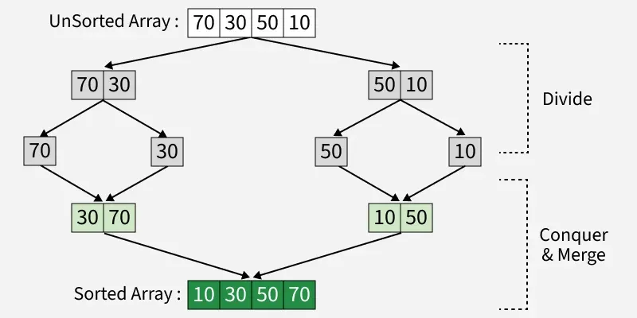
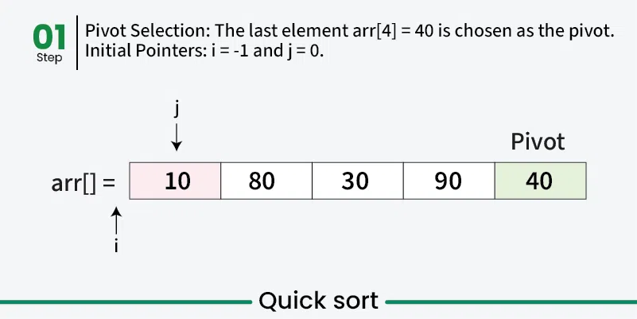

### Divide and Conquer

**Divide and Conquer** is an algorithmic paradigm that breaks a problem into smaller subproblems, solves them recursively, and then combines their solutions to solve the original problem.

**Key Steps:**
1. **Divide:** Break problem into smaller subproblems
2. **Conquer:** Solve subproblems recursively
3. **Combine:** Merge solutions of subproblems

**Key Properties:**
- Problem can be divided into similar subproblems
- Subproblems are independent
- Base case exists (small enough to solve directly)
- Solutions can be combined efficiently

### Divide and Conquer Template

```cpp
returnType divideAndConquer(problem) {
    // Base case
    if (problem is small enough) {
        return solveDirectly(problem);
    }
    
    // Divide
    subproblem1 = divide(problem, part1);
    subproblem2 = divide(problem, part2);
    // ... more subproblems
    
    // Conquer (recursive calls)
    solution1 = divideAndConquer(subproblem1);
    solution2 = divideAndConquer(subproblem2);
    // ... more solutions
    
    // Combine
    return combine(solution1, solution2, ...);
}
```

### Classic Divide and Conquer Algorithms

#### 1. Merge Sort



> **Image Credit:** [GeeksforGeeks - Merge Sort](https://www.geeksforgeeks.org/merge-sort/)

```cpp
#include <iostream>
#include <vector>
using namespace std;

void merge(vector<int>& arr, int left, int mid, int right) {
    int n1 = mid - left + 1;
    int n2 = right - mid;
    
    vector<int> L(n1), R(n2);
    
    for (int i = 0; i < n1; i++) L[i] = arr[left + i];
    for (int j = 0; j < n2; j++) R[j] = arr[mid + 1 + j];
    
    int i = 0, j = 0, k = left;
    
    while (i < n1 && j < n2) {
        if (L[i] <= R[j]) {
            arr[k++] = L[i++];
        }
        else {
            arr[k++] = R[j++];
        }
    }
    
    while (i < n1) arr[k++] = L[i++];
    while (j < n2) arr[k++] = R[j++];
}

void mergeSort(vector<int>& arr, int left, int right) {
    if (left < right) {
        int mid = left + (right - left) / 2;
        
        // Divide
        mergeSort(arr, left, mid);
        mergeSort(arr, mid + 1, right);
        
        // Conquer (merge)
        merge(arr, left, mid, right);
    }
}

int main() {
    vector<int> arr = {12, 11, 13, 5, 6, 7};
    mergeSort(arr, 0, arr.size() - 1);
    
    for (int x : arr) {
        cout << x << " ";
    }
    cout << endl;
    
    return 0;
}
```

**Time Complexity:** O(n log n)  
**Space Complexity:** O(n)

#### 2. Quick Sort



> **Image Credit:** [GeeksforGeeks - Quick Sort](https://www.geeksforgeeks.org/quick-sort/)

```cpp
#include <iostream>
#include <vector>
using namespace std;

int partition(vector<int>& arr, int low, int high) {
    int pivot = arr[high];
    int i = low - 1;
    
    for (int j = low; j < high; j++) {
        if (arr[j] < pivot) {
            i++;
            swap(arr[i], arr[j]);
        }
    }
    swap(arr[i + 1], arr[high]);
    return i + 1;
}

void quickSort(vector<int>& arr, int low, int high) {
    if (low < high) {
        // Divide: Partition array
        int pi = partition(arr, low, high);
        
        // Conquer: Sort subarrays
        quickSort(arr, low, pi - 1);
        quickSort(arr, pi + 1, high);
    }
}
```

**Time Complexity:** O(n log n) average, O(n²) worst case  
**Space Complexity:** O(log n) for recursion stack

#### 3. Binary Search

```cpp
#include <iostream>
#include <vector>
using namespace std;

int binarySearch(vector<int>& arr, int left, int right, int target) {
    if (left > right) return -1;
    
    int mid = left + (right - left) / 2;
    
    if (arr[mid] == target) {
        return mid;
    }
    else if (arr[mid] > target) {
        return binarySearch(arr, left, mid - 1, target); // Search left
    }
    else {
        return binarySearch(arr, mid + 1, right, target); // Search right
    }
}
```

**Time Complexity:** O(log n)  
**Space Complexity:** O(log n) for recursion stack

#### 4. Power of a Number

```cpp
double power(double x, int n) {
    if (n == 0) return 1;
    
    double half = power(x, n / 2);
    
    if (n % 2 == 0) {
        return half * half;
    }
    else {
        return x * half * half;
    }
}
```

**Time Complexity:** O(log n)  
**Space Complexity:** O(log n)

#### 5. Maximum Subarray Sum (Kadane's with Divide & Conquer)

```cpp
#include <iostream>
#include <vector>
#include <climits>
using namespace std;

int maxCrossingSum(vector<int>& arr, int left, int mid, int right) {
    int leftSum = INT_MIN;
    int sum = 0;
    
    for (int i = mid; i >= left; i--) {
        sum += arr[i];
        leftSum = max(leftSum, sum);
    }
    
    int rightSum = INT_MIN;
    sum = 0;
    
    for (int i = mid + 1; i <= right; i++) {
        sum += arr[i];
        rightSum = max(rightSum, sum);
    }
    
    return leftSum + rightSum;
}

int maxSubarraySum(vector<int>& arr, int left, int right) {
    if (left == right) return arr[left];
    
    int mid = left + (right - left) / 2;
    
    int leftSum = maxSubarraySum(arr, left, mid);
    int rightSum = maxSubarraySum(arr, mid + 1, right);
    int crossSum = maxCrossingSum(arr, left, mid, right);
    
    return max({leftSum, rightSum, crossSum});
}
```

**Time Complexity:** O(n log n)  
**Space Complexity:** O(log n)

#### 6. Strassen's Matrix Multiplication

Multiply two matrices using divide and conquer (faster than O(n³)).

```cpp
#include <iostream>
#include <vector>
using namespace std;

vector<vector<int>> addMatrix(vector<vector<int>>& A, vector<vector<int>>& B) {
    int n = A.size();
    vector<vector<int>> C(n, vector<int>(n));
    for (int i = 0; i < n; i++) {
        for (int j = 0; j < n; j++) {
            C[i][j] = A[i][j] + B[i][j];
        }
    }
    return C;
}

vector<vector<int>> subtractMatrix(vector<vector<int>>& A, vector<vector<int>>& B) {
    int n = A.size();
    vector<vector<int>> C(n, vector<int>(n));
    for (int i = 0; i < n; i++) {
        for (int j = 0; j < n; j++) {
            C[i][j] = A[i][j] - B[i][j];
        }
    }
    return C;
}

vector<vector<int>> strassenMultiply(vector<vector<int>>& A, 
                                     vector<vector<int>>& B) {
    int n = A.size();
    
    if (n == 1) {
        return {{A[0][0] * B[0][0]}};
    }
    
    // Divide matrices into 4 submatrices
    int half = n / 2;
    
    // This is a simplified version - full implementation is more complex
    // For complete implementation, see GeeksforGeeks
    
    return {}; // Placeholder
}
```

**Time Complexity:** O(n^log₂7) ≈ O(n^2.81)  
**Space Complexity:** O(n²)

#### 7. Closest Pair of Points

Find closest pair of points in 2D plane.

```cpp
#include <iostream>
#include <vector>
#include <cmath>
#include <algorithm>
#include <climits>
using namespace std;

struct Point {
    int x, y;
    Point(int x, int y) : x(x), y(y) {}
};

double distance(Point p1, Point p2) {
    return sqrt(pow(p1.x - p2.x, 2) + pow(p1.y - p2.y, 2));
}

double closestPairUtil(vector<Point>& points, int left, int right) {
    if (right - left <= 3) {
        // Brute force for small sets
        double minDist = INT_MAX;
        for (int i = left; i < right; i++) {
            for (int j = i + 1; j < right; j++) {
                minDist = min(minDist, distance(points[i], points[j]));
            }
        }
        return minDist;
    }
    
    int mid = left + (right - left) / 2;
    Point midPoint = points[mid];
    
    double dl = closestPairUtil(points, left, mid);
    double dr = closestPairUtil(points, mid, right);
    double d = min(dl, dr);
    
    // Check points in strip
    vector<Point> strip;
    for (int i = left; i < right; i++) {
        if (abs(points[i].x - midPoint.x) < d) {
            strip.push_back(points[i]);
        }
    }
    
    sort(strip.begin(), strip.end(), [](Point a, Point b) {
        return a.y < b.y;
    });
    
    for (int i = 0; i < strip.size(); i++) {
        for (int j = i + 1; j < strip.size() && 
             (strip[j].y - strip[i].y) < d; j++) {
            d = min(d, distance(strip[i], strip[j]));
        }
    }
    
    return d;
}

double closestPair(vector<Point>& points) {
    sort(points.begin(), points.end(), [](Point a, Point b) {
        return a.x < b.x;
    });
    return closestPairUtil(points, 0, points.size());
}
```

**Time Complexity:** O(n log² n)  
**Space Complexity:** O(n)

### Divide and Conquer vs Other Techniques

| Feature | Divide & Conquer | Dynamic Programming | Greedy |
|---------|------------------|---------------------|--------|
| **Subproblems** | Independent | Overlapping | No subproblems |
| **Memoization** | Not needed | Needed | Not needed |
| **Combine** | Yes | Yes | No |
| **Examples** | Merge Sort, Quick Sort | Fibonacci, LCS | Activity Selection |

### Time Complexity Analysis

**Master Theorem:** For recurrence T(n) = aT(n/b) + f(n):
- If f(n) = O(n^log_b(a - ε)): T(n) = Θ(n^log_b(a))
- If f(n) = Θ(n^log_b(a)): T(n) = Θ(n^log_b(a) × log n)
- If f(n) = Ω(n^log_b(a + ε)): T(n) = Θ(f(n))

**Examples:**
- Merge Sort: T(n) = 2T(n/2) + O(n) → T(n) = O(n log n)
- Binary Search: T(n) = T(n/2) + O(1) → T(n) = O(log n)
- Quick Sort: T(n) = T(n/2) + T(n/2) + O(n) → T(n) = O(n log n) average

### Advantages of Divide and Conquer

1. **Efficient** - Often O(n log n) time complexity
2. **Parallelizable** - Subproblems can be solved in parallel
3. **Intuitive** - Natural problem-solving approach
4. **Cache friendly** - Works well with memory hierarchy

### Disadvantages of Divide and Conquer

1. **Recursion overhead** - Function call overhead
2. **Stack overflow** - Deep recursion can cause issues
3. **Not always optimal** - Some problems have better solutions
4. **Complex implementation** - Can be harder to implement

### When to Use Divide and Conquer?

✅ **Use Divide & Conquer when:**
- Problem can be divided into similar subproblems
- Subproblems are independent
- Combining solutions is efficient
- Need O(n log n) or better solution

❌ **Don't use Divide & Conquer when:**
- Subproblems overlap (use DP instead)
- Simple iterative solution exists
- Problem size is small
- Memory is very limited

### Common Divide and Conquer Problems

1. Merge Sort
2. Quick Sort
3. Binary Search
4. Power of Number
5. Maximum Subarray Sum
6. Closest Pair of Points
7. Strassen's Matrix Multiplication
8. Count Inversions
9. Majority Element
10. Fast Exponentiation

### References

- [GeeksforGeeks - Divide and Conquer](https://www.geeksforgeeks.org/divide-and-conquer-algorithm-introduction/)
- [GeeksforGeeks - Merge Sort](https://www.geeksforgeeks.org/merge-sort/)
- [GeeksforGeeks - Quick Sort](https://www.geeksforgeeks.org/quick-sort/)

