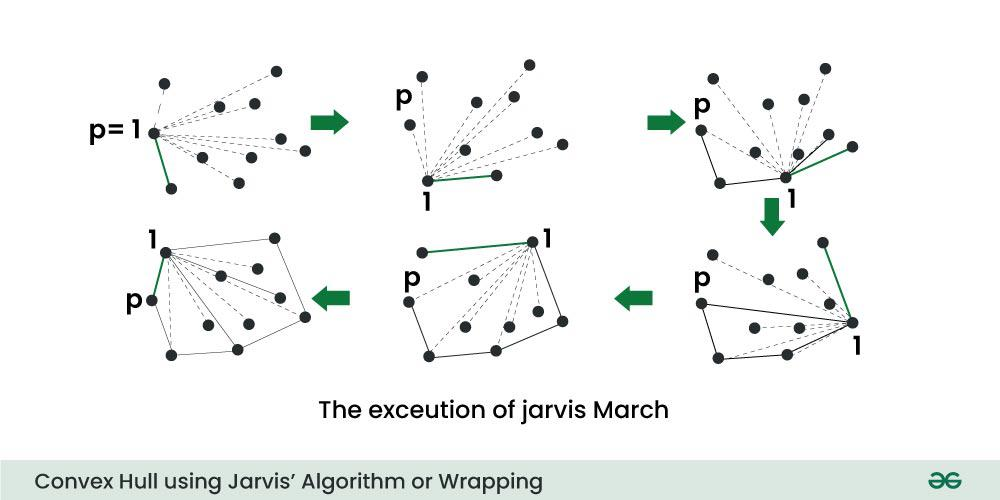

# Geometric Algorithms

**Geometric Algorithms** are algorithms designed to solve problems involving geometric objects like points, lines, polygons, and shapes in 2D or 3D space.

**Geometric Computing:** These algorithms solve problems in computational geometry, computer graphics, robotics, and geographic information systems. They involve operations like finding convex hulls, computing distances, determining point locations relative to polygons, and solving intersection problems. Geometric algorithms are fundamental in areas requiring spatial reasoning and geometric computations.




> **Image Credit:** [GeeksforGeeks - Convex Hull using Jarvis' Algorithm](https://www.geeksforgeeks.org/dsa/convex-hull-using-jarvis-algorithm-or-wrapping/)

### Basic Geometric Concepts

#### 1. Point Representation

```cpp
struct Point {
    double x, y;
    Point(double x, double y) : x(x), y(y) {}
};
```

#### 2. Distance Between Two Points

```cpp
#include <iostream>
#include <cmath>
using namespace std;

double distance(Point p1, Point p2) {
    return sqrt(pow(p1.x - p2.x, 2) + pow(p1.y - p2.y, 2));
}
```

#### 3. Orientation of Three Points

Check if three points are collinear, clockwise, or counterclockwise.

```cpp
int orientation(Point p1, Point p2, Point p3) {
    double val = (p2.y - p1.y) * (p3.x - p2.x) - 
                 (p2.x - p1.x) * (p3.y - p2.y);
    
    if (val == 0) return 0;  // Collinear
    return (val > 0) ? 1 : 2; // Clockwise : Counterclockwise
}
```

### Geometric Algorithms

#### 1. Convex Hull (Graham Scan)

Find smallest convex polygon containing all points.

```cpp
#include <iostream>
#include <vector>
#include <algorithm>
#include <stack>
#include <cmath>
using namespace std;

struct Point {
    int x, y;
    Point(int x, int y) : x(x), y(y) {}
};

Point bottomLeft;

int orientation(Point p1, Point p2, Point p3) {
    int val = (p2.y - p1.y) * (p3.x - p2.x) - 
              (p2.x - p1.x) * (p3.y - p2.y);
    if (val == 0) return 0;
    return (val > 0) ? 1 : 2;
}

int distSq(Point p1, Point p2) {
    return (p1.x - p2.x) * (p1.x - p2.x) + 
           (p1.y - p2.y) * (p1.y - p2.y);
}

bool compare(Point p1, Point p2) {
    int o = orientation(bottomLeft, p1, p2);
    if (o == 0) {
        return distSq(bottomLeft, p2) >= distSq(bottomLeft, p1);
    }
    return o == 2;
}

vector<Point> convexHull(vector<Point>& points) {
    int n = points.size();
    if (n < 3) return {};
    
    // Find bottom-most point (or leftmost in case of tie)
    int bottom = 0;
    for (int i = 1; i < n; i++) {
        if (points[i].y < points[bottom].y || 
           (points[i].y == points[bottom].y && 
            points[i].x < points[bottom].x)) {
            bottom = i;
        }
    }
    
    swap(points[0], points[bottom]);
    bottomLeft = points[0];
    
    // Sort points by polar angle
    sort(points.begin() + 1, points.end(), compare);
    
    stack<Point> hull;
    hull.push(points[0]);
    hull.push(points[1]);
    hull.push(points[2]);
    
    for (int i = 3; i < n; i++) {
        while (hull.size() > 1) {
            Point top = hull.top();
            hull.pop();
            Point secondTop = hull.top();
            
            if (orientation(secondTop, top, points[i]) == 2) {
                hull.push(top);
                break;
            }
        }
        hull.push(points[i]);
    }
    
    vector<Point> result;
    while (!hull.empty()) {
        result.push_back(hull.top());
        hull.pop();
    }
    
    reverse(result.begin(), result.end());
    return result;
}
```

**Time Complexity:** O(n log n)  
**Space Complexity:** O(n)

#### 2. Line Segment Intersection

Check if two line segments intersect.

```cpp
bool onSegment(Point p, Point q, Point r) {
    return q.x <= max(p.x, r.x) && q.x >= min(p.x, r.x) &&
           q.y <= max(p.y, r.y) && q.y >= min(p.y, r.y);
}

bool doIntersect(Point p1, Point q1, Point p2, Point q2) {
    int o1 = orientation(p1, q1, p2);
    int o2 = orientation(p1, q1, q2);
    int o3 = orientation(p2, q2, p1);
    int o4 = orientation(p2, q2, q1);
    
    // General case
    if (o1 != o2 && o3 != o4) return true;
    
    // Special cases
    if (o1 == 0 && onSegment(p1, p2, q1)) return true;
    if (o2 == 0 && onSegment(p1, q2, q1)) return true;
    if (o3 == 0 && onSegment(p2, p1, q2)) return true;
    if (o4 == 0 && onSegment(p2, q1, q2)) return true;
    
    return false;
}
```

#### 3. Point in Polygon

Check if point lies inside polygon.

```cpp
bool pointInPolygon(Point point, vector<Point>& polygon) {
    int n = polygon.size();
    bool inside = false;
    
    for (int i = 0, j = n - 1; i < n; j = i++) {
        if (((polygon[i].y > point.y) != (polygon[j].y > point.y)) &&
            (point.x < (polygon[j].x - polygon[i].x) * 
             (point.y - polygon[i].y) / 
             (polygon[j].y - polygon[i].y) + polygon[i].x)) {
            inside = !inside;
        }
    }
    
    return inside;
}
```

**Time Complexity:** O(n)  
**Space Complexity:** O(1)

#### 4. Area of Polygon

```cpp
double polygonArea(vector<Point>& polygon) {
    int n = polygon.size();
    double area = 0.0;
    
    for (int i = 0; i < n; i++) {
        int j = (i + 1) % n;
        area += polygon[i].x * polygon[j].y;
        area -= polygon[j].x * polygon[i].y;
    }
    
    return abs(area) / 2.0;
}
```

**Time Complexity:** O(n)  
**Space Complexity:** O(1)

#### 5. Closest Pair of Points

Find two closest points (see Divide and Conquer section).

### Applications of Geometric Algorithms

1. **Computer Graphics:** Rendering, collision detection
2. **Robotics:** Path planning, obstacle avoidance
3. **GIS:** Geographic information systems
4. **CAD:** Computer-aided design
5. **Game Development:** Spatial queries, physics

### Time Complexity

| Algorithm | Time Complexity |
|-----------|----------------|
| Convex Hull (Graham Scan) | O(n log n) |
| Line Segment Intersection | O(1) |
| Point in Polygon | O(n) |
| Polygon Area | O(n) |
| Closest Pair | O(n log² n) |

### References

- [GeeksforGeeks - Geometric Algorithms](https://www.geeksforgeeks.org/geometric-algorithms/)
