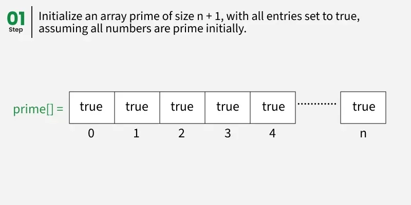

# Mathematical Algorithms

**Mathematical Algorithms** are algorithms that solve mathematical problems and computations efficiently. These include number theory, combinatorics, and numerical algorithms.

### Number Theory Algorithms

#### 1. Greatest Common Divisor (GCD)

```cpp
#include <iostream>
using namespace std;

// Euclidean Algorithm
int gcd(int a, int b) {
    if (b == 0) return a;
    return gcd(b, a % b);
}

// Iterative version
int gcdIterative(int a, int b) {
    while (b != 0) {
        int temp = b;
        b = a % b;
        a = temp;
    }
    return a;
}

// Extended Euclidean Algorithm (also finds coefficients)
int extendedGCD(int a, int b, int& x, int& y) {
    if (b == 0) {
        x = 1;
        y = 0;
        return a;
    }
    
    int x1, y1;
    int gcd = extendedGCD(b, a % b, x1, y1);
    
    x = y1;
    y = x1 - (a / b) * y1;
    
    return gcd;
}
```

**Time Complexity:** O(log min(a, b))  
**Space Complexity:** O(log min(a, b)) for recursive

#### 2. Least Common Multiple (LCM)

```cpp
int lcm(int a, int b) {
    return (a / gcd(a, b)) * b;
}
```

#### 3. Prime Number Algorithms

##### Sieve of Eratosthenes



> **Image Credit:** [GeeksforGeeks - Sieve of Eratosthenes](https://www.geeksforgeeks.org/sieve-of-eratosthenes/)

```cpp
#include <iostream>
#include <vector>
using namespace std;

vector<bool> sieveOfEratosthenes(int n) {
    vector<bool> isPrime(n + 1, true);
    isPrime[0] = isPrime[1] = false;
    
    for (int i = 2; i * i <= n; i++) {
        if (isPrime[i]) {
            for (int j = i * i; j <= n; j += i) {
                isPrime[j] = false;
            }
        }
    }
    
    return isPrime;
}

// Get all primes up to n
vector<int> getPrimes(int n) {
    vector<bool> isPrime = sieveOfEratosthenes(n);
    vector<int> primes;
    
    for (int i = 2; i <= n; i++) {
        if (isPrime[i]) {
            primes.push_back(i);
        }
    }
    
    return primes;
}
```

**Time Complexity:** O(n log log n)  
**Space Complexity:** O(n)

##### Check if Number is Prime

```cpp
bool isPrime(int n) {
    if (n <= 1) return false;
    if (n <= 3) return true;
    if (n % 2 == 0 || n % 3 == 0) return false;
    
    for (int i = 5; i * i <= n; i += 6) {
        if (n % i == 0 || n % (i + 2) == 0) {
            return false;
        }
    }
    
    return true;
}
```

**Time Complexity:** O(√n)  
**Space Complexity:** O(1)

#### 4. Prime Factorization

```cpp
#include <iostream>
#include <vector>
#include <map>
using namespace std;

map<int, int> primeFactorization(int n) {
    map<int, int> factors;
    
    // Count factors of 2
    while (n % 2 == 0) {
        factors[2]++;
        n /= 2;
    }
    
    // Check odd factors
    for (int i = 3; i * i <= n; i += 2) {
        while (n % i == 0) {
            factors[i]++;
            n /= i;
        }
    }
    
    // If n is still > 1, it's prime
    if (n > 1) {
        factors[n]++;
    }
    
    return factors;
}
```

**Time Complexity:** O(√n)  
**Space Complexity:** O(log n)

#### 5. Modular Arithmetic

##### Modular Exponentiation

```cpp
#include <iostream>
using namespace std;

long long modPower(long long base, long long exp, long long mod) {
    long long result = 1;
    base = base % mod;
    
    while (exp > 0) {
        if (exp % 2 == 1) {
            result = (result * base) % mod;
        }
        exp = exp >> 1;
        base = (base * base) % mod;
    }
    
    return result;
}
```

**Time Complexity:** O(log exp)  
**Space Complexity:** O(1)

##### Modular Inverse

```cpp
// Using Extended Euclidean Algorithm
int modInverse(int a, int m) {
    int x, y;
    int g = extendedGCD(a, m, x, y);
    
    if (g != 1) {
        return -1; // Inverse doesn't exist
    }
    
    return (x % m + m) % m; // Make positive
}

// Using Fermat's Little Theorem (when m is prime)
int modInverseFermat(int a, int m) {
    return modPower(a, m - 2, m);
}
```

#### 6. Fibonacci Number

```cpp
// Matrix exponentiation method (O(log n))
#include <vector>
using namespace std;

vector<vector<long long>> multiply(vector<vector<long long>>& A, 
                                  vector<vector<long long>>& B) {
    vector<vector<long long>> C(2, vector<long long>(2, 0));
    for (int i = 0; i < 2; i++) {
        for (int j = 0; j < 2; j++) {
            for (int k = 0; k < 2; k++) {
                C[i][j] += A[i][k] * B[k][j];
            }
        }
    }
    return C;
}

vector<vector<long long>> matrixPower(vector<vector<long long>> base, int n) {
    vector<vector<long long>> result = {{1, 0}, {0, 1}}; // Identity matrix
    
    while (n > 0) {
        if (n % 2 == 1) {
            result = multiply(result, base);
        }
        base = multiply(base, base);
        n /= 2;
    }
    
    return result;
}

long long fibonacci(int n) {
    if (n == 0) return 0;
    if (n == 1) return 1;
    
    vector<vector<long long>> base = {{1, 1}, {1, 0}};
    vector<vector<long long>> result = matrixPower(base, n - 1);
    
    return result[0][0];
}
```

**Time Complexity:** O(log n)  
**Space Complexity:** O(1)

### Combinatorial Algorithms

#### 1. Factorial

```cpp
long long factorial(int n) {
    if (n <= 1) return 1;
    return n * factorial(n - 1);
}

// With memoization for large n
long long factorialMemo(int n, vector<long long>& memo) {
    if (n <= 1) return 1;
    if (memo[n] != -1) return memo[n];
    memo[n] = n * factorialMemo(n - 1, memo);
    return memo[n];
}
```

#### 2. Combinations (nCr)

```cpp
long long nCr(int n, int r) {
    if (r > n) return 0;
    if (r == 0 || r == n) return 1;
    
    // Use Pascal's triangle property: C(n,r) = C(n-1,r-1) + C(n-1,r)
    vector<vector<long long>> dp(n + 1, vector<long long>(r + 1, 0));
    
    for (int i = 0; i <= n; i++) {
        for (int j = 0; j <= min(i, r); j++) {
            if (j == 0 || j == i) {
                dp[i][j] = 1;
            }
            else {
                dp[i][j] = dp[i - 1][j - 1] + dp[i - 1][j];
            }
        }
    }
    
    return dp[n][r];
}

// Space optimized
long long nCrOptimized(int n, int r) {
    if (r > n) return 0;
    if (r > n - r) r = n - r; // C(n,r) = C(n,n-r)
    
    long long result = 1;
    for (int i = 0; i < r; i++) {
        result = result * (n - i) / (i + 1);
    }
    
    return result;
}
```

**Time Complexity:** O(n × r) or O(r) for optimized  
**Space Complexity:** O(n × r) or O(1) for optimized

#### 3. Permutations (nPr)

```cpp
long long nPr(int n, int r) {
    if (r > n) return 0;
    
    long long result = 1;
    for (int i = 0; i < r; i++) {
        result *= (n - i);
    }
    
    return result;
}
```

**Time Complexity:** O(r)  
**Space Complexity:** O(1)

### Numerical Algorithms

#### 1. Square Root (Binary Search)

```cpp
double sqrtBinarySearch(double n) {
    if (n < 0) return -1;
    if (n == 0 || n == 1) return n;
    
    double left = 0, right = n;
    double precision = 1e-6;
    
    while (right - left > precision) {
        double mid = (left + right) / 2;
        if (mid * mid > n) {
            right = mid;
        }
        else {
            left = mid;
        }
    }
    
    return (left + right) / 2;
}
```

**Time Complexity:** O(log n)  
**Space Complexity:** O(1)

#### 2. Power of Number

```cpp
// See Fast Exponentiation in Utility Algorithms
```

### Applications of Mathematical Algorithms

1. **Cryptography:** RSA, modular arithmetic
2. **Computer Graphics:** Transformations, rotations
3. **Scientific Computing:** Numerical methods
4. **Competitive Programming:** Number theory problems
5. **Machine Learning:** Optimization algorithms

### Time Complexity

| Algorithm | Time Complexity |
|-----------|----------------|
| GCD (Euclidean) | O(log min(a, b)) |
| Sieve of Eratosthenes | O(n log log n) |
| Prime Check | O(√n) |
| Prime Factorization | O(√n) |
| Modular Exponentiation | O(log exp) |
| Fibonacci (Matrix) | O(log n) |
| nCr | O(n × r) or O(r) |

### References

- [GeeksforGeeks - Mathematical Algorithms](https://www.geeksforgeeks.org/mathematical-algorithms/)
- [GeeksforGeeks - Number Theory](https://www.geeksforgeeks.org/number-theory/)
