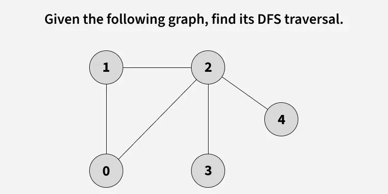
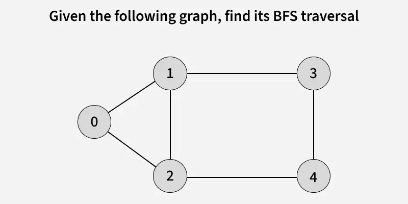
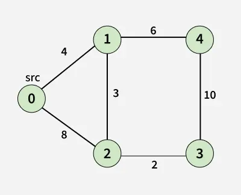
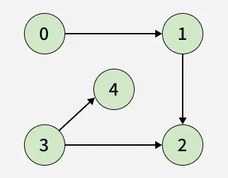

# Graph Algorithms

**Graph Algorithms** are algorithms designed to solve problems on graphs. They are fundamental in computer science and used in many real-world applications like social networks, routing, scheduling, and more.

**Note:** Basic graph concepts and representations are covered in [Graph Data Structure](./../DataStructures/07-Graph.md). This file focuses on graph algorithms.

### Graph Traversal Algorithms

#### 1. Depth-First Search (DFS)

Explore as far as possible along each branch before backtracking.



> **Image Credit:** [GeeksforGeeks - Depth First Search or DFS for a Graph](https://www.geeksforgeeks.org/depth-first-search-or-dfs-for-a-graph/)

```cpp
#include <iostream>
#include <vector>
#include <list>
using namespace std;

class Graph {
private:
    int V;
    vector<list<int>> adj;
    
    void DFSUtil(int v, vector<bool>& visited) {
        visited[v] = true;
        cout << v << " ";
        
        for (int u : adj[v]) {
            if (!visited[u]) {
                DFSUtil(u, visited);
            }
        }
    }
    
public:
    Graph(int V) : V(V) {
        adj.resize(V);
    }
    
    void addEdge(int u, int v) {
        adj[u].push_back(v);
        adj[v].push_back(u); // For undirected graph
    }
    
    void DFS(int start) {
        vector<bool> visited(V, false);
        DFSUtil(start, visited);
        cout << endl;
    }
    
    void DFSAll() {
        vector<bool> visited(V, false);
        for (int i = 0; i < V; i++) {
            if (!visited[i]) {
                DFSUtil(i, visited);
            }
        }
        cout << endl;
    }
};

int main() {
    Graph g(5);
    g.addEdge(0, 1);
    g.addEdge(0, 2);
    g.addEdge(1, 3);
    g.addEdge(2, 4);
    
    cout << "DFS starting from 0: ";
    g.DFS(0);
    
    return 0;
}
```

**Time Complexity:** O(V + E)  
**Space Complexity:** O(V) for recursion stack

#### 2. Breadth-First Search (BFS)

Explore all neighbors at current depth before moving to next level.



> **Image Credit:** [GeeksforGeeks - Breadth First Search or BFS for a Graph](https://www.geeksforgeeks.org/breadth-first-search-or-bfs-for-a-graph/)

```cpp
#include <iostream>
#include <vector>
#include <list>
#include <queue>
using namespace std;

class Graph {
private:
    int V;
    vector<list<int>> adj;
    
public:
    Graph(int V) : V(V) {
        adj.resize(V);
    }
    
    void addEdge(int u, int v) {
        adj[u].push_back(v);
        adj[v].push_back(u);
    }
    
    void BFS(int start) {
        vector<bool> visited(V, false);
        queue<int> q;
        
        visited[start] = true;
        q.push(start);
        
        while (!q.empty()) {
            int v = q.front();
            q.pop();
            cout << v << " ";
            
            for (int u : adj[v]) {
                if (!visited[u]) {
                    visited[u] = true;
                    q.push(u);
                }
            }
        }
        cout << endl;
    }
};

int main() {
    Graph g(5);
    g.addEdge(0, 1);
    g.addEdge(0, 2);
    g.addEdge(1, 3);
    g.addEdge(2, 4);
    
    cout << "BFS starting from 0: ";
    g.BFS(0);
    
    return 0;
}
```

**Time Complexity:** O(V + E)  
**Space Complexity:** O(V) for queue

### Shortest Path Algorithms

#### 1. Dijkstra's Algorithm

Find shortest path from source to all vertices (non-negative weights).



> **Image Credit:** [GeeksforGeeks - Dijkstra's Shortest Path Algorithm](https://www.geeksforgeeks.org/dijkstras-shortest-path-algorithm-greedy-algo-7/)

```cpp
#include <iostream>
#include <vector>
#include <queue>
#include <climits>
using namespace std;

vector<int> dijkstra(vector<vector<pair<int, int>>>& graph, int src) {
    int V = graph.size();
    vector<int> dist(V, INT_MAX);
    dist[src] = 0;
    
    priority_queue<pair<int, int>, vector<pair<int, int>>, 
                   greater<pair<int, int>>> pq;
    pq.push({0, src});
    
    while (!pq.empty()) {
        int u = pq.top().second;
        int d = pq.top().first;
        pq.pop();
        
        if (d > dist[u]) continue;
        
        for (auto& edge : graph[u]) {
            int v = edge.first;
            int weight = edge.second;
            
            if (dist[u] + weight < dist[v]) {
                dist[v] = dist[u] + weight;
                pq.push({dist[v], v});
            }
        }
    }
    
    return dist;
}

int main() {
    int V = 5;
    vector<vector<pair<int, int>>> graph(V);
    
    graph[0].push_back({1, 4});
    graph[0].push_back({2, 1});
    graph[1].push_back({3, 1});
    graph[2].push_back({1, 2});
    graph[2].push_back({3, 5});
    graph[3].push_back({4, 3});
    
    vector<int> dist = dijkstra(graph, 0);
    
    for (int i = 0; i < V; i++) {
        cout << "Distance to " << i << ": " << dist[i] << endl;
    }
    
    return 0;
}
```

**Time Complexity:** O((V + E) log V) with priority queue  
**Space Complexity:** O(V)

#### 2. Bellman-Ford Algorithm

Find shortest path (handles negative weights, detects negative cycles).

```cpp
#include <iostream>
#include <vector>
#include <climits>
using namespace std;

struct Edge {
    int src, dest, weight;
    Edge(int s, int d, int w) : src(s), dest(d), weight(w) {}
};

vector<int> bellmanFord(vector<Edge>& edges, int V, int src) {
    vector<int> dist(V, INT_MAX);
    dist[src] = 0;
    
    // Relax edges V-1 times
    for (int i = 0; i < V - 1; i++) {
        for (Edge& edge : edges) {
            if (dist[edge.src] != INT_MAX && 
                dist[edge.src] + edge.weight < dist[edge.dest]) {
                dist[edge.dest] = dist[edge.src] + edge.weight;
            }
        }
    }
    
    // Check for negative cycles
    for (Edge& edge : edges) {
        if (dist[edge.src] != INT_MAX && 
            dist[edge.src] + edge.weight < dist[edge.dest]) {
            cout << "Negative cycle detected!" << endl;
            return {};
        }
    }
    
    return dist;
}
```

**Time Complexity:** O(V × E)  
**Space Complexity:** O(V)

#### 3. Floyd-Warshall Algorithm

Find shortest paths between all pairs of vertices.

```cpp
#include <iostream>
#include <vector>
#include <climits>
using namespace std;

vector<vector<int>> floydWarshall(vector<vector<int>>& graph) {
    int V = graph.size();
    vector<vector<int>> dist = graph;
    
    for (int k = 0; k < V; k++) {
        for (int i = 0; i < V; i++) {
            for (int j = 0; j < V; j++) {
                if (dist[i][k] != INT_MAX && dist[k][j] != INT_MAX) {
                    dist[i][j] = min(dist[i][j], dist[i][k] + dist[k][j]);
                }
            }
        }
    }
    
    return dist;
}
```

**Time Complexity:** O(V³)  
**Space Complexity:** O(V²)

### Minimum Spanning Tree Algorithms

#### 1. Kruskal's Algorithm (Greedy)

```cpp
// See Greedy Algorithms section for implementation
```

#### 2. Prim's Algorithm (Greedy)

```cpp
#include <iostream>
#include <vector>
#include <queue>
#include <climits>
using namespace std;

int primMST(vector<vector<pair<int, int>>>& graph) {
    int V = graph.size();
    vector<bool> inMST(V, false);
    vector<int> key(V, INT_MAX);
    key[0] = 0;
    
    priority_queue<pair<int, int>, vector<pair<int, int>>, 
                   greater<pair<int, int>>> pq;
    pq.push({0, 0});
    
    int mstWeight = 0;
    
    while (!pq.empty()) {
        int u = pq.top().second;
        pq.pop();
        
        if (inMST[u]) continue;
        
        inMST[u] = true;
        mstWeight += key[u];
        
        for (auto& edge : graph[u]) {
            int v = edge.first;
            int weight = edge.second;
            
            if (!inMST[v] && weight < key[v]) {
                key[v] = weight;
                pq.push({key[v], v});
            }
        }
    }
    
    return mstWeight;
}
```

**Time Complexity:** O((V + E) log V)  
**Space Complexity:** O(V)

### Topological Sorting

Order vertices such that for every edge (u, v), u comes before v.



> **Image Credit:** [GeeksforGeeks - Topological Sorting](https://www.geeksforgeeks.org/topological-sorting/)

```cpp
#include <iostream>
#include <vector>
#include <list>
#include <stack>
using namespace std;

class Graph {
private:
    int V;
    vector<list<int>> adj;
    
    void topologicalSortUtil(int v, vector<bool>& visited, stack<int>& st) {
        visited[v] = true;
        
        for (int u : adj[v]) {
            if (!visited[u]) {
                topologicalSortUtil(u, visited, st);
            }
        }
        
        st.push(v);
    }
    
public:
    Graph(int V) : V(V) {
        adj.resize(V);
    }
    
    void addEdge(int u, int v) {
        adj[u].push_back(v); // Directed edge
    }
    
    vector<int> topologicalSort() {
        vector<bool> visited(V, false);
        stack<int> st;
        
        for (int i = 0; i < V; i++) {
            if (!visited[i]) {
                topologicalSortUtil(i, visited, st);
            }
        }
        
        vector<int> result;
        while (!st.empty()) {
            result.push_back(st.top());
            st.pop();
        }
        
        return result;
    }
};
```

**Time Complexity:** O(V + E)  
**Space Complexity:** O(V)

### Cycle Detection

#### 1. Detect Cycle in Undirected Graph (DFS)

```cpp
bool hasCycleDFS(vector<vector<int>>& graph, int v, int parent, 
                 vector<bool>& visited) {
    visited[v] = true;
    
    for (int u : graph[v]) {
        if (!visited[u]) {
            if (hasCycleDFS(graph, u, v, visited)) {
                return true;
            }
        }
        else if (u != parent) {
            return true; // Back edge found
        }
    }
    
    return false;
}

bool hasCycle(vector<vector<int>>& graph) {
    int V = graph.size();
    vector<bool> visited(V, false);
    
    for (int i = 0; i < V; i++) {
        if (!visited[i]) {
            if (hasCycleDFS(graph, i, -1, visited)) {
                return true;
            }
        }
    }
    
    return false;
}
```

#### 2. Detect Cycle in Directed Graph (DFS)

```cpp
bool hasCycleDFS(vector<vector<int>>& graph, int v, 
                 vector<bool>& visited, vector<bool>& recStack) {
    visited[v] = true;
    recStack[v] = true;
    
    for (int u : graph[v]) {
        if (!visited[u]) {
            if (hasCycleDFS(graph, u, visited, recStack)) {
                return true;
            }
        }
        else if (recStack[u]) {
            return true; // Back edge in recursion stack
        }
    }
    
    recStack[v] = false;
    return false;
}

bool hasCycle(vector<vector<int>>& graph) {
    int V = graph.size();
    vector<bool> visited(V, false);
    vector<bool> recStack(V, false);
    
    for (int i = 0; i < V; i++) {
        if (!visited[i]) {
            if (hasCycleDFS(graph, i, visited, recStack)) {
                return true;
            }
        }
    }
    
    return false;
}
```

### Strongly Connected Components (SCC)

#### Kosaraju's Algorithm

```cpp
#include <iostream>
#include <vector>
#include <list>
#include <stack>
using namespace std;

class Graph {
private:
    int V;
    vector<list<int>> adj;
    
    void fillOrder(int v, vector<bool>& visited, stack<int>& st) {
        visited[v] = true;
        for (int u : adj[v]) {
            if (!visited[u]) {
                fillOrder(u, visited, st);
            }
        }
        st.push(v);
    }
    
    void DFSUtil(int v, vector<bool>& visited) {
        visited[v] = true;
        cout << v << " ";
        
        for (int u : adj[v]) {
            if (!visited[u]) {
                DFSUtil(u, visited);
            }
        }
    }
    
    Graph getTranspose() {
        Graph g(V);
        for (int v = 0; v < V; v++) {
            for (int u : adj[v]) {
                g.adj[u].push_back(v);
            }
        }
        return g;
    }
    
public:
    Graph(int V) : V(V) {
        adj.resize(V);
    }
    
    void addEdge(int u, int v) {
        adj[u].push_back(v);
    }
    
    void printSCCs() {
        stack<int> st;
        vector<bool> visited(V, false);
        
        // Fill vertices in stack according to finishing times
        for (int i = 0; i < V; i++) {
            if (!visited[i]) {
                fillOrder(i, visited, st);
            }
        }
        
        // Get transpose graph
        Graph transposed = getTranspose();
        
        // Process vertices in order defined by stack
        fill(visited.begin(), visited.end(), false);
        
        while (!st.empty()) {
            int v = st.top();
            st.pop();
            
            if (!visited[v]) {
                transposed.DFSUtil(v, visited);
                cout << endl;
            }
        }
    }
};
```

**Time Complexity:** O(V + E)  
**Space Complexity:** O(V)

### Common Graph Algorithm Problems (Striver's A2Z - 54 Problems)

#### Traversal:
1. DFS
2. BFS
3. Number of Islands
4. Flood Fill
5. Clone Graph

#### Shortest Path:
6. Dijkstra's Algorithm
7. Bellman-Ford
8. Floyd-Warshall
9. Shortest Path in Binary Matrix
10. Network Delay Time

#### MST:
11. Kruskal's Algorithm
12. Prim's Algorithm
13. Connecting Cities with Minimum Cost

#### Topological Sort:
14. Course Schedule
15. Alien Dictionary
16. Sequence Reconstruction

#### Cycle Detection:
17. Detect Cycle (Undirected)
18. Detect Cycle (Directed)
19. Course Schedule II

#### Strongly Connected Components:
20. Kosaraju's Algorithm
21. Tarjan's Algorithm
22. Number of Provinces

### Time Complexity Summary

| Algorithm | Time Complexity |
|-----------|----------------|
| DFS/BFS | O(V + E) |
| Dijkstra | O((V + E) log V) |
| Bellman-Ford | O(V × E) |
| Floyd-Warshall | O(V³) |
| Kruskal's MST | O(E log E) |
| Prim's MST | O((V + E) log V) |
| Topological Sort | O(V + E) |
| Cycle Detection | O(V + E) |
| Kosaraju's SCC | O(V + E) |

### Space Complexity

- **Space Complexity:** O(V) to O(V²) depending on algorithm
- **Auxiliary Space:** O(V) for visited arrays, queues, stacks

### Applications of Graph Algorithms

1. **Social Networks:** Friend suggestions, network analysis
2. **Routing:** GPS navigation, network routing
3. **Scheduling:** Task scheduling, resource allocation
4. **Web Crawling:** Search engines
5. **Compiler Design:** Dependency resolution
6. **Game Development:** Pathfinding, AI

### References

- [GeeksforGeeks - Graph Algorithms](https://www.geeksforgeeks.org/graph-data-structure-and-algorithms/)
- [GeeksforGeeks - DFS](https://www.geeksforgeeks.org/depth-first-search-or-dfs-for-a-graph/)
- [GeeksforGeeks - BFS](https://www.geeksforgeeks.org/breadth-first-search-or-bfs-for-a-graph/)
- [GeeksforGeeks - Dijkstra's Algorithm](https://www.geeksforgeeks.org/dijkstras-shortest-path-algorithm-greedy-algo-7/)
