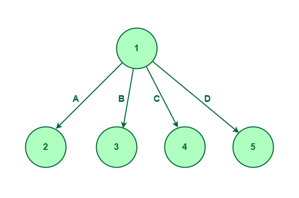
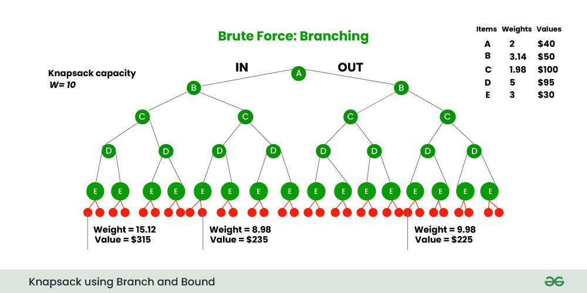

# Branch and Bound

**Branch and Bound** is an algorithmic technique for solving optimization problems by systematically exploring the solution space. It's similar to backtracking but uses bounds to prune branches that cannot lead to optimal solutions.

**Optimization Strategy:** Branch and Bound works by dividing the problem into subproblems (branching), calculating bounds for each subproblem, and eliminating branches that cannot improve the current best solution (pruning). This technique is particularly effective for integer programming, traveling salesman problem, and knapsack problems, as it avoids exploring the entire solution space.



> **Image Credit:** [GeeksforGeeks - Introduction to Branch and Bound](https://www.geeksforgeeks.org/introduction-to-branch-and-bound-data-structures-and-algorithms-tutorial/)



> **Image Credit:** [GeeksforGeeks - 0/1 Knapsack using Branch and Bound](https://www.geeksforgeeks.org/0-1-knapsack-using-branch-and-bound/)

**Key Concepts:**
- **Branching:** Divide problem into subproblems
- **Bounding:** Calculate bounds (upper/lower) for subproblems
- **Pruning:** Eliminate subproblems that cannot improve current best
- **Search Tree:** Explore solution space as a tree

**When to Use:**
- Optimization problems
- Integer programming
- Combinatorial optimization
- Problems with constraints

### Branch and Bound Template

```cpp
struct Node {
    // State information
    int level;
    int bound;
    // ... other state variables
};

int branchAndBound(problem) {
    priority_queue<Node> pq; // Best-first search
    int bestValue = INT_MIN; // For maximization
    
    Node root = createRootNode();
    pq.push(root);
    
    while (!pq.empty()) {
        Node current = pq.top();
        pq.pop();
        
        // Prune if bound is worse than best
        if (current.bound < bestValue) continue;
        
        // Check if leaf node (solution)
        if (isLeaf(current)) {
            bestValue = max(bestValue, evaluate(current));
            continue;
        }
        
        // Branch: create child nodes
        vector<Node> children = branch(current);
        
        for (Node child : children) {
            child.bound = calculateBound(child);
            
            // Only add if bound is promising
            if (child.bound >= bestValue) {
                pq.push(child);
            }
        }
    }
    
    return bestValue;
}
```

### Branch and Bound Examples

#### 1. 0/1 Knapsack Problem

Maximize value in knapsack with weight constraint.

```cpp
#include <iostream>
#include <vector>
#include <algorithm>
#include <queue>
using namespace std;

struct Item {
    int weight, value;
    double ratio;
    
    Item(int w, int v) : weight(w), value(v) {
        ratio = (double)v / w;
    }
};

struct Node {
    int level;
    int profit;
    int weight;
    double bound;
    
    bool operator<(const Node& other) const {
        return bound < other.bound; // Max heap (larger bound first)
    }
};

double calculateBound(Node u, int n, int capacity, vector<Item>& items) {
    if (u.weight >= capacity) return 0;
    
    double bound = u.profit;
    int j = u.level + 1;
    int totalWeight = u.weight;
    
    // Greedy: add items with best value/weight ratio
    while (j < n && totalWeight + items[j].weight <= capacity) {
        totalWeight += items[j].weight;
        bound += items[j].value;
        j++;
    }
    
    // Add fraction of next item if space remains
    if (j < n) {
        bound += (capacity - totalWeight) * items[j].ratio;
    }
    
    return bound;
}

int knapsackBranchBound(vector<Item>& items, int capacity) {
    int n = items.size();
    
    // Sort by value/weight ratio (descending)
    sort(items.begin(), items.end(), 
         [](Item a, Item b) { return a.ratio > b.ratio; });
    
    priority_queue<Node> pq;
    Node u, v;
    
    u.level = -1;
    u.profit = 0;
    u.weight = 0;
    u.bound = calculateBound(u, n, capacity, items);
    
    pq.push(u);
    int maxProfit = 0;
    
    while (!pq.empty()) {
        u = pq.top();
        pq.pop();
        
        if (u.bound > maxProfit && u.level < n - 1) {
            // Include next item
            v.level = u.level + 1;
            v.weight = u.weight + items[v.level].weight;
            v.profit = u.profit + items[v.level].value;
            
            if (v.weight <= capacity && v.profit > maxProfit) {
                maxProfit = v.profit;
            }
            
            v.bound = calculateBound(v, n, capacity, items);
            if (v.bound > maxProfit) {
                pq.push(v);
            }
            
            // Exclude next item
            v.weight = u.weight;
            v.profit = u.profit;
            v.bound = calculateBound(v, n, capacity, items);
            if (v.bound > maxProfit) {
                pq.push(v);
            }
        }
    }
    
    return maxProfit;
}
```

**Time Complexity:** O(2^n) worst case, but pruning reduces it significantly  
**Space Complexity:** O(n)

#### 2. Traveling Salesman Problem (TSP)

Find shortest route visiting all cities exactly once.

```cpp
#include <iostream>
#include <vector>
#include <climits>
#include <queue>
using namespace std;

struct Node {
    vector<int> path;
    int cost;
    int bound;
    int level;
    
    bool operator<(const Node& other) const {
        return bound > other.bound; // Min heap
    }
};

int calculateBound(Node node, vector<vector<int>>& graph) {
    // Simplified bound calculation
    // In practice, use more sophisticated bounding
    return node.cost;
}

int tspBranchBound(vector<vector<int>>& graph) {
    int n = graph.size();
    int minCost = INT_MAX;
    
    priority_queue<Node> pq;
    Node root;
    root.path = {0};
    root.cost = 0;
    root.level = 0;
    root.bound = calculateBound(root, graph);
    pq.push(root);
    
    while (!pq.empty()) {
        Node current = pq.top();
        pq.pop();
        
        if (current.bound >= minCost) continue;
        
        if (current.level == n - 1) {
            // Complete path
            int totalCost = current.cost + graph[current.path.back()][0];
            minCost = min(minCost, totalCost);
            continue;
        }
        
        int lastCity = current.path.back();
        for (int i = 0; i < n; i++) {
            bool visited = false;
            for (int city : current.path) {
                if (city == i) {
                    visited = true;
                    break;
                }
            }
            
            if (!visited) {
                Node child = current;
                child.path.push_back(i);
                child.cost += graph[lastCity][i];
                child.level++;
                child.bound = calculateBound(child, graph);
                
                if (child.bound < minCost) {
                    pq.push(child);
                }
            }
        }
    }
    
    return minCost;
}
```

### Branch and Bound vs Backtracking

| Feature | Branch and Bound | Backtracking |
|---------|------------------|--------------|
| **Purpose** | Optimization | Constraint satisfaction |
| **Bounds** | Uses bounds to prune | Uses constraints to prune |
| **Search** | Best-first (priority queue) | Depth-first (stack) |
| **Optimal** | Finds optimal solution | Finds all solutions |

### Advantages of Branch and Bound

1. **Optimal solution** - Guarantees optimal answer
2. **Pruning** - Eliminates unpromising branches early
3. **Systematic** - Explores solution space systematically
4. **Flexible** - Can use different bounding functions

### Disadvantages of Branch and Bound

1. **Complex** - Harder to implement than backtracking
2. **Memory intensive** - May store many nodes
3. **Bounding function** - Quality of bound affects performance
4. **Still exponential** - Worst case is still exponential

### When to Use Branch and Bound?

✅ **Use Branch & Bound when:**
- Need optimal solution
- Problem has good bounding function
- Optimization problem
- Can prune effectively

❌ **Don't use Branch & Bound when:**
- Simple greedy/DP solution exists
- Problem size is very large
- Bounding function is weak
- Need all solutions (use backtracking)

### Applications

1. **0/1 Knapsack** - Resource allocation
2. **Traveling Salesman** - Route optimization
3. **Assignment Problem** - Job assignment
4. **Integer Programming** - Optimization with integer constraints

### References

- [GeeksforGeeks - Branch and Bound](https://www.geeksforgeeks.org/branch-and-bound-algorithm/)
