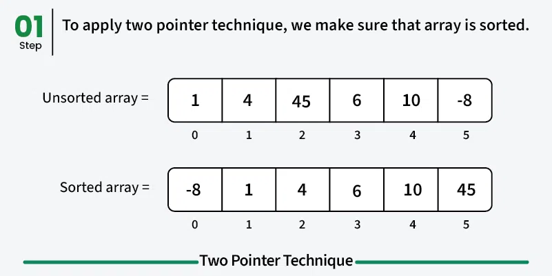

### Two Pointer Algorithm

In many problems involving arrays, we have to analyze each element of the array compared to its other elements.



> **Image Credit:** [GeeksforGeeks - Two Pointers Technique](https://www.geeksforgeeks.org/two-pointers-technique/)

**The Two Pointer Technique** is an efficient approach for solving array and string problems by using two pointers that traverse the data structure in a coordinated manner. This technique reduces time complexity from O(n²) to O(n) in many cases.     

*To solve problems like these we usually start from the first index and loop through the array one or more times depending on our implementation. Sometimes, we also have to create a temporary array depending on our problem's requirements.*    

**The above approach might give us the correct result, but it likely won't give us the most *space- and time-efficient solution*.**    

*As a result, it is often good to consider whether our problem can be solved efficiently by using the two-pointers approach.*    

In the two-pointer approach, pointers refer to an array's indexes. By using pointers, we can process two elements per loop, instead of just one.     

**Common patterns in the two-pointer approach involve:**
- *Two pointers each starting from the beginning and the end until they both meet*
- *One pointer moves at a slow pace while the other pointer moves at a faster pace*  

Both of the above patterns can help us to reduce the time and space complexity of our problems as we get the expected result in fewer iterations and without using too much additional space.    

*Let's See Some Above Explanation using Example*

**Sum Exists in an Array :** *Problem: Given a sorted array of integers, we need to see if there are two numbers in it such that their sum is equal to a specific value.*

For example, if our input array is [1, 1, 2, 3, 4, 6, 8, 9] and the target value is 11, then our method should return true. However, if the target value is 20, it should return false.    

*Let's first see a naive solution:*    

```cpp
public boolean twoSumSlow(int[] input, int targetValue) {

    for (int i = 0; i < input.length; i++) {
        for (int j = 1; j < input.length; j++) {
            if (input[i] + input[j] == targetValue) {
                return true;
            }
        }
    }
    return false;
}
```    

In the above solution, we looped over the input array twice to get all possible combinations. We checked the combination sum against the target value and returned true if it matches. **The time complexity of this solution is $O(n^2)$**.    

Now let’s see how can we apply the two-pointer technique here:    

```cpp
public boolean twoSum(int[] input, int targetValue) {

    int pointerOne = 0;
    int pointerTwo = input.length - 1;

    while (pointerOne < pointerTwo) {
        int sum = input[pointerOne] + input[pointerTwo];

        if (sum == targetValue) {
            return true;
        } else if (sum < targetValue) {
            pointerOne++;
        } else {
            pointerTwo--;
        }
    }

    return false;
}
```   

Since the array is already sorted, we can use two pointers. One pointer starts from the beginning of the array, and the other pointer begins from the end of the array, and then we add the values at these pointers. If the sum of the values is less than the target value, we increment the left pointer, and if the sum is higher than the target value, we decrement the right pointer.    

We keep moving these pointers until we get the sum that matches the target value or we have reached the middle of the array, and no combinations have been found. **The time complexity of this solution is O(n) and space complexity is O(1)**, a significant improvement over our first implementation.     

[For More Implementation like this see this blog post on Baeldung](https://www.baeldung.com/java-two-pointer-technique)      

**More Details on this Topic:**
> [Medium Article by Andre Ye on Two Pointer Technique -- for concept](https://medium.com/swlh/two-pointer-technique-solving-array-problems-at-light-speed-56a77ee83d16)    
> [Medium Article by Gerrett Bodley on Two Pointers Technique -- for concept](https://medium.com/geekculture/intro-to-algorithms-two-pointers-technique-b37f962eab5)    
> [Two Pointer by Algodaily -- for concept](https://algodaily.com/lessons/using-the-two-pointer-technique)    
> [Two Pointer by GFG -- for implementation](https://www.geeksforgeeks.org/two-pointers-technique/)    
> [Medium Article by Amanda Treutler on Two Pointer Technique -- for implementation](https://levelup.gitconnected.com/using-the-multiple-pointers-strategy-to-solve-algorithms-b90a98f854db)    

*Use [12ft.io](https://12ft.io/) and this [medium article](https://famzil.medium.com/you-have-2-free-stories-left-this-month-f5a11095d4b9) on your desktop browser if you're experiencing trouble with the member-only article.*