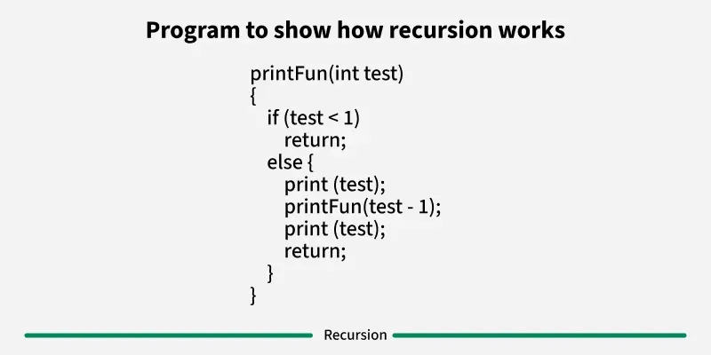
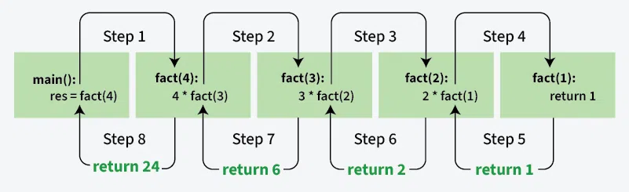

### Recursion Algorithm

**Recursion** is a programming technique where a function calls itself directly or indirectly to solve a problem. It's a powerful method for solving problems that can be broken down into smaller, similar subproblems.





> **Image Credit:** [GeeksforGeeks - Introduction to Recursion](https://www.geeksforgeeks.org/introduction-to-recursion-data-structure-and-algorithm-tutorials/)

**Key Properties:**
- Function calls itself
- Has a base case (stopping condition)
- Recursive case reduces problem size
- Each recursive call works on a smaller instance

**Recursion vs Iteration:**
- Recursion: More elegant, easier to understand for some problems
- Iteration: More efficient (no function call overhead), uses less memory

### Recursion Structure

```cpp
returnType function(parameters) {
    // Base case: stopping condition
    if (baseCondition) {
        return baseValue;
    }
    
    // Recursive case: reduce problem size
    return function(modifiedParameters);
}
```

### Basic Recursion Examples

#### 1. Factorial

```cpp
#include <iostream>
using namespace std;

int factorial(int n) {
    // Base case
    if (n == 0 || n == 1) {
        return 1;
    }
    
    // Recursive case
    return n * factorial(n - 1);
}

int main() {
    int n = 5;
    cout << "Factorial of " << n << " = " << factorial(n) << endl;
    return 0;
}
```

**Time Complexity:** O(n)  
**Space Complexity:** O(n) for recursion stack

#### 2. Fibonacci Sequence

```cpp
#include <iostream>
using namespace std;

int fibonacci(int n) {
    // Base cases
    if (n == 0) return 0;
    if (n == 1) return 1;
    
    // Recursive case
    return fibonacci(n - 1) + fibonacci(n - 2);
}

int main() {
    int n = 7;
    cout << "Fibonacci(" << n << ") = " << fibonacci(n) << endl;
    return 0;
}
```

**Time Complexity:** O(2^n) - exponential (inefficient)  
**Space Complexity:** O(n)

**Optimized with Memoization:**

```cpp
#include <iostream>
#include <vector>
using namespace std;

int fibonacciMemo(int n, vector<int>& memo) {
    if (n == 0) return 0;
    if (n == 1) return 1;
    
    if (memo[n] != -1) {
        return memo[n];
    }
    
    memo[n] = fibonacciMemo(n - 1, memo) + fibonacciMemo(n - 2, memo);
    return memo[n];
}

int fibonacci(int n) {
    vector<int> memo(n + 1, -1);
    return fibonacciMemo(n, memo);
}
```

**Time Complexity:** O(n)  
**Space Complexity:** O(n)

#### 3. Sum of Array Elements

```cpp
#include <iostream>
#include <vector>
using namespace std;

int sumArray(vector<int>& arr, int index) {
    // Base case
    if (index == arr.size()) {
        return 0;
    }
    
    // Recursive case
    return arr[index] + sumArray(arr, index + 1);
}

int main() {
    vector<int> arr = {1, 2, 3, 4, 5};
    cout << "Sum = " << sumArray(arr, 0) << endl;
    return 0;
}
```

**Time Complexity:** O(n)  
**Space Complexity:** O(n)

### Recursion Patterns (Striver's A2Z Style)

#### Pattern 1: Print Something N Times

```cpp
void printNTimes(int n) {
    if (n == 0) return; // Base case
    
    cout << "Hello" << endl;
    printNTimes(n - 1); // Recursive call
}
```

#### Pattern 2: Print 1 to N

```cpp
void print1ToN(int n) {
    if (n == 0) return; // Base case
    
    print1ToN(n - 1); // Print smaller first
    cout << n << " ";  // Then print current
}

void printNTo1(int n) {
    if (n == 0) return; // Base case
    
    cout << n << " ";  // Print current first
    printNTo1(n - 1);  // Then print smaller
}
```

#### Pattern 3: Sum of First N Numbers

```cpp
int sumFirstN(int n) {
    if (n == 0) return 0; // Base case
    
    return n + sumFirstN(n - 1); // Recursive case
}
```

#### Pattern 4: Reverse an Array

```cpp
#include <iostream>
#include <vector>
using namespace std;

void reverseArray(vector<int>& arr, int left, int right) {
    if (left >= right) return; // Base case
    
    // Swap
    swap(arr[left], arr[right]);
    
    // Recursive call
    reverseArray(arr, left + 1, right - 1);
}

int main() {
    vector<int> arr = {1, 2, 3, 4, 5};
    reverseArray(arr, 0, arr.size() - 1);
    
    for (int x : arr) {
        cout << x << " ";
    }
    cout << endl;
    return 0;
}
```

#### Pattern 5: Check if String is Palindrome

```cpp
#include <iostream>
#include <string>
using namespace std;

bool isPalindrome(string s, int left, int right) {
    if (left >= right) return true; // Base case
    
    if (s[left] != s[right]) return false;
    
    return isPalindrome(s, left + 1, right - 1);
}

int main() {
    string s = "racecar";
    cout << (isPalindrome(s, 0, s.length() - 1) ? "Yes" : "No") << endl;
    return 0;
}
```

#### Pattern 6: Power of a Number

```cpp
#include <iostream>
using namespace std;

double power(double x, int n) {
    if (n == 0) return 1; // Base case
    
    if (n < 0) {
        x = 1 / x;
        n = -n;
    }
    
    double half = power(x, n / 2);
    
    if (n % 2 == 0) {
        return half * half;
    }
    else {
        return x * half * half;
    }
}

int main() {
    cout << "2^10 = " << power(2, 10) << endl;
    return 0;
}
```

**Time Complexity:** O(log n)

#### Pattern 7: Count Digits

```cpp
int countDigits(int n) {
    if (n == 0) return 0; // Base case
    
    return 1 + countDigits(n / 10);
}
```

#### Pattern 8: Generate All Subsets

```cpp
#include <iostream>
#include <vector>
using namespace std;

void generateSubsets(vector<int>& arr, vector<int>& subset, int index) {
    // Base case: print current subset
    if (index == arr.size()) {
        for (int x : subset) {
            cout << x << " ";
        }
        cout << endl;
        return;
    }
    
    // Don't include current element
    generateSubsets(arr, subset, index + 1);
    
    // Include current element
    subset.push_back(arr[index]);
    generateSubsets(arr, subset, index + 1);
    subset.pop_back(); // Backtrack
}

int main() {
    vector<int> arr = {1, 2, 3};
    vector<int> subset;
    generateSubsets(arr, subset, 0);
    return 0;
}
```

**Time Complexity:** O(2^n)  
**Space Complexity:** O(n)

#### Pattern 9: Tower of Hanoi

```cpp
#include <iostream>
using namespace std;

void towerOfHanoi(int n, char from, char to, char aux) {
    if (n == 1) {
        cout << "Move disk 1 from " << from << " to " << to << endl;
        return;
    }
    
    // Move n-1 disks from 'from' to 'aux' using 'to'
    towerOfHanoi(n - 1, from, aux, to);
    
    // Move nth disk from 'from' to 'to'
    cout << "Move disk " << n << " from " << from << " to " << to << endl;
    
    // Move n-1 disks from 'aux' to 'to' using 'from'
    towerOfHanoi(n - 1, aux, to, from);
}

int main() {
    int n = 3;
    towerOfHanoi(n, 'A', 'C', 'B');
    return 0;
}
```

**Time Complexity:** O(2^n)  
**Space Complexity:** O(n)

#### Pattern 10: Permutations of Array

```cpp
#include <iostream>
#include <vector>
using namespace std;

void permute(vector<int>& arr, int index) {
    if (index == arr.size()) {
        // Print permutation
        for (int x : arr) {
            cout << x << " ";
        }
        cout << endl;
        return;
    }
    
    for (int i = index; i < arr.size(); i++) {
        swap(arr[index], arr[i]);
        permute(arr, index + 1);
        swap(arr[index], arr[i]); // Backtrack
    }
}

int main() {
    vector<int> arr = {1, 2, 3};
    permute(arr, 0);
    return 0;
}
```

**Time Complexity:** O(n! × n)  
**Space Complexity:** O(n)

### Types of Recursion

#### 1. Direct Recursion
Function calls itself directly.

```cpp
int factorial(int n) {
    if (n <= 1) return 1;
    return n * factorial(n - 1); // Direct call
}
```

#### 2. Indirect Recursion
Function calls another function which calls the original.

```cpp
void functionA(int n) {
    if (n > 0) {
        cout << n << " ";
        functionB(n - 1); // Calls functionB
    }
}

void functionB(int n) {
    if (n > 1) {
        cout << n << " ";
        functionA(n / 2); // Calls functionA
    }
}
```

#### 3. Tail Recursion
Recursive call is the last statement.

```cpp
void printNTo1(int n) {
    if (n == 0) return;
    cout << n << " ";
    printNTo1(n - 1); // Last statement - tail recursion
}
```

#### 4. Head Recursion
Recursive call is before processing.

```cpp
void print1ToN(int n) {
    if (n == 0) return;
    print1ToN(n - 1); // Before processing - head recursion
    cout << n << " ";
}
```

### Recursion Tree Visualization

For `factorial(4)`:

```
factorial(4)
    └── 4 * factorial(3)
            └── 3 * factorial(2)
                    └── 2 * factorial(1)
                            └── 1 (base case)
```

### Advantages of Recursion

1. **Elegant code** - Cleaner and more readable
2. **Natural for tree/graph problems** - Fits naturally
3. **Divide and conquer** - Breaks problem into subproblems
4. **Less code** - Often shorter than iterative solution

### Disadvantages of Recursion

1. **Memory overhead** - Uses call stack
2. **Slower** - Function call overhead
3. **Stack overflow** - Deep recursion can cause stack overflow
4. **Hard to debug** - Complex call stack

### When to Use Recursion?

✅ **Use Recursion when:**
- Problem has recursive structure
- Tree/graph traversal
- Divide and conquer problems
- Backtracking problems
- Code clarity is important

❌ **Don't use Recursion when:**
- Performance is critical
- Deep recursion (risk of stack overflow)
- Simple iterative solution exists
- Memory is limited

### Time Complexity

| Problem | Time Complexity |
|---------|----------------|
| Factorial | O(n) |
| Fibonacci (naive) | O(2^n) |
| Fibonacci (memoized) | O(n) |
| Power | O(log n) |
| Subsets | O(2^n) |
| Permutations | O(n!) |
| Tower of Hanoi | O(2^n) |

### Space Complexity

- **Space Complexity:** O(n) for recursion stack (typically)
- **Auxiliary Space:** O(1) to O(n) depending on problem

### Common Recursion Problems (Striver's A2Z)

1. Print Name N times
2. Print 1 to N
3. Print N to 1
4. Sum of first N numbers
5. Factorial of N
6. Reverse an array
7. Check if string is palindrome
8. Fibonacci number
9. Count digits
10. Power of a number
11. Generate all subsets
12. Generate all permutations
13. Combination sum
14. N-Queens problem
15. Sudoku solver
16. Rat in a maze
17. Word break
18. Palindrome partitioning
19. Subset sum
20. Generate parentheses

### References

- [GeeksforGeeks - Recursion](https://www.geeksforgeeks.org/introduction-to-recursion-data-structure-and-algorithm-tutorials/)
- [GeeksforGeeks - Recursion Practice Problems](https://www.geeksforgeeks.org/recursion-practice-problems-solutions/)
