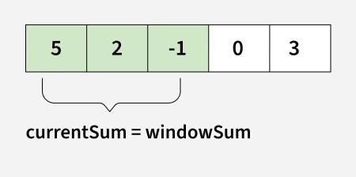

### Utility Techniques and Algorithms

**Utility Techniques** are common algorithmic techniques and patterns used to solve various problems efficiently. These include sliding window, prefix sum, two pointers, and other useful approaches.

### 1. Window Sliding Technique

**Sliding Window** is a technique for solving problems involving arrays/strings by maintaining a window that slides through the array.



> **Image Credit:** [GeeksforGeeks - Window Sliding Technique](https://www.geeksforgeeks.org/window-sliding-technique/)

**The Sliding Window Technique** efficiently solves subarray/substring problems by maintaining a window of elements and sliding it through the array. Instead of recalculating everything, we update the window by adding new elements and removing old ones, achieving O(n) time complexity.

**Key Concepts:**
- Maintain a window (subarray/substring)
- Slide window by adding/removing elements
- Efficient for subarray/substring problems
- O(n) time complexity for many problems

#### Basic Sliding Window Template

```cpp
int slidingWindow(vector<int>& arr, int k) {
    int n = arr.size();
    int windowSum = 0;
    int maxSum = INT_MIN;
    
    // Initialize first window
    for (int i = 0; i < k; i++) {
        windowSum += arr[i];
    }
    maxSum = windowSum;
    
    // Slide window
    for (int i = k; i < n; i++) {
        windowSum = windowSum - arr[i - k] + arr[i]; // Remove left, add right
        maxSum = max(maxSum, windowSum);
    }
    
    return maxSum;
}
```

#### Example 1: Maximum Sum of K Consecutive Elements

```cpp
#include <iostream>
#include <vector>
#include <climits>
using namespace std;

int maxSumKConsecutive(vector<int>& arr, int k) {
    int n = arr.size();
    if (k > n) return -1;
    
    int windowSum = 0;
    
    // Sum of first window
    for (int i = 0; i < k; i++) {
        windowSum += arr[i];
    }
    
    int maxSum = windowSum;
    
    // Slide window
    for (int i = k; i < n; i++) {
        windowSum = windowSum - arr[i - k] + arr[i];
        maxSum = max(maxSum, windowSum);
    }
    
    return maxSum;
}

int main() {
    vector<int> arr = {1, 4, 2, 10, 2, 3, 1, 0, 20};
    int k = 4;
    cout << "Maximum sum of " << k << " consecutive: " 
         << maxSumKConsecutive(arr, k) << endl;
    return 0;
}
```

**Time Complexity:** O(n)  
**Space Complexity:** O(1)

#### Example 2: Longest Substring with K Distinct Characters

```cpp
#include <iostream>
#include <string>
#include <unordered_map>
using namespace std;

int longestSubstringKDistinct(string s, int k) {
    int n = s.length();
    if (n == 0 || k == 0) return 0;
    
    unordered_map<char, int> charCount;
    int left = 0;
    int maxLen = 0;
    
    for (int right = 0; right < n; right++) {
        charCount[s[right]]++;
        
        // Shrink window if more than k distinct characters
        while (charCount.size() > k) {
            charCount[s[left]]--;
            if (charCount[s[left]] == 0) {
                charCount.erase(s[left]);
            }
            left++;
        }
        
        maxLen = max(maxLen, right - left + 1);
    }
    
    return maxLen;
}
```

**Time Complexity:** O(n)  
**Space Complexity:** O(k)

#### Example 3: Minimum Window Substring

Find minimum window in string containing all characters of pattern.

```cpp
#include <iostream>
#include <string>
#include <unordered_map>
#include <climits>
using namespace std;

string minWindow(string s, string t) {
    if (s.empty() || t.empty()) return "";
    
    unordered_map<char, int> required;
    for (char c : t) required[c]++;
    
    int left = 0, right = 0;
    int formed = 0;
    int requiredSize = required.size();
    
    unordered_map<char, int> windowCounts;
    
    int minLen = INT_MAX;
    int minLeft = 0;
    
    while (right < s.length()) {
        char c = s[right];
        windowCounts[c]++;
        
        if (required.count(c) && 
            windowCounts[c] == required[c]) {
            formed++;
        }
        
        while (left <= right && formed == requiredSize) {
            if (right - left + 1 < minLen) {
                minLen = right - left + 1;
                minLeft = left;
            }
            
            char leftChar = s[left];
            windowCounts[leftChar]--;
            
            if (required.count(leftChar) && 
                windowCounts[leftChar] < required[leftChar]) {
                formed--;
            }
            
            left++;
        }
        
        right++;
    }
    
    return minLen == INT_MAX ? "" : s.substr(minLeft, minLen);
}
```

**Time Complexity:** O(|s| + |t|)  
**Space Complexity:** O(|s| + |t|)

### 2. Prefix Sum Technique

**Prefix Sum** is a technique that precomputes cumulative sums to answer range sum queries efficiently.

**Key Concepts:**
- Precompute prefix sums
- Answer range queries in O(1)
- Useful for multiple range queries
- Can be extended to 2D

#### Basic Prefix Sum

```cpp
#include <iostream>
#include <vector>
using namespace std;

class PrefixSum {
private:
    vector<int> prefix;
    
public:
    PrefixSum(vector<int>& arr) {
        int n = arr.size();
        prefix.resize(n + 1, 0);
        
        for (int i = 0; i < n; i++) {
            prefix[i + 1] = prefix[i] + arr[i];
        }
    }
    
    // Query sum from index left to right (inclusive)
    int rangeSum(int left, int right) {
        return prefix[right + 1] - prefix[left];
    }
};

int main() {
    vector<int> arr = {1, 2, 3, 4, 5};
    PrefixSum ps(arr);
    
    cout << "Sum from index 1 to 3: " << ps.rangeSum(1, 3) << endl; // 2+3+4 = 9
    cout << "Sum from index 0 to 4: " << ps.rangeSum(0, 4) << endl; // 1+2+3+4+5 = 15
    
    return 0;
}
```

**Time Complexity:** O(n) preprocessing, O(1) per query  
**Space Complexity:** O(n)

#### 2D Prefix Sum

```cpp
#include <iostream>
#include <vector>
using namespace std;

class PrefixSum2D {
private:
    vector<vector<int>> prefix;
    int rows, cols;
    
public:
    PrefixSum2D(vector<vector<int>>& matrix) {
        rows = matrix.size();
        cols = matrix[0].size();
        prefix.resize(rows + 1, vector<int>(cols + 1, 0));
        
        for (int i = 0; i < rows; i++) {
            for (int j = 0; j < cols; j++) {
                prefix[i + 1][j + 1] = matrix[i][j] + 
                                      prefix[i][j + 1] + 
                                      prefix[i + 1][j] - 
                                      prefix[i][j];
            }
        }
    }
    
    // Query sum from (r1, c1) to (r2, c2) inclusive
    int rangeSum(int r1, int c1, int r2, int c2) {
        return prefix[r2 + 1][c2 + 1] - 
               prefix[r1][c2 + 1] - 
               prefix[r2 + 1][c1] + 
               prefix[r1][c1];
    }
};
```

**Time Complexity:** O(rows × cols) preprocessing, O(1) per query

### 3. Two Pointer Technique

**Two Pointers** use two pointers moving through array/string to solve problems efficiently.

**Note:** Detailed coverage in [Two Pointer Algorithm](./14_Two_Pointer_Algorithm.md)

#### Basic Two Pointer Template

```cpp
int twoPointer(vector<int>& arr, int target) {
    int left = 0;
    int right = arr.size() - 1;
    
    while (left < right) {
        int sum = arr[left] + arr[right];
        
        if (sum == target) {
            return true; // Found
        }
        else if (sum < target) {
            left++; // Need larger sum
        }
        else {
            right--; // Need smaller sum
        }
    }
    
    return false;
}
```

### 4. Swapping Techniques

#### Swap Two Variables

```cpp
// Method 1: Using temporary variable
void swap(int& a, int& b) {
    int temp = a;
    a = b;
    b = temp;
}

// Method 2: Using arithmetic
void swap(int& a, int& b) {
    a = a + b;
    b = a - b;
    a = a - b;
}

// Method 3: Using XOR (bit manipulation)
void swap(int& a, int& b) {
    a = a ^ b;
    b = a ^ b; // b = (a^b)^b = a
    a = a ^ b; // a = (a^b)^a = b
}
```

### 5. Kadane's Algorithm

Find maximum sum subarray (can be solved with DP or greedy).

```cpp
#include <iostream>
#include <vector>
#include <climits>
using namespace std;

int kadaneMaxSubarray(vector<int>& arr) {
    int maxSoFar = INT_MIN;
    int maxEndingHere = 0;
    
    for (int num : arr) {
        maxEndingHere = max(num, maxEndingHere + num);
        maxSoFar = max(maxSoFar, maxEndingHere);
    }
    
    return maxSoFar;
}
```

**Time Complexity:** O(n)  
**Space Complexity:** O(1)

### 6. Moore's Voting Algorithm

Find majority element (appears more than n/2 times).

```cpp
#include <iostream>
#include <vector>
using namespace std;

int findMajorityElement(vector<int>& nums) {
    int candidate = nums[0];
    int count = 1;
    
    // Phase 1: Find candidate
    for (int i = 1; i < nums.size(); i++) {
        if (nums[i] == candidate) {
            count++;
        }
        else {
            count--;
            if (count == 0) {
                candidate = nums[i];
                count = 1;
            }
        }
    }
    
    // Phase 2: Verify candidate
    count = 0;
    for (int num : nums) {
        if (num == candidate) count++;
    }
    
    return (count > nums.size() / 2) ? candidate : -1;
}
```

**Time Complexity:** O(n)  
**Space Complexity:** O(1)

### 7. Fast Exponentiation

Compute x^n efficiently.

```cpp
double fastPower(double x, int n) {
    if (n == 0) return 1;
    if (n < 0) {
        x = 1 / x;
        n = -n;
    }
    
    double result = 1;
    while (n > 0) {
        if (n % 2 == 1) {
            result *= x;
        }
        x *= x;
        n /= 2;
    }
    
    return result;
}
```

**Time Complexity:** O(log n)  
**Space Complexity:** O(1)

### Common Utility Problems

#### Sliding Window:
1. Maximum sum of K consecutive elements
2. Longest substring with K distinct characters
3. Minimum window substring
4. Subarray with given sum
5. Count anagrams in string

#### Prefix Sum:
6. Range sum queries
7. Subarray sum equals K
8. Maximum subarray sum
9. 2D range sum queries
10. Equilibrium point

### Time Complexity

| Technique | Time Complexity |
|-----------|----------------|
| Sliding Window | O(n) |
| Prefix Sum | O(n) preprocessing, O(1) query |
| Two Pointers | O(n) |
| Kadane's Algorithm | O(n) |
| Moore's Voting | O(n) |
| Fast Exponentiation | O(log n) |

### Space Complexity

- **Space Complexity:** O(1) to O(n) depending on technique
- **Sliding Window:** O(1) to O(k) for hash map
- **Prefix Sum:** O(n) for prefix array

### Applications

1. **Sliding Window:** Subarray/substring problems, optimization
2. **Prefix Sum:** Range queries, cumulative problems
3. **Two Pointers:** Sorted array problems, palindrome checking
4. **Kadane's:** Maximum subarray problems
5. **Moore's Voting:** Majority element, frequent elements

### References

- [GeeksforGeeks - Sliding Window Technique](https://www.geeksforgeeks.org/window-sliding-technique/)
- [GeeksforGeeks - Prefix Sum Array](https://www.geeksforgeeks.org/prefix-sum-array-implementation-applications-competitive-programming/)
- [GeeksforGeeks - Two Pointer Technique](https://www.geeksforgeeks.org/two-pointer-technique/)
