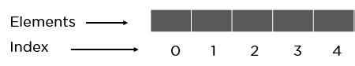
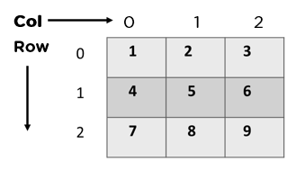
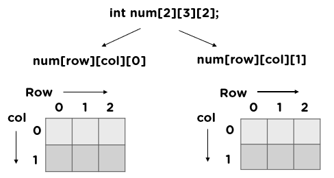

### Array - Concepts

An array is a linear data structure that collects elements of the same data type and stores them in contiguous and adjacent memory locations.   

For simplicity, we can think of an array as a fleet of stairs where on each step is placed a value (let’s say one of your friends). Here, you can identify the location of any of your friends by simply knowing the count of the step they are on.   
*Remember: “Location of next index depends on the data type we use”.*   

     

The above image can be looked at as a top-level view of a staircase where you are at the base of the staircase. Each element can be uniquely identified by its index in the array (in a similar way as you could identify your friends by the step on which they were on in the above example). 

**Array’s size:** Arrays work on an index system starting from 0 to (n-1), where n is the size of the array. There is types of indexing of the array as given below.    
**Types of indexing in an array:**     
- **0 (zero-based indexing):** The first element of the array is indexed by a subscript of 0.  
- **1 (one-based indexing):** The first element of the array is indexed by the subscript of 1.  
- **n (N-based indexing):** The base index of an array can be freely chosen. Usually, programming languages allowing n-based indexing also allow negative index values, and other scalar data types like enumerations, or characters may be used as an array index.   
#### Types of Arrays

1. **One dimensional array (1-D arrays):** You can imagine a 1d array as a row, where elements are stored one after another.      
    
2. **Multidimensional array:** These multi-dimensional arrays are again of two types. They are:
    - **Two-Dimensional Arrays:** You can imagine it like a table where each cell contains elements.
       
    - **Three-Dimensional Arrays:** You can imagine it like a cuboid made up of smaller cuboids where each cuboid can contain an element.
        

### Strings - Concepts 

In programming, a String is used as a datatype just like int or float as above. H!owever, the difference here is that, String deals with textual kind of data. It can consist of alphabets, numbers, spaces and special characters. Strings are often enclosed in double quotation marks(“This is a String”). Strings can be thought of as a thread connecting various letters as shown below.    


### Difference between Arrays in C++ and Java

*We now understand what an array is in a datastructure, but there is a significant difference between arrays in C++ and Java, which is discussed below:*    

#### In C

**Arrays**   

Arrays in C are simply syntactic sugar to access contiguous memory spaces, or - vulgarizing it shamelessly here - a variant of a pointer notation. To avoid allocating big chunks of contiguous memory and avoid having to reallocate your memory yourself manipulating data of variable size, you then resort to implementations of common Computer Science Data Structure concepts (for instance, a linked list, which uses a pointer to indicate the memory address of the next element in a series).    

You can substitute pointer arithmetic with array notations in C, and vice versa.   

The following will print the 5 elements of an array using different access methods:   

```cpp
#include <stdio.h>

int main(int ac, char **av) {
  char arr[2] = {'a', 'b'};

  printf("0:%c 0:%c 1:%c 1:%c\n", arr[0], *arr, arr[1], *(arr + 1));
  return (0);
}
```   

The following will be valid with int variables. Notice the slight modification to accomodate for the size of an integer:    

```cpp
#include <stdio.h>

int main(int ac, char **av) {
  int arr[2] = {42, -42};

  printf("0:%d 0:%d 1:%d 1:%d\n", arr[0], *arr, arr[1], *(arr + 4));
  return (0);
}
```

*(To obtain the size of a given data type, resort to the use of sizeof.)*

**Strings**   

*I'm referring to the traditional C-string implementation here.*   

Strings in C are basically simply arrays of characters. The main reason for this is obvious: as you need to often manipulate strings and print them to a stream, using a contiguous memory space makes sense and is an easy implementation. However, as you need to remember the size of your contiguous memory space to not inadvertently access something forbidden, we rely on the concept of a "NULL-terminated string", meaning a string of N characters is a actually an array of N + 1 characters terminated by a trailing '\0' character, which is used as the de-facto character to look for when you want to reach the end of a string.    

A straightforward declaration would be:   
```cpp
char *test = "my test";
```
which would be equivalent to:   
```cpp
char test[8] = { 'm', 'y', ' ', 't', 'e', 's', 't', '\0' };
```
*(Notice the trailing '\0')*  

However, you have to realize that in that case, the string "my test" is static, and that's the memory space you are directly pointing to. Which means you will encounter issues when trying to dynamically modify it.  

For instance, this would blow up in your face (following the previous declaration):   

```cpp
test[4] = 'H'; /* expect a violent complaint here */
```
So to have a string you can actually modify you can declare a string simply as:   
```cpp
#include <stdio.h>
#include <stdlib.h>

int main(int ac, char **av) {
  char *test = strdup("my test");

  printf("%s\n", test);
  return (0);
}
```
Where *strdup()* is a function of the C standard library allocating memory for your string and injecting the characters in there. Or you can allocate memory yourself with *malloc()* and copy characters manually or with a function like *strcpy()*.   

This particular declaration is thus mutable, and your are free to modify the content of the string (which in the end is just a dynamically allocated array of characters, allocated with *malloc()*).   

If you need to change the length of this string (add/remove characters to/from it), you will need to everytime be wary of the allocated memory. For instance, calling *strcat()* will fail if you haven't reallocated some additional memory first. Some functions, however, will take care of this for you.   

The C string does NOT support Unicode by default. You need to implement to manage code points yourself, or consider using 3rd-party library.     

#### In Java

**Arrays**    

Arrays in Java are very close to their C parent (to the point that we even have a method for efficient array-to-array-copy support using a bare-bone native implementation: *System.arraycopy()*). They represent contiguous memory spaces.    

However, they wrap these bare-bone arrays within an object (which keeps track of the size/length of the array for you).   

Java arrays can have their content modified, but like their C counterpart, you will need to allocate more memory when trying to expand them (except you do it indirectly, and will usually reallocate a complete array instead of doing a *realloc()* like in C).     

**Strings**   

Strings in Java are immutable, meaning they cannot be changed, once initialized, and operations on String actually create new String instances. Look up *StringBuilder* and *StringBuffer* for efficient string manipulation with an existing instance, and beware of their internal implementation details (especially when it comes to pre-setting the capacity of your buffer efficiently, to avoid frequent re-allocations).   

for instance, the following code uses produces a $3^{rd}$ String instance out of someString and "another string":    

```cpp
String myNewStr = someString + "another string";
``` 

In the underlying implementation, the Java String* classes also use an arrays of characters, like their C parent.  

This implies that they use more memory than the bare-bone C implementation, as you have the overhead of your instance.   

Not only that, they actually use a lot more memory because the Java String class provides Unicode support by default, meaning it allows for multiple code points per character (which is not a trivial thing to do in C, in comparison).   

On the other, notice that except if considering performance, you don't need to worry about threading, memory, and implementing functions looking for trailing '\0' characters.   

**Applications of Array in C/C++:**   

- Arrays are used to implement vectors, and lists in C++ STL.
- Arrays are used as the base of all sorting algorithms.
- Arrays are used to implement other DS like a stack, queue, etc.
- Used for implementing matrices. 
- Data structures like trees also sometimes use the array - implementation since arrays are easier to handle than pointers. For example, a segment tree uses array implementation.
- Binary search trees and balanced binary trees are used in data structures such as a heap, map, and set, which can be built using arrays.
- Graphs are also implemented as arrays in the form of an adjacency matrix.

**Applications of Array in Java:**  

- Arrays are good for implementing lists.*
- Arrays can be used to determine the flow of the code.
- Arrays are better than pointers for tree implementation.

**Source:** [Stack Overflow](https://stackoverflow.com/questions/3802470/array-string-difference-in-java-vs-c)  

### Dynamic Array vs Static Array

A Dynamic array ([Vector in C++](https://www.geeksforgeeks.org/vector-in-cpp-stl/), [ArrayList in Java](https://www.geeksforgeeks.org/arraylist-in-java/)) automatically grows when we try to insert a new item and there is no more space available, and it shrinks when we don't need it, unlike a static array, which cannot be changed once declared.   

In a dynamic array, the area usually doubles in size. A simple dynamic array can be created by allocating a fixed-size array that is typically larger than the number of elements that are immediately required. The elements of the dynamic array are stored concurrently at the beginning of the underlying array, and the remaining positions near the end of the underlying array are reserved, or unused.   

**More Information on Dynamic Array:** [Array vs Arraylist in Java](https://www.javatpoint.com/array-vs-arraylist-in-java) [Dynamic arrays in Java](https://www.geeksforgeeks.org/how-do-dynamic-arrays-work/) [Static vs Dynamic Array in C/C++](https://dotnettutorials.net/lesson/static-vs-dynamic-array/)     

### Advantages of array data structure

- Arrays store multiple data of similar types with the same name.
- It allows random access to elements.
- As the array is of fixed size and stored in contiguous memory locations there is no memory shortage or overflow.
- It is helpful to store any type of data with a fixed size.
- Since the elements in the array are stored at contiguous memory locations it is easy to iterate in this data structure and unit time is required to access an element if the index is known. 

**More Details on this Topic:**     
> [Scaler String in Data Structure](https://www.scaler.com/topics/data-structures/string-in-data-structure/)
> [GeeksforGeeks String in Data Structure](https://www.geeksforgeeks.org/string-data-structure/)
> [GeeksforGeeks Array Data Structure](https://www.geeksforgeeks.org/array-data-structure/)
> [Java Arrays in Javatpoint](https://www.javatpoint.com/array-in-java)  