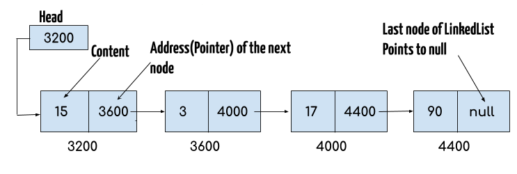
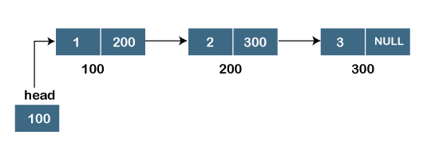
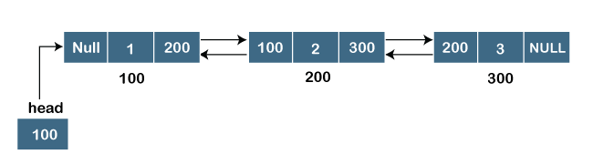
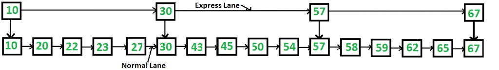
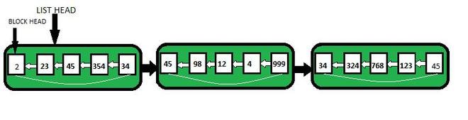

### Linked Lists

*A linked list is a sequence of data structures, which are connected together via links.*    

Linked List is a sequence of links which contains items. Each link contains a connection to another link. Linked list is the second most-used data structure after array. Following are the important terms to understand the concept of Linked List.    
- **Head :** First node is head contain a link to second link useful to find linked list first node with data.
- **Link :** Each link of a linked list can store a data called an element.
- **Next :** Each link of a linked list contains a link to the next link called Next.
- **LinkedList :** A Linked List contains the connection link to the first link called First.

#### Linked List Representation

Linked list can be visualized as a chain of nodes, where every node points to the next node.   



*As per the above illustration, following are the important points to be considered.*
- Linked List contains a link element called first.
- Each link carries a data field(s) and a link field called next.
- Each link is linked with its next link using its next link.
- Last link carries a link as null to mark the end of the list.

### Advantage and Disadavantage of using Linked List

**Advantages of Linked Lists:**
- Insertion and deletion in linked lists are very efficient.
- Linked list can be expanded in constant time.
- For implementation of stacks and queues and for representation of trees and graphs.
- Linked lists are used for dynamic memory allocation which means effective memory utilization hence, no memory wastage.

**Disadvantages of Linked Lists:**
- Use of pointers is more in linked lists hence, complex and requires more memory.
- Searching an element is costly and requires O(n) time complexity.
- Traversing is more time consuming and reverse traversing is not possible in singly linked lists.
- Random access is not possible due to dynamic memory allocation.

### Types of Linked List

Following are the various types of linked list.
- **Singly Linked List** - Item navigation is forward only.
- **Doubly Linked List** - Items can be navigated forward and backward.
- **Circular Linked List** − Last item contains link of the first element as next and the first element has a link to the last element as previous.
- **Doubly Circular Linked List** - Two consecutive elements are linked or connected by previous and next pointer and the last node points to first node by next pointer and also the first node points to last node by the previous pointer.
- **Skip List** - Create multiple layers so that we can skip some nodes faster searching.
- **Unrolled Linked List** - Storing multiple elements at each node and it also has the advantage of fast insertion and deletion as that of a linked list.
- **Multilevel Linked List** - 2D data structure that comprises several linked lists and each node in a multilevel linked list has a next and child pointer.

### Declaration of Linked List

There is major difference between declaration of linked list in java and Cpp, as java mainly a object oriented Language and in java every thing is object for java checkout [This Blog](https://www.geeksforgeeks.org/linked-list-in-java/).    

In C language, a linked list can be implemented using structure and pointers.      

```cpp
struct LinkedList{
    int data;
    struct LinkedList *next;
};
```
To know more on *Creating, Traversing the list in C++* see [This Blog](https://www.hackerearth.com/practice/data-structures/linked-list/singly-linked-list/tutorial/) and for more *Graphical Representation* see [this blog](https://www.tutorialspoint.com/data_structures_algorithms/linked_list_algorithms.htm)    

### Simple Linked List

It is the commonly used linked list in programs. If we are talking about the linked list, it means it is a singly linked list. The singly linked list is a data structure that *contains two parts, i.e., one is the data part, and the other one is the address part, which contains the address of the next or the successor node.* The address part in a node is also known as a pointer.   

Suppose we have three nodes, and the addresses of these three nodes are 100, 200 and 300 respectively. The representation of three nodes as a linked list is shown in the below figure:   

   

**Representation of the node in a singly linked list**     

```cpp
struct node  
{  
    int data;  
    struct node *next;  
}
```    

More Information on various [Operation on Singly Linked List](https://www.javatpoint.com/singly-linked-list)    
### Doubly Linked List

As the name suggests, the doubly linked list contains two pointers. We can define the doubly linked list as a linear data structure with *three parts: the data part and the other two address part. In other words, a doubly linked list is a list that has three parts in a single node, includes one data part, a pointer to its previous node, and a pointer to the next node.*    

Suppose we have three nodes, and the address of these nodes are 100, 200 and 300, respectively. The representation of these nodes in a doubly-linked list is shown below:   

     

**Representation of the node in a doubly linked list**   

```cpp
struct node  
{  
    int data;  
    struct node *next;  
    struct node *prev;   
}
```    

More Information on various [Operation on Double Linked List](https://www.javatpoint.com/doubly-linked-list)   
### Circular Linked List

A circular linked list is a variation of a singly linked list. The only difference between the singly linked list and a circular linked list is that the last node does not point to any node in a singly linked list, so its link part contains a NULL value. On the other hand, the circular linked list is a list in which *the last node connects to the first node, so the link part of the last node holds the first node's address. The circular linked list has no starting and ending node.* We can traverse in any direction, i.e., either backward or forward. The diagrammatic representation of the circular linked list is shown below:  

```cpp
struct node  
{  
    int data;  
    struct node *next;  
}
```

A circular linked list is a sequence of elements in which each node has a link to the next node, and the last node is having a link to the first node. The representation of the circular linked list will be similar to the singly linked list, as shown below:   

    

More Information on various [Operation on Circular Linked List](https://www.javatpoint.com/circular-singly-linked-list)    
### Doubly Circular Linked List 

The doubly circular linked list has the features of both the circular linked list and doubly linked list.   

   

The above figure shows the representation of the doubly circular linked list in which the last node is attached to the first node and thus creates a circle. It is a doubly linked list also because each node holds the address of the previous node also. The main difference between the doubly linked list and doubly circular linked list is that the *doubly circular linked list does not contain the NULL value in the previous field of the node. As the doubly circular linked contains three parts, i.e., two address parts and one data part* so its representation is similar to the doubly linked list.     

```cpp
struct node  
{  
    int data;  
    struct node *next;  
    struct node *prev;   
}
```    

More Information on various [Operation on Doubly Circular Linked List](https://www.javatpoint.com/circular-doubly-linked-list)   
### Skip List

Skips list creates multiple layers so that we can skip some nodes. See the following example list with 16 nodes and two layers. The *upper layer works as an “express lane” that connects only the main outer stations, and the lower layer works as a “normal lane” that connects every station*.    

Suppose we want to search for 50, we start from the first node of the “express lane” and keep moving on the “express lane” till we find a node whose next is greater than 50. Once we find such a node (30 is the node in the following example) on “express lane”, we move to “normal lane” using a pointer from this node, and linearly search for 50 on “normal lane”. In the following example, we start from 30 on the “normal lane” and with linear search, we find 50.     

**Representation of the node in a Skip List**  

```cpp
struct Node
{
    int key;
    // Array to hold pointers to node of different level
    Node **forward;
    Node(int, int);
}
```  

     

More Information on various *[operation on Skip List](https://www.geeksforgeeks.org/skip-list/)* like *[Insertion](https://www.geeksforgeeks.org/skip-list-set-2-insertion/), [Searching and Deletion](https://www.geeksforgeeks.org/skip-list-set-3-searching-deletion/)*     
### Unrolled Linked List

Unrolled linked list covers the advantages of both array and linked list as it reduces the memory overhead in comparison to simple linked lists by storing multiple elements at each node and it also has the advantage of fast insertion and deletion as that of a linked list.    

**Representation of the node in a Unrolled Linked List**  

```cpp
// Unrolled Linked List Node
struct Node
{
    int numElements;
    int array[maxElements];
    Node *next;
}
```

   

More Information on [Operation on Unrolled Linked List](https://www.geeksforgeeks.org/unrolled-linked-list-set-1-introduction/)   

### Multilevel Linked List

Multilevel Linked List is a 2D data structure that comprises several linked lists and each node in a multilevel linked list has a next and child pointer. All the elements are linked using pointers.

**Representation of the node in a Multilevel Linked List**  

```cpp
struct Node
{
    int data;
    Node *next;
    Node *child;
}
```


More Information on [Operation on Multilevel Linked List](https://www.geeksforgeeks.org/multilevel-linked-list/)    

**More Details on this Topic:**
> [Linked List on Tutorialspoint](https://www.tutorialspoint.com/data_structures_algorithms/linked_list_algorithms.htm)    
> [Linked List on JavaTpoint](https://www.javatpoint.com/ds-linked-list)    
> [Linked List on GeeksforGeeks](https://www.geeksforgeeks.org/linked-list-set-1-introduction/)    
> [Linked List Different Articles & Programs](https://www.geeksforgeeks.org/data-structures/linked-list/)    