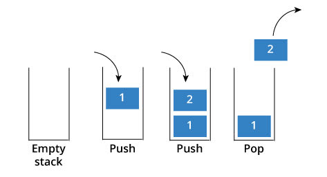

### Stacks

A Stack is a linear data structure that follows the LIFO (Last-In-First-Out) principle. Stack has one end, whereas the Queue has two ends (front and rear). It contains only *one pointer top pointer pointing to the topmost element of the stack*. Whenever an element is added in the stack, it is added on the top of the stack, and the element can be deleted only from the stack. In other words, a stack can be defined as a container in which insertion and deletion can be done from the one end known as the top of the stack.    s

**Some key points related to stack**    
- It is called as stack because it behaves like a real-world stack, piles of books, etc.
- A Stack is an abstract data type with a pre-defined capacity, which means that it can store the elements of a limited size.
- It is a data structure that follows some order to insert and delete the elements, and that order can be LIFO or FILO.

**You can Implement Stack using Array and Linked_List:** For [Linked_List](https://www.javatpoint.com/ds-linked-list-implementation-of-stack) and [Array](https://www.javatpoint.com/ds-array-implementation-of-stack) view respective blog.  
### Working of Stack

Stack works on the LIFO pattern. In programming terms, putting an item on top of the stack is called push and removing an item is called pop.  



In the above image, although item 3 was kept last, it was removed first. This is exactly how the LIFO (Last In First Out) Principle works.    
### Standard Stack Operations

**The following are some common operations implemented on the stack:**   

- **push(element(s)):** add an element (or several elements) to the top of the stack.
- **pop():** remove the top element of the stack and return the removed element.
- **peek():** return the top element of the stack without modifying the stack itself.
- **isEmpty():** return true if the stack does not contain any elements, false if the stack’s size is greater than 0.
- **clear():** remove all elements from the stack.
- **size():** return the number of elements in the stack (similar to the length property of an array).

**Operations**  

**push(x):** Insert element x at the top of a stack   
```cpp
void push (int stack[ ] , int x , int n) {
 if ( top == n-1 ) {         //If the top position is the last of position in a stack, this means that the stack is full
    cout << “Stack is full.Overflow condition!” ;
    }
    else{
        top = top +1 ;            //Incrementing top position 
        stack[ top ] = x ;       //Inserting element on incremented position  
    }
}
```  

**pop( ):** Removes an element from the top of a stack   
```cpp
   void pop (int stack[ ] ,int n ) 
    {
        if( isEmpty ( ) )
        {
            cout << “Stack is empty. Underflow condition! ” << endl ;
        }
        else    
        {
             top = top - 1 ; //Decrementing top’s position will detach last element from stack            
        }
    }
```   

**topElement( ):** Access the top element of a stack   
```cpp
  int topElement ( )
    {
        return stack[ top ];
    }
```
**isEmpty ( ) :** Check whether a stack is empty    
```cpp
    bool isEmpty ( )
    {
        if ( top == -1 )  //Stack is empty
        return true ; 
        else
        return false;
    }
```
**size ( ):** Determines the current size of a stack   
```cpp
   int size ( )
    {
        return top + 1;
    }
```

### Applications of Stack

**The following are application on the stack:**   
- **Recursion:** The recursion means that the function is calling itself again. To maintain the previous states, the compiler creates a system stack in which all the previous records of the function are maintained.
- **DFS(Depth First Search):** This search is implemented on a Graph, and Graph uses the stack data structure.
- **Backtracking:** Suppose we have to create a path to solve a maze problem. If we are moving in a particular path, and we realize that we come on the wrong way. In order to come at the beginning of the path to create a new path, we have to use the stack data structure.
- **Expression conversion:** Stack can also be used for expression conversion. This is one of the most important applications of stack. The list of the expression conversion is given below:
```cpp
    Infix to prefix
    Infix to postfix
    Prefix to infix
    Prefix to postfix
    Postfix to infix
```  
### Expression Parsing & Operators Precedence

The way to write arithmetic expression is known as a notation. An arithmetic expression can be written in three different but equivalent notations, i.e., without changing the essence or output of an expression. These notations are −
- Infix Notation
- Prefix (Polish) Notation
- Postfix (Reverse-Polish) Notation

These notations are named as how they use operator in expression and Operator precedence specifies the manner in which operands are grouped with operators. For *Precedence in [java](https://introcs.cs.princeton.edu/java/11precedence/) and [cpp](https://www.tutorialspoint.com/cprogramming/c_operators_precedence.htm) see this blog. For *Expression Parsing* see [This Blog](https://www.tutorialspoint.com/data_structures_algorithms/expression_parsing.htm)  

**BONUS TIP: Power(In Level 1), Divide/Multiple(In Level 2), Plus/Minus(In Level 3) First check the precedence then if same precedence is found then check associativity**

### Postfix Expression Evaluation

Postfix (Reverse Polish) notation is easier to evaluate using a stack. The algorithm scans the expression from left to right:

**Algorithm:**
1. Scan the expression from left to right
2. If operand is encountered, push it onto the stack
3. If operator is encountered, pop two operands, perform operation, push result back
4. Final result is at the top of the stack

**Example:** Evaluate `2 3 4 * +` (which is `2 + 3 * 4` in infix)

```cpp
#include <iostream>
#include <stack>
#include <string>
#include <cctype>
using namespace std;

int evaluatePostfix(string expression) {
    stack<int> st;
    
    for (int i = 0; i < expression.length(); i++) {
        char c = expression[i];
        
        // Skip spaces
        if (c == ' ') continue;
        
        // If operand, push to stack
        if (isdigit(c)) {
            int num = 0;
            while (i < expression.length() && isdigit(expression[i])) {
                num = num * 10 + (expression[i] - '0');
                i++;
            }
            i--; // Adjust for loop increment
            st.push(num);
        }
        // If operator, pop two operands and perform operation
        else {
            int operand2 = st.top(); st.pop();
            int operand1 = st.top(); st.pop();
            
            switch(c) {
                case '+': st.push(operand1 + operand2); break;
                case '-': st.push(operand1 - operand2); break;
                case '*': st.push(operand1 * operand2); break;
                case '/': st.push(operand1 / operand2); break;
            }
        }
    }
    
    return st.top();
}

// Example usage
int main() {
    string exp = "2 3 4 * +"; // Equivalent to 2 + 3 * 4 = 14
    cout << "Postfix Evaluation: " << evaluatePostfix(exp) << endl;
    return 0;
}
```

- **Time Complexity:** O(n) where n is the length of expression
- **Space Complexity:** O(n) for the stack

### Prefix Expression Evaluation

Prefix (Polish) notation evaluation is similar but we scan from right to left:

**Algorithm:**
1. Scan the expression from right to left
2. If operand is encountered, push it onto the stack
3. If operator is encountered, pop two operands, perform operation, push result back
4. Final result is at the top of the stack

```cpp
int evaluatePrefix(string expression) {
    stack<int> st;
    
    // Scan from right to left
    for (int i = expression.length() - 1; i >= 0; i--) {
        char c = expression[i];
        
        if (c == ' ') continue;
        
        if (isdigit(c)) {
            int num = 0, multiplier = 1;
            int j = i;
            while (j >= 0 && isdigit(expression[j])) {
                num = num + (expression[j] - '0') * multiplier;
                multiplier *= 10;
                j--;
            }
            i = j + 1;
            st.push(num);
        }
        else {
            int operand1 = st.top(); st.pop();
            int operand2 = st.top(); st.pop();
            
            switch(c) {
                case '+': st.push(operand1 + operand2); break;
                case '-': st.push(operand1 - operand2); break;
                case '*': st.push(operand1 * operand2); break;
                case '/': st.push(operand1 / operand2); break;
            }
        }
    }
    
    return st.top();
}
```

### Infix to Postfix Conversion

Converting infix to postfix using stack is a common problem. We use operator precedence:

```cpp
#include <iostream>
#include <stack>
#include <string>
#include <cctype>
using namespace std;

int precedence(char op) {
    if (op == '+' || op == '-') return 1;
    if (op == '*' || op == '/') return 2;
    if (op == '^') return 3;
    return 0;
}

string infixToPostfix(string infix) {
    stack<char> st;
    string postfix = "";
    
    for (int i = 0; i < infix.length(); i++) {
        char c = infix[i];
        
        // If operand, add to output
        if (isalnum(c)) {
            postfix += c;
        }
        // If '(', push to stack
        else if (c == '(') {
            st.push(c);
        }
        // If ')', pop until '('
        else if (c == ')') {
            while (!st.empty() && st.top() != '(') {
                postfix += st.top();
                st.pop();
            }
            st.pop(); // Remove '('
        }
        // If operator
        else {
            while (!st.empty() && precedence(st.top()) >= precedence(c)) {
                postfix += st.top();
                st.pop();
            }
            st.push(c);
        }
    }
    
    // Pop remaining operators
    while (!st.empty()) {
        postfix += st.top();
        st.pop();
    }
    
    return postfix;
}

// Example: "a+b*c" -> "abc*+"
```

- **Time Complexity:** O(n)
- **Space Complexity:** O(n)

### Infix to Prefix Conversion

For prefix conversion, we reverse the infix, convert to postfix, then reverse again:

```cpp
string infixToPrefix(string infix) {
    // Reverse the infix expression
    reverse(infix.begin(), infix.end());
    
    // Replace '(' with ')' and vice versa
    for (int i = 0; i < infix.length(); i++) {
        if (infix[i] == '(') infix[i] = ')';
        else if (infix[i] == ')') infix[i] = '(';
    }
    
    // Convert to postfix
    string postfix = infixToPostfix(infix);
    
    // Reverse to get prefix
    reverse(postfix.begin(), postfix.end());
    
    return postfix;
}
```

### Monotonic Stack

A **Monotonic Stack** is a stack that maintains elements in a monotonic (either strictly increasing or strictly decreasing) order. It's extremely useful for solving problems like:
- Next Greater Element
- Next Smaller Element
- Largest Rectangle in Histogram
- Trapping Rain Water
- Stock Span Problem

#### Monotonic Increasing Stack

Maintains elements in increasing order (from bottom to top):

```cpp
// Monotonic Increasing Stack - finds next smaller element
vector<int> nextSmallerElement(vector<int>& arr) {
    int n = arr.size();
    vector<int> result(n, -1);
    stack<int> st; // Monotonic increasing stack
    
    for (int i = 0; i < n; i++) {
        // Pop elements until we find smaller element or stack is empty
        while (!st.empty() && arr[st.top()] > arr[i]) {
            result[st.top()] = arr[i]; // Next smaller element
            st.pop();
        }
        st.push(i);
    }
    
    return result;
}
```

#### Monotonic Decreasing Stack

Maintains elements in decreasing order (from bottom to top):

```cpp
// Monotonic Decreasing Stack - finds next greater element
vector<int> nextGreaterElement(vector<int>& arr) {
    int n = arr.size();
    vector<int> result(n, -1);
    stack<int> st; // Monotonic decreasing stack
    
    for (int i = 0; i < n; i++) {
        // Pop elements until we find greater element or stack is empty
        while (!st.empty() && arr[st.top()] < arr[i]) {
            result[st.top()] = arr[i]; // Next greater element
            st.pop();
        }
        st.push(i);
    }
    
    return result;
}
```

#### Example: Next Greater Element Problem

**Problem:** Given an array, find the next greater element for each element.

```cpp
vector<int> nextGreaterElements(vector<int>& nums) {
    int n = nums.size();
    vector<int> result(n, -1);
    stack<int> st; // Store indices
    
    for (int i = 0; i < n; i++) {
        while (!st.empty() && nums[st.top()] < nums[i]) {
            result[st.top()] = nums[i];
            st.pop();
        }
        st.push(i);
    }
    
    return result;
}

// Example: [4, 5, 2, 25] -> [5, 25, 25, -1]
```

#### Example: Largest Rectangle in Histogram

**Problem:** Find the largest rectangle area in a histogram.

```cpp
int largestRectangleArea(vector<int>& heights) {
    stack<int> st; // Monotonic increasing stack
    int maxArea = 0;
    int n = heights.size();
    
    for (int i = 0; i <= n; i++) {
        int h = (i == n) ? 0 : heights[i];
        
        while (!st.empty() && heights[st.top()] > h) {
            int height = heights[st.top()];
            st.pop();
            int width = st.empty() ? i : i - st.top() - 1;
            maxArea = max(maxArea, height * width);
        }
        st.push(i);
    }
    
    return maxArea;
}
```

#### Example: Stock Span Problem

**Problem:** Calculate the span of stock prices (number of consecutive days where price <= current price).

```cpp
vector<int> calculateSpan(vector<int>& prices) {
    int n = prices.size();
    vector<int> span(n, 1);
    stack<int> st; // Monotonic decreasing stack (stores indices)
    
    for (int i = 0; i < n; i++) {
        // Pop until we find a price greater than current
        while (!st.empty() && prices[st.top()] <= prices[i]) {
            st.pop();
        }
        
        // Calculate span
        span[i] = st.empty() ? i + 1 : i - st.top();
        st.push(i);
    }
    
    return span;
}
```

**Key Points about Monotonic Stack:**
- **Time Complexity:** O(n) - each element is pushed and popped at most once
- **Space Complexity:** O(n) for the stack
- **When to use:** Problems involving finding next/previous greater/smaller elements, range queries, histogram problems
- **Pattern:** Maintain stack in monotonic order while processing elements

**More Details on this Topic:**
> [Monotonic Stack on GeeksforGeeks](https://www.geeksforgeeks.org/introduction-to-monotonic-stack-data-structure-and-algorithms/)
> [Next Greater Element on LeetCode](https://leetcode.com/problems/next-greater-element-i/)

**Advantages of Stack:**    

- The linked list implementation of a stack can grow and shrink according to the needs at runtime.
- It is used in many virtual machines like JVM.
- Stacks are more secure and reliable as they do not get corrupted easily.
- Stack cleans up the objects automatically.

**Disadvantages of Stack:**   

- Requires extra memory due to involvement of pointers.
- Random accessing is not possible in stack.
- The total of size of the stack must be defined before.
- If the stack falls outside the memory it can lead to abnormal termination.

**More Details on this Topic:**         
> [Stack on GeeksforGeeks](https://www.geeksforgeeks.org/stack-data-structure/)     
> [Stack on JavaTpoint](https://www.javatpoint.com/data-structure-stack)        
> [Stack on Tutorialspoint](https://www.tutorialspoint.com/data_structures_algorithms/stack_algorithm.htm)       
> [Stack on Hackerearth](https://www.hackerearth.com/practice/data-structures/stacks/basics-of-stacks/tutorial/)       
> [Stack on Simplilearn](https://www.simplilearn.com/tutorials/data-structure-tutorial/stacks-in-data-structures)         