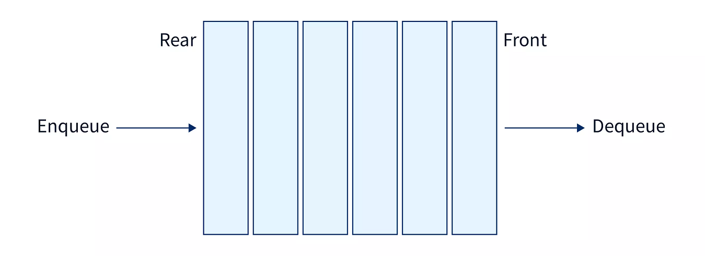
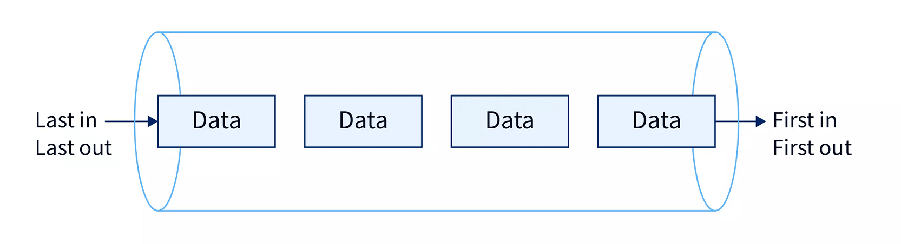
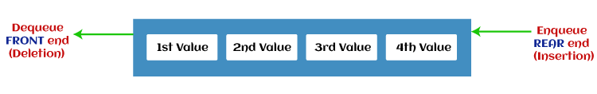
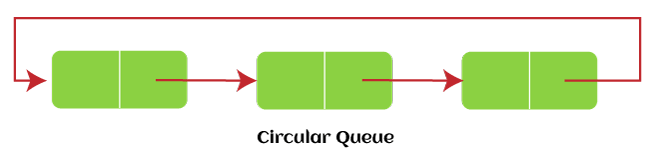
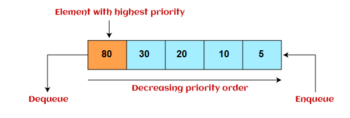
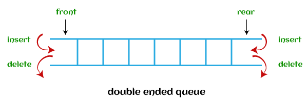
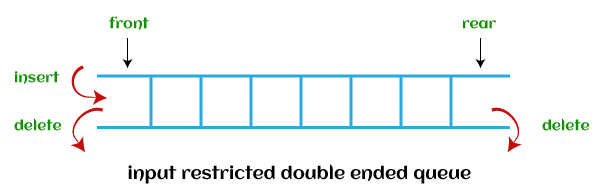
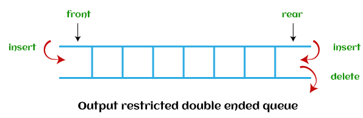

### Queue

The Queue in data structure is an ordered, linear sequence of items. It is a FIFO (First In First Out) data structure, which means that we can insert an item to the rear end of the queue and remove from the front of the queue only.    
- *A Queue is a sequential data type, unlike an array, in an array, we can access any of its elements using indexing, but we can only access the element at the front of the queue at a time.*   

    

A real-world example of queue can be a single-lane one-way road, where the vehicle enters first, exits first. More real-world examples can be seen as queues at the ticket windows and bus-stops.   

### Working of Queue

The Queue in data structure uses the *FIFO (First In First Out)* approach. Initially, we will set a front pointer to keep track of the front most element of the queue. Then the queue is initialized to -1 as its front, as we will add (enqueue) elements to the queue, the front gets updated to point to its front most element and if we remove (dequeue) elements from the queue, the front gets reduced.    

   

**You can Implement Queue using Array and Linked_List:** For [Linked List](https://www.javatpoint.com/linked-list-implementation-of-queue) and [Array](https://www.javatpoint.com/array-representation-of-queue) view respective blog.   

### Basic Operations of Queue

**A queue is an object (an abstract data structure - ADT) that allows the following operations:**
- **Enqueue:** Add an element to the end of the queue
- **Dequeue:** Remove an element from the front of the queue
- **Queue underflow (IsEmpty):** Check if the queue is empty
- **Queue overflow (IsFull):** Check if the queue is full
- **Peek:** Get the value of the front of the queue without removing it

#### Enqueue
*The Enqueue operation is used to add an element to the front of the queue.*   
*Steps of the algorithm:*   
1. Check if the Queue is full.
2. Set the front as 0 for the first element.
3. Increase rear by 1.
4. Add the new element at the rear index.

#### Dequeue
*The Dequeue operation is used to remove an element from the rear of the queue.*        
*Steps of the algorithm:*     
1. Check if the Queue is empty.
2. Return the value at the front index.
3. Increase front by 1.
4. Set front and rear as -1 for the last element.

#### Peek

*The Peek operation is used to return the front most element of the queue.*   
*Steps of the algorithm:*   
1. Check if the Queue is empty.
2. Return the value at the front index.

#### isFull

*The isFull operation is used to check if the queue is full or not.*    
*Steps of the algorithm:*   
1. Check if the number of elements in the queue (size) is equal to the capacity, if yes, return True.
2. Return False.

#### isEmpty

*The isEmpty operation is used to check if the queue is empty or not.*    
*Steps of the algorithm:*   
1. Check if the number of elements in the queue (size) is equal to 0, if yes, return True.
2. Return False.

*Code Implementing the Queue data structure in C++ with the help of an array.*   
```cpp
#include <iostream>
#include <limits.h>
using namespace std;

# define N 1000 // N is the capacity of the Queue

// Class to implement a queue
class Queue {
public:
	int front, rear, size;
	unsigned capacity;
	int* array;
};

// Function to create a queue of assigned capacity
Queue* createQ(unsigned capacity){
	Queue* queue = new Queue();
	queue->capacity = capacity;
	queue->front = queue->size = 0;

    // The rear of the queue will be at the last index
	queue->rear = capacity - 1;
	queue->array = new int[queue->capacity];
	return queue;
}

// Function to check if the Queue is full or not
bool isFull(Queue* queue){
    if (queue->size == queue->capacity){
        cout<<"The Queue is full\n";
        return true;
    }
    cout<<"The Queue is not full\n";
	return false;
}

// Function to check is the Queue is empty or not
bool isEmpty(Queue* queue){
    if (queue->size == 0){
        cout<<"The Queue is empty\n";
        return true;
    }
    cout<<"The Queue is not empty\n";
	return false;
}

// Function to add an item to the queue.
// It changes rear and size
void enqueue(Queue* queue){
    int item; 
    cout<<"Enter the element to be inserted into the queue:\n";
    cin>>item;
	if (queue->size == queue->capacity){
	    cout<<"The Queue is already full, can't add any more items\n";
		return;
	}
	queue->rear = (queue->rear + 1)
				% queue->capacity;
	queue->array[queue->rear] = item;
	queue->size = queue->size + 1;
	cout << item << " enqueued to the queue\n";
}

// Function to remove an item from queue.
// It changes front and size
int dequeue(Queue* queue){
	if (queue->size == 0){
	    cout<<"The Queue is already empty, can't remove any more items\n";
		return INT_MIN;
	}
	int item = queue->array[queue->front];
	queue->front = (queue->front + 1)
				% queue->capacity;
	queue->size = queue->size - 1;
	cout<<"Removing "<<item<<" from the queue\n";
	return item;
}

// Function to get the front of the queue
int peek(Queue* queue){
	if (queue->size == 0) return INT_MIN;
	cout<<"The front most element of the queue is "<<queue->array[queue->front]<<"\n";
	return queue->array[queue->front];
}

// Driver code
int main(){
    cout<<"QUEUE (Total Capacity: "<<N<<")\n";\
    
    // Initializing a Queue of 1000 capacity
    Queue* queue = createQ(1000); 
    
    int choice;
    while(1){
        cout<<"\nChoose any of the following options:\n";
        cout<<" 0: Exit         1: Enqueue      2: Dequeue         3: Peek\n";
        cout<<" 4: Check if the stack is empty     5: Check if the stack is full\n\n";
        cin>>choice;

        switch(choice){
            case 0: cout<<"\nEND"; exit(0);
            case 1: enqueue(queue); break;
            case 2: dequeue(queue); break;
            case 3: peek(queue); break;
            case 4: isEmpty(queue); break;
            case 5: isFull(queue); break;
            default: printf("Please choose a correct option!");
        }
    }
    return 0;
}

```
For Java Implementation see [Queue on Freecodecamp using Java](https://www.freecodecamp.org/news/queue-data-structure-definition-and-java-example-code/)   
### Types of Queues
**There are different types of queues:**   
- *Simple Queue or Linear Queue*
- *Circular Queue*
- *Priority Queue*
- *Double Ended Queue (or Deque)*

#### Simple Queue or Linear Queue

In Linear Queue, an insertion takes place from one end while the deletion occurs from another end. The end at which the insertion takes place is known as the rear end, and the end at which the deletion takes place is known as front end. It strictly follows the FIFO rule.    

   

The major drawback of using a linear Queue is that insertion is done only from the rear end. If the first three elements are deleted from the Queue, we cannot insert more elements even though the space is available in a Linear Queue. In this case, the linear Queue shows the overflow condition as the rear is pointing to the last element of the Queue.   

To know more about the queue in data structure, you can click the link - [https://www.geeksforgeeks.org/array-implementation-of-queue-simple/](https://www.geeksforgeeks.org/array-implementation-of-queue-simple/)   
#### Circular Queue

In Circular Queue, all the nodes are represented as circular. It is similar to the linear Queue except that the last element of the queue is connected to the first element. It is also known as Ring Buffer, as all the ends are connected to another end. The representation of circular queue is shown in the below image -   

   

The drawback that occurs in a linear queue is overcome by using the circular queue. If the empty space is available in a circular queue, the new element can be added in an empty space by simply incrementing the value of rear. The main advantage of using the circular queue is better memory utilization.   

To know more about the circular queue, you can click the link - [https://www.javatpoint.com/circular-queue](https://www.javatpoint.com/circular-queue)
#### Priority Queue

It is a special type of queue in which the elements are arranged based on the priority. It is a special type of queue data structure in which every element has a priority associated with it. Suppose some elements occur with the same priority, they will be arranged according to the FIFO principle. The representation of priority queue is shown in the below image -    

   

Insertion in priority queue takes place based on the arrival, while deletion in the priority queue occurs based on the priority. Priority queue is mainly used to implement the CPU scheduling algorithms.   

**There are two types of priority queue that are discussed as follows -**

- **Ascending priority queue** - In ascending priority queue, elements can be inserted in arbitrary order, but only smallest can be deleted first. Suppose an array with elements 7, 5, and 3 in the same order, so, insertion can be done with the same sequence, but the order of deleting the elements is 3, 5, 7.
- **Descending priority queue** - In descending priority queue, elements can be inserted in arbitrary order, but only the largest element can be deleted first. Suppose an array with elements 7, 3, and 5 in the same order, so, insertion can be done with the same sequence, but the order of deleting the elements is 7, 5, 3.

To learn more about the priority queue, you can click the link - [https://www.javatpoint.com/ds-priority-queue](https://www.javatpoint.com/ds-priority-queue)

#### Deque (Double Ended Queue)

In Deque or Double Ended Queue, insertion and deletion can be done from both ends of the queue either from the front or rear. It means that we can insert and delete elements from both front and rear ends of the queue. Deque can be used as a palindrome checker means that if we read the string from both ends, then the string would be the same.   

Deque can be used both as stack and queue as it allows the insertion and deletion operations on both ends. Deque can be considered as stack because stack follows the LIFO (Last In First Out) principle in which insertion and deletion both can be performed only from one end. And in deque, it is possible to perform both insertion and deletion from one end, and Deque does not follow the FIFO principle.   

The representation of the deque is shown in the below image -   

   

To know more about the deque, you can click the link - [https://www.javatpoint.com/ds-deque](https://www.javatpoint.com/ds-deque)

There are two types of deque that are discussed as follows -

- **Input restricted deque** - As the name implies, in input restricted queue, insertion operation can be performed at only one end, while deletion can be performed from both ends.   

   

- **Output restricted deque** - As the name implies, in output restricted queue, deletion operation can be performed at only one end, while insertion can be performed from both ends.   

   
### Applications of Queue

Queue is used when things don’t have to be processed immediately, but have to be processed in *First In First Out* order like *Breadth First Search*. This property of Queue makes it also useful in following kind of scenarios.
1. When a resource is shared among multiple consumers. Examples include *CPU scheduling, Disk Scheduling*. 
2. When data is transferred asynchronously (data not necessarily received at same rate as sent) between two processes. Examples include *IO Buffers, pipes, file IO, etc*. 
3. Queue can be used as an essential component in various other data structures.

**More Details on this Topic:**
> [Queue on JavaTpoint](https://www.javatpoint.com/data-structure-queue)    
> [Queue on Tutorialspoint](https://www.tutorialspoint.com/data_structures_algorithms/dsa_queue.htm)    
> [Queue on GeeksforGeeks](https://www.geeksforgeeks.org/queue-data-structure/)    
> [Queue on Programiz](https://www.programiz.com/dsa/queue)    
> [Queue on Scaler](https://www.scaler.com/topics/data-structures/queue-in-data-structure/)   