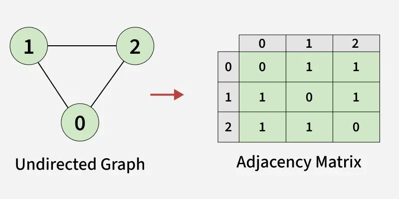

### Graph

A **Graph** is a non-linear data structure consisting of a finite set of **vertices** (nodes) and a set of **edges** (links) that connect pairs of vertices. Graphs are used to represent relationships between entities and are fundamental in computer science.



*Image Credit: [GeeksforGeeks - Graph and its Representations](https://www.geeksforgeeks.org/dsa/graph-and-its-representations/)*

**Key Terminology:**
- **Vertex/Node:** A data point in the graph
- **Edge:** Connection between two vertices
- **Directed Graph (Digraph):** Edges have direction (A → B)
- **Undirected Graph:** Edges have no direction (A ↔ B)
- **Weighted Graph:** Edges have weights/costs
- **Unweighted Graph:** All edges have equal weight
- **Path:** Sequence of vertices connected by edges
- **Cycle:** Path that starts and ends at the same vertex
- **Connected Graph:** There's a path between every pair of vertices
- **Degree:** Number of edges connected to a vertex

### Graph Representation

#### 1. Adjacency Matrix

A 2D array where `matrix[i][j] = 1` if there's an edge from vertex i to j, else 0.

```cpp
#include <iostream>
#include <vector>
using namespace std;

class Graph {
private:
    int V; // Number of vertices
    vector<vector<int>> adjMatrix;
    
public:
    Graph(int vertices) : V(vertices) {
        adjMatrix.resize(V, vector<int>(V, 0));
    }
    
    // Add edge for undirected graph
    void addEdge(int u, int v) {
        adjMatrix[u][v] = 1;
        adjMatrix[v][u] = 1; // For undirected graph
    }
    
    // Add edge for directed graph
    void addDirectedEdge(int u, int v) {
        adjMatrix[u][v] = 1;
    }
    
    // Add weighted edge
    void addWeightedEdge(int u, int v, int weight) {
        adjMatrix[u][v] = weight;
        adjMatrix[v][u] = weight; // For undirected
    }
    
    void printGraph() {
        for (int i = 0; i < V; i++) {
            for (int j = 0; j < V; j++) {
                cout << adjMatrix[i][j] << " ";
            }
            cout << endl;
        }
    }
};
```

**Pros:**
- Easy to check if edge exists: O(1)
- Easy to add/remove edges: O(1)
- Good for dense graphs

**Cons:**
- Space: O(V²) even for sparse graphs
- Adding vertex: O(V²)

#### 2. Adjacency List

Array of lists, where each list stores neighbors of a vertex.

```cpp
#include <iostream>
#include <vector>
#include <list>
using namespace std;

class Graph {
private:
    int V;
    vector<list<int>> adjList;
    
public:
    Graph(int vertices) : V(vertices) {
        adjList.resize(V);
    }
    
    // Add edge for undirected graph
    void addEdge(int u, int v) {
        adjList[u].push_back(v);
        adjList[v].push_back(u); // For undirected graph
    }
    
    // Add edge for directed graph
    void addDirectedEdge(int u, int v) {
        adjList[u].push_back(v);
    }
    
    void printGraph() {
        for (int i = 0; i < V; i++) {
            cout << "Vertex " << i << ": ";
            for (int neighbor : adjList[i]) {
                cout << neighbor << " ";
            }
            cout << endl;
        }
    }
};
```

**Pros:**
- Space efficient: O(V + E)
- Good for sparse graphs
- Easy to iterate over neighbors

**Cons:**
- Checking if edge exists: O(V) in worst case
- Less cache-friendly than matrix

### Graph Traversal Algorithms

#### 1. Depth First Search (DFS)

DFS explores as far as possible along each branch before backtracking.

**Recursive Implementation:**

```cpp
class Graph {
private:
    int V;
    vector<list<int>> adjList;
    vector<bool> visited;
    
    void DFSUtil(int v) {
        visited[v] = true;
        cout << v << " ";
        
        for (int neighbor : adjList[v]) {
            if (!visited[neighbor]) {
                DFSUtil(neighbor);
            }
        }
    }
    
public:
    Graph(int vertices) : V(vertices) {
        adjList.resize(V);
        visited.resize(V, false);
    }
    
    void addEdge(int u, int v) {
        adjList[u].push_back(v);
        adjList[v].push_back(u);
    }
    
    void DFS(int start) {
        fill(visited.begin(), visited.end(), false);
        DFSUtil(start);
    }
    
    // DFS for disconnected graph
    void DFSAll() {
        fill(visited.begin(), visited.end(), false);
        for (int i = 0; i < V; i++) {
            if (!visited[i]) {
                DFSUtil(i);
            }
        }
    }
};
```

**Iterative Implementation (using Stack):**

```cpp
#include <stack>

void DFSIterative(int start) {
    vector<bool> visited(V, false);
    stack<int> st;
    
    st.push(start);
    
    while (!st.empty()) {
        int v = st.top();
        st.pop();
        
        if (!visited[v]) {
            visited[v] = true;
            cout << v << " ";
            
            // Push all unvisited neighbors
            for (int neighbor : adjList[v]) {
                if (!visited[neighbor]) {
                    st.push(neighbor);
                }
            }
        }
    }
}
```

- **Time Complexity:** O(V + E)
- **Space Complexity:** O(V) for visited array and recursion stack

#### 2. Breadth First Search (BFS)

BFS explores all neighbors at current depth before moving to next level.

```cpp
#include <queue>

class Graph {
private:
    int V;
    vector<list<int>> adjList;
    
public:
    Graph(int vertices) : V(vertices) {
        adjList.resize(V);
    }
    
    void addEdge(int u, int v) {
        adjList[u].push_back(v);
        adjList[v].push_back(u);
    }
    
    void BFS(int start) {
        vector<bool> visited(V, false);
        queue<int> q;
        
        visited[start] = true;
        q.push(start);
        
        while (!q.empty()) {
            int v = q.front();
            q.pop();
            cout << v << " ";
            
            for (int neighbor : adjList[v]) {
                if (!visited[neighbor]) {
                    visited[neighbor] = true;
                    q.push(neighbor);
                }
            }
        }
    }
    
    // BFS with level information
    void BFSWithLevels(int start) {
        vector<bool> visited(V, false);
        queue<pair<int, int>> q; // {vertex, level}
        
        visited[start] = true;
        q.push({start, 0});
        
        while (!q.empty()) {
            auto [v, level] = q.front();
            q.pop();
            cout << "Vertex " << v << " at level " << level << endl;
            
            for (int neighbor : adjList[v]) {
                if (!visited[neighbor]) {
                    visited[neighbor] = true;
                    q.push({neighbor, level + 1});
                }
            }
        }
    }
};
```

- **Time Complexity:** O(V + E)
- **Space Complexity:** O(V) for visited array and queue

### Graph Algorithms

#### 1. Cycle Detection

**Undirected Graph - Using DFS:**

```cpp
bool hasCycleUndirected(int v, int parent, vector<bool>& visited) {
    visited[v] = true;
    
    for (int neighbor : adjList[v]) {
        if (!visited[neighbor]) {
            if (hasCycleUndirected(neighbor, v, visited)) {
                return true;
            }
        }
        // If neighbor is visited and not parent, cycle exists
        else if (neighbor != parent) {
            return true;
        }
    }
    return false;
}
```

**Directed Graph - Using DFS with recursion stack:**

```cpp
bool hasCycleDirected(int v, vector<bool>& visited, vector<bool>& recStack) {
    visited[v] = true;
    recStack[v] = true;
    
    for (int neighbor : adjList[v]) {
        if (!visited[neighbor]) {
            if (hasCycleDirected(neighbor, visited, recStack)) {
                return true;
            }
        }
        // If neighbor is in recursion stack, back edge found
        else if (recStack[neighbor]) {
            return true;
        }
    }
    
    recStack[v] = false;
    return false;
}
```

#### 2. Topological Sort (for DAG - Directed Acyclic Graph)

Topological sort is a linear ordering of vertices such that for every directed edge (u, v), u comes before v.

**Using DFS:**

```cpp
void topologicalSortUtil(int v, vector<bool>& visited, stack<int>& st) {
    visited[v] = true;
    
    for (int neighbor : adjList[v]) {
        if (!visited[neighbor]) {
            topologicalSortUtil(neighbor, visited, st);
        }
    }
    
    st.push(v); // Push to stack after processing all neighbors
}

vector<int> topologicalSort() {
    vector<bool> visited(V, false);
    stack<int> st;
    
    for (int i = 0; i < V; i++) {
        if (!visited[i]) {
            topologicalSortUtil(i, visited, st);
        }
    }
    
    vector<int> result;
    while (!st.empty()) {
        result.push_back(st.top());
        st.pop();
    }
    return result;
}
```

**Using Kahn's Algorithm (BFS-based):**

```cpp
vector<int> topologicalSortKahn() {
    vector<int> inDegree(V, 0);
    
    // Calculate in-degrees
    for (int i = 0; i < V; i++) {
        for (int neighbor : adjList[i]) {
            inDegree[neighbor]++;
        }
    }
    
    queue<int> q;
    // Add vertices with 0 in-degree
    for (int i = 0; i < V; i++) {
        if (inDegree[i] == 0) {
            q.push(i);
        }
    }
    
    vector<int> result;
    while (!q.empty()) {
        int v = q.front();
        q.pop();
        result.push_back(v);
        
        // Reduce in-degree of neighbors
        for (int neighbor : adjList[v]) {
            inDegree[neighbor]--;
            if (inDegree[neighbor] == 0) {
                q.push(neighbor);
            }
        }
    }
    
    return result;
}
```

#### 3. Shortest Path Algorithms

**BFS for Unweighted Graph:**

```cpp
vector<int> shortestPathBFS(int start) {
    vector<int> distance(V, -1);
    queue<int> q;
    
    distance[start] = 0;
    q.push(start);
    
    while (!q.empty()) {
        int v = q.front();
        q.pop();
        
        for (int neighbor : adjList[v]) {
            if (distance[neighbor] == -1) {
                distance[neighbor] = distance[v] + 1;
                q.push(neighbor);
            }
        }
    }
    
    return distance;
}
```

**Dijkstra's Algorithm (Weighted Graph - Greedy):**

```cpp
#include <queue>
#include <climits>

vector<int> dijkstra(int start) {
    vector<int> distance(V, INT_MAX);
    vector<bool> visited(V, false);
    priority_queue<pair<int, int>, vector<pair<int, int>>, greater<pair<int, int>>> pq;
    
    distance[start] = 0;
    pq.push({0, start});
    
    while (!pq.empty()) {
        int u = pq.top().second;
        pq.pop();
        
        if (visited[u]) continue;
        visited[u] = true;
        
        for (auto [neighbor, weight] : adjList[u]) {
            if (!visited[neighbor] && distance[u] + weight < distance[neighbor]) {
                distance[neighbor] = distance[u] + weight;
                pq.push({distance[neighbor], neighbor});
            }
        }
    }
    
    return distance;
}
```

- **Time Complexity:** O((V + E) log V) with priority queue
- **Space Complexity:** O(V)

### Applications of Graphs

1. **Social Networks:** Friends, connections
2. **Web Pages:** Links between pages
3. **GPS Navigation:** Shortest path finding
4. **Network Routing:** Internet routing protocols
5. **Dependency Resolution:** Package managers, build systems
6. **Recommendation Systems:** User-item relationships
7. **Game Development:** Pathfinding, AI
8. **Compiler Design:** Control flow graphs

### Time Complexity Summary

| Operation | Adjacency Matrix | Adjacency List |
|-----------|------------------|----------------|
| Check Edge | O(1) | O(V) |
| Add Edge | O(1) | O(1) |
| Remove Edge | O(1) | O(V) |
| Add Vertex | O(V²) | O(1) |
| DFS/BFS | O(V²) | O(V + E) |
| Space | O(V²) | O(V + E) |

**More Details on this Topic:**
> [Graph on GeeksforGeeks](https://www.geeksforgeeks.org/graph-data-structure-and-algorithms/)
> [Graph on Programiz](https://www.programiz.com/dsa/graph)
> [Graph Algorithms on HackerEarth](https://www.hackerearth.com/practice/algorithms/graphs/basics-of-graphs/tutorial/)