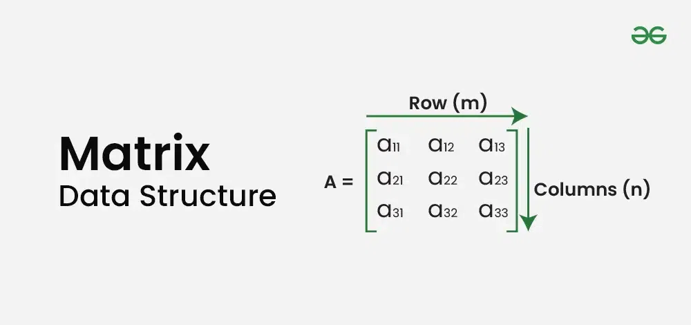

### Matrix (2D Array)

A **Matrix** (or 2D Array) is a two-dimensional data structure consisting of rows and columns. It's essentially an array of arrays, where each element is accessed using two indices: row and column.



*Image Credit: [GeeksforGeeks - Matrix Data Structure](https://www.geeksforgeeks.org/matrix/)*

**Key Properties:**
- Elements are arranged in rows and columns
- Fixed size (rows × columns)
- Direct access using `matrix[i][j]`
- Memory is stored in row-major or column-major order

### Matrix Representation

**Example 3×4 Matrix:**
```
    0   1   2   3
0   1   2   3   4
1   5   6   7   8
2   9  10  11  12
```

### Basic Matrix Operations

#### 1. Matrix Declaration and Initialization

```cpp
#include <iostream>
#include <vector>
using namespace std;

int main() {
    // Method 1: Fixed size array
    int matrix1[3][4] = {
        {1, 2, 3, 4},
        {5, 6, 7, 8},
        {9, 10, 11, 12}
    };
    
    // Method 2: Using vector (dynamic)
    vector<vector<int>> matrix2 = {
        {1, 2, 3, 4},
        {5, 6, 7, 8},
        {9, 10, 11, 12}
    };
    
    // Method 3: Dynamic allocation
    int rows = 3, cols = 4;
    int** matrix3 = new int*[rows];
    for (int i = 0; i < rows; i++) {
        matrix3[i] = new int[cols];
    }
    
    return 0;
}
```

#### 2. Matrix Traversal

**Row-wise Traversal:**

```cpp
void traverseRowWise(vector<vector<int>>& matrix) {
    int rows = matrix.size();
    int cols = matrix[0].size();
    
    for (int i = 0; i < rows; i++) {
        for (int j = 0; j < cols; j++) {
            cout << matrix[i][j] << " ";
        }
        cout << endl;
    }
}
```

**Column-wise Traversal:**

```cpp
void traverseColumnWise(vector<vector<int>>& matrix) {
    int rows = matrix.size();
    int cols = matrix[0].size();
    
    for (int j = 0; j < cols; j++) {
        for (int i = 0; i < rows; i++) {
            cout << matrix[i][j] << " ";
        }
        cout << endl;
    }
}
```

**Spiral Traversal:**

```cpp
vector<int> spiralOrder(vector<vector<int>>& matrix) {
    vector<int> result;
    if (matrix.empty()) return result;
    
    int top = 0, bottom = matrix.size() - 1;
    int left = 0, right = matrix[0].size() - 1;
    
    while (top <= bottom && left <= right) {
        // Traverse right
        for (int j = left; j <= right; j++) {
            result.push_back(matrix[top][j]);
        }
        top++;
        
        // Traverse down
        for (int i = top; i <= bottom; i++) {
            result.push_back(matrix[i][right]);
        }
        right--;
        
        // Traverse left
        if (top <= bottom) {
            for (int j = right; j >= left; j--) {
                result.push_back(matrix[bottom][j]);
            }
            bottom--;
        }
        
        // Traverse up
        if (left <= right) {
            for (int i = bottom; i >= top; i--) {
                result.push_back(matrix[i][left]);
            }
            left++;
        }
    }
    
    return result;
}
```

#### 3. Matrix Addition

```cpp
vector<vector<int>> matrixAddition(vector<vector<int>>& A, 
                                   vector<vector<int>>& B) {
    int rows = A.size();
    int cols = A[0].size();
    vector<vector<int>> result(rows, vector<int>(cols));
    
    for (int i = 0; i < rows; i++) {
        for (int j = 0; j < cols; j++) {
            result[i][j] = A[i][j] + B[i][j];
        }
    }
    
    return result;
}
```

- **Time Complexity:** O(rows × cols)
- **Space Complexity:** O(rows × cols)

#### 4. Matrix Multiplication

```cpp
vector<vector<int>> matrixMultiplication(vector<vector<int>>& A, 
                                         vector<vector<int>>& B) {
    int rowsA = A.size();
    int colsA = A[0].size();
    int colsB = B[0].size();
    
    vector<vector<int>> result(rowsA, vector<int>(colsB, 0));
    
    for (int i = 0; i < rowsA; i++) {
        for (int j = 0; j < colsB; j++) {
            for (int k = 0; k < colsA; k++) {
                result[i][j] += A[i][k] * B[k][j];
            }
        }
    }
    
    return result;
}
```

- **Time Complexity:** O(rowsA × colsA × colsB)
- **Space Complexity:** O(rowsA × colsB)

#### 5. Matrix Transpose

```cpp
vector<vector<int>> transpose(vector<vector<int>>& matrix) {
    int rows = matrix.size();
    int cols = matrix[0].size();
    vector<vector<int>> result(cols, vector<int>(rows));
    
    for (int i = 0; i < rows; i++) {
        for (int j = 0; j < cols; j++) {
            result[j][i] = matrix[i][j];
        }
    }
    
    return result;
}

// In-place transpose for square matrix
void transposeSquare(vector<vector<int>>& matrix) {
    int n = matrix.size();
    for (int i = 0; i < n; i++) {
        for (int j = i + 1; j < n; j++) {
            swap(matrix[i][j], matrix[j][i]);
        }
    }
}
```

- **Time Complexity:** O(rows × cols)
- **Space Complexity:** O(rows × cols) for new matrix, O(1) for square in-place

### Common Matrix Problems

#### 1. Search in Sorted Matrix

**Problem:** Search for a target in a matrix where each row and column is sorted.

```cpp
bool searchMatrix(vector<vector<int>>& matrix, int target) {
    if (matrix.empty()) return false;
    
    int rows = matrix.size();
    int cols = matrix[0].size();
    int i = 0, j = cols - 1; // Start from top-right
    
    while (i < rows && j >= 0) {
        if (matrix[i][j] == target) {
            return true;
        }
        else if (matrix[i][j] > target) {
            j--; // Move left
        }
        else {
            i++; // Move down
        }
    }
    
    return false;
}
```

- **Time Complexity:** O(rows + cols)
- **Space Complexity:** O(1)

#### 2. Rotate Matrix 90 Degrees

```cpp
void rotate90Clockwise(vector<vector<int>>& matrix) {
    int n = matrix.size();
    
    // Transpose
    for (int i = 0; i < n; i++) {
        for (int j = i + 1; j < n; j++) {
            swap(matrix[i][j], matrix[j][i]);
        }
    }
    
    // Reverse each row
    for (int i = 0; i < n; i++) {
        reverse(matrix[i].begin(), matrix[i].end());
    }
}
```

- **Time Complexity:** O(n²)
- **Space Complexity:** O(1)

#### 3. Set Matrix Zeroes

**Problem:** If an element is 0, set entire row and column to 0.

```cpp
void setZeroes(vector<vector<int>>& matrix) {
    int rows = matrix.size();
    int cols = matrix[0].size();
    bool firstRowZero = false, firstColZero = false;
    
    // Check if first row has zero
    for (int j = 0; j < cols; j++) {
        if (matrix[0][j] == 0) {
            firstRowZero = true;
            break;
        }
    }
    
    // Check if first column has zero
    for (int i = 0; i < rows; i++) {
        if (matrix[i][0] == 0) {
            firstColZero = true;
            break;
        }
    }
    
    // Use first row and column as markers
    for (int i = 1; i < rows; i++) {
        for (int j = 1; j < cols; j++) {
            if (matrix[i][j] == 0) {
                matrix[i][0] = 0;
                matrix[0][j] = 0;
            }
        }
    }
    
    // Set zeros based on markers
    for (int i = 1; i < rows; i++) {
        for (int j = 1; j < cols; j++) {
            if (matrix[i][0] == 0 || matrix[0][j] == 0) {
                matrix[i][j] = 0;
            }
        }
    }
    
    // Set first row
    if (firstRowZero) {
        for (int j = 0; j < cols; j++) {
            matrix[0][j] = 0;
        }
    }
    
    // Set first column
    if (firstColZero) {
        for (int i = 0; i < rows; i++) {
            matrix[i][0] = 0;
        }
    }
}
```

- **Time Complexity:** O(rows × cols)
- **Space Complexity:** O(1)

#### 4. Diagonal Traversal

```cpp
vector<int> diagonalTraversal(vector<vector<int>>& matrix) {
    vector<int> result;
    int rows = matrix.size();
    int cols = matrix[0].size();
    
    // Traverse diagonals from top-left to bottom-right
    for (int d = 0; d < rows + cols - 1; d++) {
        int i = (d < cols) ? 0 : d - cols + 1;
        int j = (d < cols) ? d : cols - 1;
        
        while (i < rows && j >= 0) {
            result.push_back(matrix[i][j]);
            i++;
            j--;
        }
    }
    
    return result;
}
```

#### 5. Maximum Sum Submatrix (Kadane's for 2D)

```cpp
int maxSumSubmatrix(vector<vector<int>>& matrix) {
    int rows = matrix.size();
    int cols = matrix[0].size();
    int maxSum = INT_MIN;
    
    // Try all possible left and right columns
    for (int left = 0; left < cols; left++) {
        vector<int> rowSum(rows, 0);
        
        for (int right = left; right < cols; right++) {
            // Add current column to rowSum
            for (int i = 0; i < rows; i++) {
                rowSum[i] += matrix[i][right];
            }
            
            // Apply Kadane's algorithm on rowSum
            int currentSum = 0;
            for (int i = 0; i < rows; i++) {
                currentSum = max(rowSum[i], currentSum + rowSum[i]);
                maxSum = max(maxSum, currentSum);
            }
        }
    }
    
    return maxSum;
}
```

- **Time Complexity:** O(rows × cols²)
- **Space Complexity:** O(rows)

### Special Matrix Types

#### 1. Sparse Matrix
Most elements are zero. Use compressed representations:
- **Coordinate List (COO)**
- **Compressed Sparse Row (CSR)**
- **Compressed Sparse Column (CSC)**

#### 2. Diagonal Matrix
Non-zero elements only on main diagonal.

#### 3. Symmetric Matrix
`matrix[i][j] = matrix[j][i]`

#### 4. Identity Matrix
Square matrix with 1s on diagonal, 0s elsewhere.

### Time Complexity Summary

| Operation | Time Complexity | Space Complexity |
|-----------|----------------|------------------|
| Access Element | O(1) | O(1) |
| Traversal | O(rows × cols) | O(1) |
| Addition | O(rows × cols) | O(rows × cols) |
| Multiplication | O(rowsA × colsA × colsB) | O(rowsA × colsB) |
| Transpose | O(rows × cols) | O(rows × cols) |
| Search (Sorted) | O(rows + cols) | O(1) |
| Rotate | O(rows × cols) | O(1) |

### Applications of Matrix

1. **Image Processing:** Pixel manipulation, filters
2. **Graphics:** Transformations, rotations
3. **Machine Learning:** Data representation, neural networks
4. **Scientific Computing:** Linear algebra operations
5. **Game Development:** Grid-based games, maps
6. **Graph Algorithms:** Adjacency matrix representation
7. **Cryptography:** Encryption/decryption algorithms

**More Details on this Topic:**
> [Matrix on GeeksforGeeks](https://www.geeksforgeeks.org/matrix/)
> [2D Array on Programiz](https://www.programiz.com/cpp-programming/multidimensional-arrays)
> [Matrix Operations on Tutorialspoint](https://www.tutorialspoint.com/data_structures_algorithms/matrix_data_structure.htm)