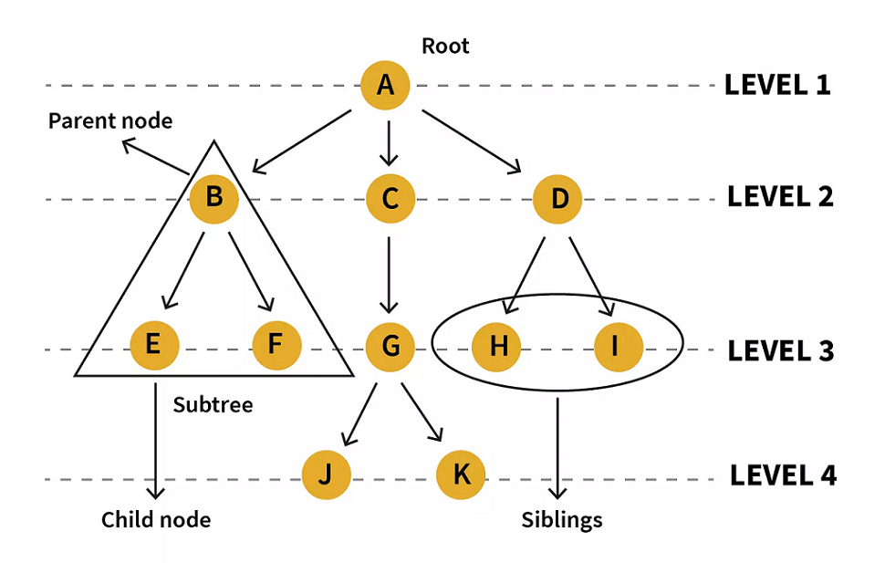
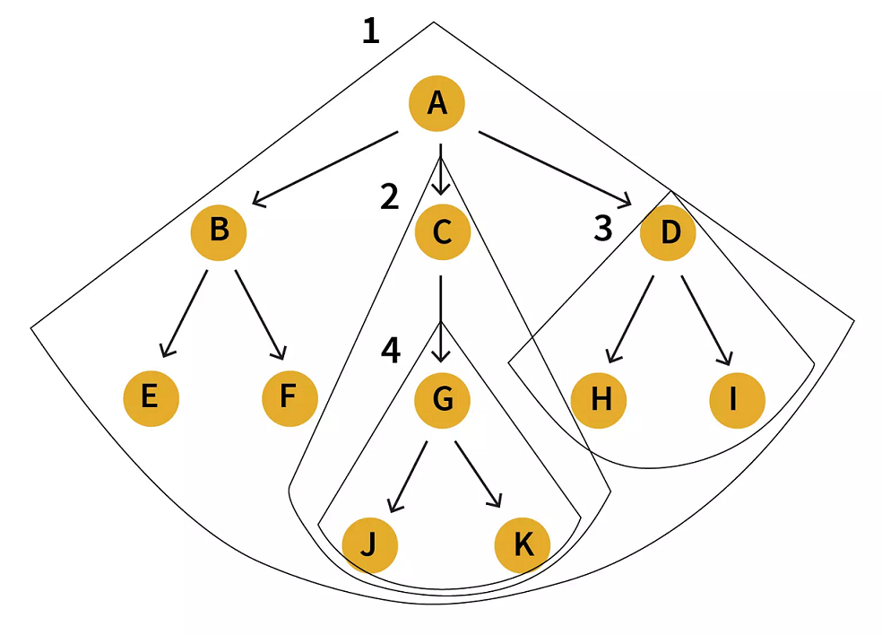
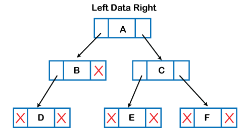
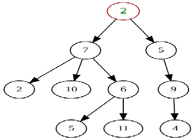
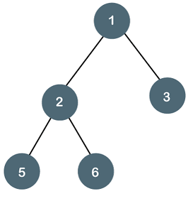
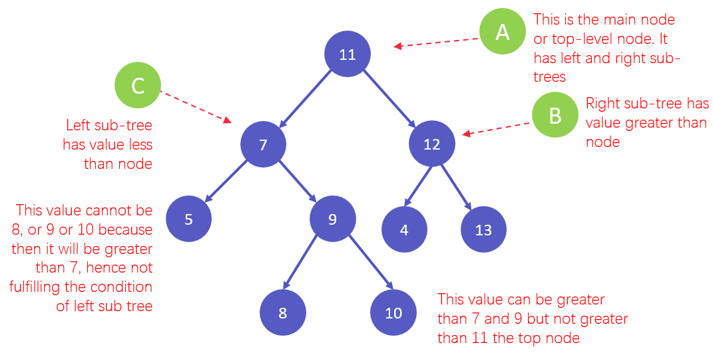

### Tree

Other data structures such as arrays, linked list, stack, and queue are linear data structures that store data sequentially. In order to perform any operation in a linear data structure, the time complexity increases with the increase in the data size. But, it is not acceptable in today's computational world.   

Different tree data structures allow quicker and easier access to the data as it is a non-linear data structure.   

- A tree data structure is defined as a collection of objects or entities known as nodes that are linked together to represent a hierarchy.
- It's a non linear data structure as it does not store data in a sequential manner, but stores in a hierarchical fashion.
- In the Tree data structure, the first node is known as a root node i.e. from which the tree originates. Each node contains some data and also contains references to child nodes. A root node can never have a parent node.

### Tree Terminologies

   

Tree is a hierarchical data structure that is defined as a collection of nodes. In a tree nodes represent the values and are connected by edges. Following are the terminologies and properties of a tree:   

| Terminology | Description | Diagram |
| --- | --- | --- |
| **Root** | Root node is a node from which the entire tree originates. It does not have a parent | *Node A* |
| **Parent Node** | An immediate predecessor of any node is its parent node. | *B is parent of E & F* |
| **Child Node** | All immediate successors of a node are its children. The relationship between the parent and child is considered as the parent-child relationship. | *F & E are children of B* |
| **Leaf** | Node which does not have any child is a leaf. Usually the boundary nodes of a tree or last nodes of the tree are the leaf or collectively called leaves of the tree. | *E, F, J, K, H, I are the leaf nodes.* |
| **Edge** | Edge is the connection represented by a line between one node to another. In a tree with n nodes, there will be ‘n-1’ edges in a tree. | *Connecting line between A&B OR A&C OR B&F OR any other nodes connecting each other.* |
| **Siblings** | Siblings in real life means people with the same parents, similarly in the case of trees, nodes with common parents are considered to be siblings. | *H&I are siblings* |
| **Path** | Path is a number of successive edges from source node to destination node. | *A ,C, G, K is path from node A to K* |
| **Height of Node** | Height of a node represents the number of edges on the longest path between that node and a leaf. | *A, C, G, K form a height. Height of A is no. of edges between A and K,, which is 3. Similarly the height of G is 1 as it has just one edge until the next leaf node* |
| **Levels of node** | Level of a node represents the generation of a node. If the root node is at level 0, then its next child node is at level 1, its grandchild is at level 2, and so on | *Level of H, I & J is 3. Level of D, E, F & G is 2* |
| **Degree of Node** | Degree of a node implies the number of child nodes a node has. | *Degree of D is 2 and of C is 3* |
| **Visiting** | When you’ve iterated or traversed to a specific node programmatically, accessing value or checking value of the current node is called visiting. | *Not Applicable* |
| **Internal Node** | A node that has at least one child is known as an internal node. | *All the nodes except E, F, J, K, H, I are internal.* |
| **Traversing** | Traversing is a process of visiting each node in a specific order in a tree data structure. | *There are three types of traversals: inorder, preorder, postorder traversal.* |
| **Ancestor node** | An ancestor or ancestors to a node are all the predecessor nodes from root until that node. I.e. any parent or grandparent and so on of a specific node are its ancestors. | *A, C & G are ancestor to K and J nodes* |
| **Descendant** | Immediate successor of a node is its descendent. | *K is descendent of G* |
| **Sub tree** | Descendants of a node represent subtree. Tree being a recursive data structure can contain many subtrees inside of it. | *Nodes B, E, F represent one subtree.* |

### Properties of Trees in Data Structure

**Recursive Data Structure:** a recursive method is the one that calls itself. Similarly a recursive data structure is the one that contains itself. A tree can be viewed as a recursive data structure, as even though a tree has only one root node, each node acts as a root node to another sub-tree. For example:    

Following is a tree that has ‘A’ as the root node. Similarly if we look at ‘C’ node, that is another tree in itself. And the tree no 3 i.e. that starts with ‘D’ node is also a tree in itself.    

    

And that is how a tree contains multiple trees in itself, and this proves that it's a recursive data structure as a recursive data structure contains itself.    
***Note:*** *Even the leaf nodes are a tree in itself i.e. they can be seen from a perspective as trees without any child nodes.*    
- **Number of edges:** If there are $‘n’$ nodes in a tree then there would be $‘n-1’$ edges. Each edge is the line-arrow connecting two nodes.
- **Depth of node x:** Depth of a specific node $x$ is defined as the length from root till this $x$ node. One edge contributes to one unit in the length. Hence depth of a node $x$ can also be considered as the number of nodes from root node till this $x$ node. Or depth of a node $x$ can also be considered as the level $L$ at which this node is, and adding $1$ to it i.e. $depth = L + 1$. It is because the first level starts with $0$.
- **Height of node x:** Height of a node represents the number of edges on the longest path between that node and a leaf.
### Basic Operation Of Tree

**These are Tree Data Structure's fundamental operations.**   

- **Create** – create a tree in data structure.
- **Insert** − Inserts data in a tree.
- **Search** − Searches specific data  in a tree to check it is present or not.
- **Preorder Traversal** – perform Traveling a tree in a pre-order manner in data structure .
- **In order Traversal** – perform Traveling a tree in an in-order manner.
- **Post order Traversal** –perform Traveling a tree in a post-order manner.

In order to perform any operation on a tree, you need to reach to the specific node. The tree traversal algorithm helps in visiting a required node in the tree.

To learn more, please visit [tree traversal](https://www.programiz.com/dsa/tree-traversal) we gonna learn this in binary tree and there we gonna also talking about the trick to traversal of tree for now you can see this two blog post for more idea [Simplest Trick for Binary Tree Traversal](https://aspiringcoders.com/simplest-trick-for-binary-tree-traversal/) and [Binary Trees Traversal Recursive vs. Iterative](http://www.crystaltenn.com/2020/04/binary-trees-traversal-recursive-vs.html)

### Implementation of Tree in Data Structure



The above representation depicts what a tree looks like on a memory. According to it, each node consists of three fields. *Left part of the node consists of the memory address of the left child, the right part of the node consists of the memory address of the right child and the center part holds the data for this node*.   

Relating to the above representation, each node can be programmatically defined as a class as follows:   

```cpp
struct Node
{
   int data;
   struct Node *left_child;
   struct Node *right_child;
};
```   
Here *left_child* will contain the reference to the *Node* that has value which is just smaller to the value in the current *Node*. Similarly *right_child* will contain reference to the *Node* that has value greater than the current *Node*.    

What we’re discussing here is in reference to a *binary tree** as a binary tree has two *children (utmost)*. That means, either a node has *0, 1 or max 2 children*. A generic tree can have *more than 2 children* as well.   
### Types of Tree data structures

*The following are the types of a tree data structure:*   

#### General Tree

A general tree is characterised by the lack of any configuration or limitations on the number of children a node can have. Any tree with a hierarchical structure can be described as a general tree. A node can have any number of children, and the tree’s orientation can be any combination of these. The degree of the nodes can range from 0 to n.     

The data structure below is a classic example of a general tree, with ‘2′ at the top as the root node.   



#### Binary Tree

In a binary tree, every element/parent node has at most 2 children. Each node can have either 0, 1, or 2 children. Typically, the 2 children are called the left child and the right child.   

**They are most commonly used in data structures for two reasons:**   
1. For obtaining nodes and categorising them, as observed in Binary Search Trees.
2. For representing data through a bifurcating structure.

A basic diagram of a binary tree is a data structure is shown below:   

    

**For more information visit this markdown for more information:**  [Binary_Tree.md](./10-Binary_Tree.md)    

#### Binary Search Tree

Binary search tree is a non-linear data structure in which one node is connected to n number of nodes. It is a node-based data structure. A node can be represented in a binary search tree with three fields, i.e., data part, left-child, and right-child. A node can be connected to the utmost two child nodes in a binary search tree, so the node contains two pointers (left child and right child pointer).     
*Every node in the left subtree must contain a value less than the value of the root node, and the value of each node in the right subtree must be bigger than the value of the root node.*     

     

**For more information visit this markdown for more information:**  [Binary_Search_Tree.md](./11-Binary_Search_Tree.md)    

#### AVL Tree

#### Treap

#### B-Tree

#### Red-Black Tree

#### Splay Tree

#### Balanced Tree

#### Self Balancing Binary Search Trees

#### Suffix Tree

#### Segment Tree

#### Spanning Tree

#### n-ary Tree

### Applications of Tree data structure

**Here are a few uses for the tree data structure:**   
- Binary Search Trees(BSTs) are used to quickly check whether an element is present in a set or not.
- Heap is a kind of tree that is used for heap sort.
A modified version of a tree called Tries is used in modern routers to store routing information.
- Most popular databases use B-Trees and T-Trees, which are variants of the tree structure we learned above to store their data
- Compilers use a syntax tree to validate the syntax of every program you write.

**More Details on this Topic:**
> [Tree on JavaTpoint](https://www.javatpoint.com/tree)   
> [Tree on Programiz](https://www.programiz.com/dsa/trees)   
> [Tree on Scaler](https://www.scaler.com/topics/data-structures/tree-data-structure/)   
> [Tree on Tutorialspoint](https://www.tutorialspoint.com/data_structures_algorithms/tree_data_structure.htm)   
> [Tree on GeeksforGeeks](https://www.geeksforgeeks.org/introduction-to-tree-data-structure/)   
