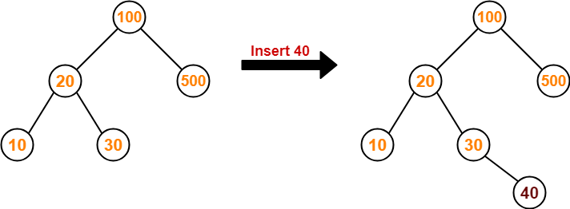
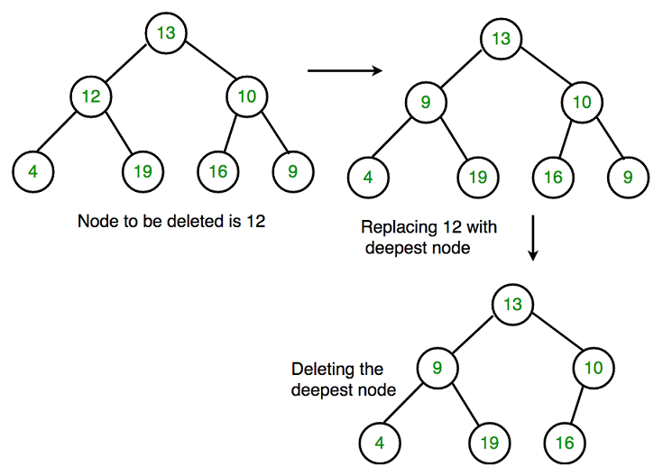
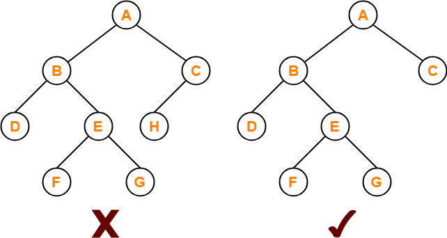
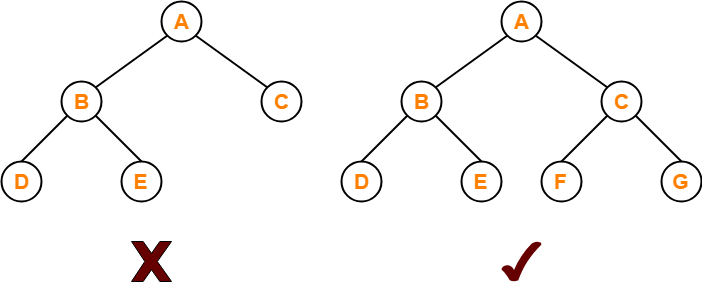
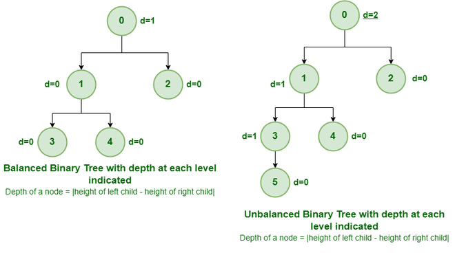
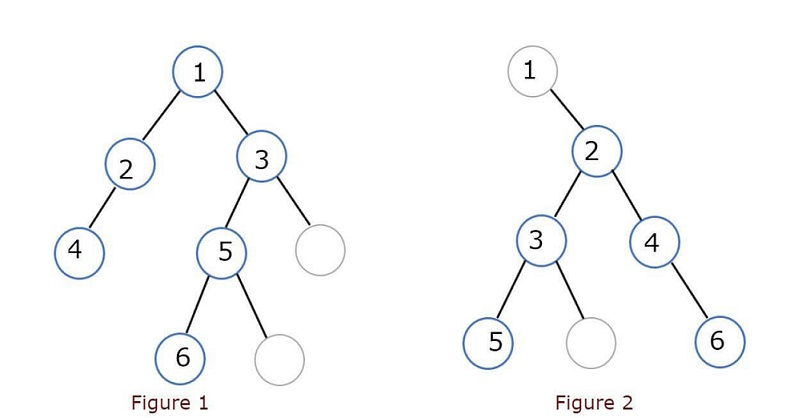

### Binary Tree

In a binary tree, every node or every vertex has two child nodes or single child nodes, or no child node. Basically, a binary tree is a very important class in a data structure in which nodes of a binary tree have at most two children nodes. In the binary tree, the left side is called the left child node and the right side of the binary tree is called the right child node.

### Binary Tree Representation

A tree is represented by a pointer to the topmost node of the tree. If the tree is empty, then the value of the root is NULL.
A Tree node contains the following parts:

1. Data
2. Pointer to the left child
3. Pointer to the right child

```java
// Class containing left and right child
// of current node and key value
class Node
{
    int key;
    Node left, right;
 
    public Node(int item)
    {
        key = item;
        left = right = null;
    }
}
```


### Basic Operation On Binary Tree

**These are basic operation on binary tree:**

- Inserting an element.
- Removing an element.
- Searching for an element.
- Traversing an element. There are three types of traversals in a binary tree which will be discussed ahead.

#### Binary Tree Inserting Element

Given a binary tree and a key, insert the key into the binary tree at the first position available in [level order](https://www.geeksforgeeks.org/level-order-tree-traversal/).



The idea is to do an iterative level order traversal of the given tree using queue. If we find a node whose left child is empty, we make a new key as the left child of the node. Else if we find a node whose right child is empty, we make the new key as the right child. We keep traversing the tree until we find a node whose either left or right child is empty.

```cpp
// Function to insert element in binary tree
Node* InsertNode(Node* root, int data)
{
    // If the tree is empty, assign new node address to root
    if (root == NULL) {
        root = CreateNode(data);
        return root;
    }

    // Else, do level order traversal until we find an empty place, i.e. either left child or right child of some node is pointing to NULL.
    queue<Node*> q;
    q.push(root);
 
    while (!q.empty()) {
        Node* temp = q.front();
        q.pop();
 
        if (temp->left != NULL)
            q.push(temp->left);
        else {
            temp->left = CreateNode(data);
            return root;
        }
 
        if (temp->right != NULL)
            q.push(temp->right);
        else {
            temp->right = CreateNode(data);
            return root;
        }
    }
}
```

- **Time Complexity:** $O(V)$ where $V$ is the number of nodes.  
- **Space Complexity:** $O(B)$, where $B$ is the width of the tree and in the worst case we need to hold all vertices of a level in the queue.  

> [More Details in this Topic](https://www.geeksforgeeks.org/insertion-in-a-binary-tree-in-level-order/)

#### Binary Tree Removing Element

Given a binary tree, delete a node from it by making sure that the tree shrinks from the bottom (i.e. the deleted node is replaced by the bottom-most and rightmost node). This is different from BST deletion. Here we do not have any order among elements, so we replace them with the last element.



**Algorithm:**

1. *Starting at the root, find the deepest and rightmost node in the binary tree and the node which we want to delete.*
2. *Replace the deepest rightmost node’s data with the node to be deleted.*
3. *Then delete the deepest rightmost node.*

```cpp
// function to delete the given deepest node (d_node) in binary tree
void deletDeepest(struct Node* root, struct Node* d_node)
{
    queue<struct Node*> q;
    q.push(root);
 
    // Do level order traversal until last node
    struct Node* temp;
    while (!q.empty()) {
        temp = q.front();
        q.pop();
        if (temp == d_node) {
            temp = NULL;
            delete (d_node);
            return;
        }
        if (temp->right) {
            if (temp->right == d_node) {
                temp->right = NULL;
                delete (d_node);
                return;
            }
            else
                q.push(temp->right);
        }
        if (temp->left) {
            if (temp->left == d_node) {
                temp->left = NULL;
                delete (d_node);
                return;
            }
            else
                q.push(temp->left);
        }
    }
}

// Function to delete given element
// in binary tree
static void delete(Node root, int key)
{
    if (root == null)
        return;
         
    if (root.left == null &&
       root.right == null)
    {
        if (root.key == key)
        {
              root=null;
              return;
        }
        else
            return;
    }
     
    Queue<Node> q = new LinkedList<Node>();
    q.add(root);
    Node temp = null, keyNode = null;
     
    // Do level order traversal until
    // we find key and last node.
    while (!q.isEmpty())
    {
        temp = q.peek();
        q.remove();
         
        if (temp.key == key)
            keyNode = temp;
 
        if (temp.left != null)
            q.add(temp.left);
 
        if (temp.right != null)
            q.add(temp.right);
    }
 
    if (keyNode != null)
    {
        int x = temp.key;
        deleteDeepest(root, temp);
        keyNode.key = x;
    }
}
```

- **Time complexity:** *O(n) where n is no number of nodes*
- **Auxiliary Space:** *O(n) size of queue*

> [More Details in this Topic](https://www.geeksforgeeks.org/deletion-binary-tree/)

#### Binary Tree Searching Element

For Binary Tree Searching Element idea is to use any of the tree traversals to traverse the tree and while traversing check if the current node matches with the given node. If any node matches with the given node and stop traversing further and if the tree is completely traversed and none of the node matches with the given node then print element not found.

```cpp
// Function to traverse the tree in preorder
// and check if the given node exists in it
static boolean ifNodeExists( Node node, int key)
{
    if (node == null)
        return false;
 
    if (node.data == key)
        return true;
 
    // then recur on left subtree /
    boolean res1 = ifNodeExists(node.left, key);
   
    // node found, no need to look further
    if(res1) return true;
 
    // node is not found in left,
    // so recur on right subtree /
    boolean res2 = ifNodeExists(node.right, key);
 
    return res2;
}
```  

- **Time Complexity:** *O(N), as we are using recursion to traverse N nodes of the tree.*
- **Auxiliary Space:** *O(N), we are not using any explicit extra space but as we are using recursion there will be extra space allocated for recursive stack.*

> [More Details in this Topic](https://www.geeksforgeeks.org/search-a-node-in-binary-tree/)

#### Binary Tree Traversal of Element

Unlike linear data structures (Array, Linked List, Queues, Stacks, etc) which have only one logical way to traverse them, trees can be traversed in different ways. Following are the generally used ways for traversing trees.

There are three types of Depth-First Traversals:
(a) Inorder (Left, Root, Right) : 4 2 5 1 3
(b) Preorder (Root, Left, Right) : 1 2 4 5 3
(c) Postorder (Left, Right, Root) : 4 5 2 3 1

```cpp
       1
     /   \         
    2     3
   /\      
  4  5    
```

##### Inorder Traversal

*Uses of Inorder*
In the case of binary search trees (BST), Inorder traversal gives nodes in non-decreasing order. To get nodes of BST in non-increasing order, a variation of Inorder traversal where Inorder traversal s reversed can be used.
*Example: In order traversal for the above-given figure is 4 2 5 1 3.*

*Algorithm: Inorder(tree)*

1. Traverse the left subtree, i.e., call Inorder(left-subtree)
2. Visit the root.
3. Traverse the right subtree, i.e., call Inorder(right-subtree)

> For InOrder Traversal see : [Inorder_Tree_Traversal_without_Recursion](https://www.geeksforgeeks.org/inorder-tree-traversal-without-recursion/)  & [Inorder_Tree Traversal_without_recursion_and_without_stack!](https://www.geeksforgeeks.org/inorder-tree-traversal-without-recursion-and-without-stack/)

##### Preorder Traversal

*Uses of Preorder*

Preorder traversal is used to create a copy of the tree. Preorder traversal is also used to get prefix expression on an expression tree.
*Example: Preorder traversal for the above-given figure is 1 2 4 5 3.*

*Algorithm Preorder(tree)*

1. Visit the root.
2. Traverse the left subtree, i.e., call Preorder(left-subtree)
3. Traverse the right subtree, i.e., call Preorder(right-subtree)

> For Preorder Traversal see : [Iterative_Preorder_Traversal](https://www.geeksforgeeks.org/iterative-preorder-traversal/) & [Morris_traversal_for_Preorder](https://www.geeksforgeeks.org/morris-traversal-for-preorder/)

##### Postorder Traversal

*Uses of Postorder*

Postorder traversal is used to delete the tree. Please see the question for the deletion of a tree for details. Postorder traversal is also useful to get the postfix expression of an expression tree.
*Example: Postorder traversal for the above-given figure is 4 5 2 3 1.*

*Algorithm Postorder(tree)*

1. Traverse the left subtree, i.e., call Postorder(left-subtree)
2. Traverse the right subtree, i.e., call Postorder(right-subtree)
3. Visit the root.

> For Postorder Traversal see : [Iterative_Postorder_Traversal](https://www.geeksforgeeks.org/iterative-postorder-traversal/)

> [More Details in Traversal](https://www.geeksforgeeks.org/tree-traversals-inorder-preorder-and-postorder/)

### Binary Tree Properties

**These are properties of a binary tree:**

- A binary tree is either an empty tree or consists of a node called the root node, a left subtree, and a right subtree. The subtrees will also act as a binary tree once.
- The top-most node is called the root.
- A node without children is called a leaf node or terminal node.
- The maximum number of nodes at each level of i is 2i.
- Height of the tree = the longest path from the root node to the leaf node.
- Depth of a node = the length of the path to its root.

### Types of Binary Tree

**The following are common types of Binary Trees.**

#### Full Binary Tree

A Binary Tree is a full binary tree if every node has 0 or 2 children. A full Binary tree is a special type of binary tree in which every parent node/internal node has either two or no children. It is also known as a proper binary tree or strict binary tree.

**Properties of Full Binary Tree:**  

- The number of leaf nodes is equal to the number of internal nodes plus 1, i.e. Number of Leaf nodes = Number of Internal nodes + 1.
- The maximum number of nodes is the same as the number of nodes in the binary tree, i.e., $(2h+1) -1$.
- The minimum number of nodes in the full binary tree is $2*h-1$.
- The minimum height of the full binary tree is $log{_2}{(n+1) - 1}$.
- The maximum height of the full binary tree can be computed as: $(n= 2*h - 1)$ | $(n+1 = 2*h)$ | $(h = n+1/2)$.



> For Implementation see: [Full Binary Tree by Programiz](https://www.programiz.com/dsa/full-binary-tree)
#### Complete Binary Tree

In Complete Binary Tree has all levels completely filled with nodes except the last level and in the last level, all the nodes are as left side as possible. It is also called as 

A complete binary tree is just like a full binary tree, but with two major differences:  
- Every level must be completely filled
- All the leaf elements must lean towards the left.
- The last leaf element might not have a right sibling i.e. a complete binary tree doesn’t have to be a full binary tree.

*Properties of Complete Binary Tree:*
- The maximum number of nodes in complete binary tree is $(2h+1) - 1$.
- The minimum number of nodes in complete binary tree is $2h$.
- The minimum height of a complete binary tree is $log{_2}{(n+1) - 1}$.



*Note:* Binary Heap is an important use case of Complete Binary tree. 

> For Implementation see: [Complete Binary Tree by Programiz](https://www.programiz.com/dsa/complete-binary-tree)
#### Perfect Binary Tree

A Perfect Binary Tree in which all the internal nodes have two children and all leaf nodes are at the same level. A perfect binary tree is a type of binary tree in which every internal node has exactly two child nodes and all the leaf nodes are at the same level.    

```cpp
The following are the examples of Perfect Binary Trees.
              18                 18
           /     \             /    \  
         15       30         15      30  
        /  \     /  \       
      40    50 100   40     
```

In a Perfect Binary Tree, the number of leaf nodes is the number of internal nodes plus 1.  
*L = I + 1 Where L = Number of leaf nodes, I = Number of internal nodes.*

A Perfect Binary Tree of height h (where the height of the binary tree is the number of edges in the longest path from the root node to any leaf node in the tree, height of root node is 0) has $(2h+1)–1$ node. 

> For Implementation see: [Perfect Binary Tree by Programiz](https://www.programiz.com/dsa/perfect-binary-tree)
#### Balanced Binary Tree

Balanced Binary Tree is a Binary tree in which height of the left and the right sub-trees of every node may differ by at most 1.    



**Note:** *AVL Tree* and *Red-Black Tree* are well-known data structure to generate/maintain Balanced Binary Search Tree. Search, insert and delete operations cost $O(log n)$ time in that.     

> For Implementation see: [Balanced Binary Tree by Programiz](https://www.programiz.com/dsa/balanced-binary-tree)
#### A degenerate (or pathological) tree

A degenerate or pathological tree is the tree having a single child either left or right.   

```cpp
      10     10                 10     
     /        \                 /
    20         20             20
     \          \            /
      30         30        30
       \          \       /
        40         40   40 
```

**Note:** Height of a Degenerate Binary Tree is equal to Total number of nodes in that tree.  
#### Skewed Binary Tree

A skewed binary tree is a pathological/degenerate tree in which the tree is either dominated by the left nodes or the right nodes. Thus, there are two types of skewed binary tree: *left-skewed binary tree* and *right-skewed binary tree*.   

```cpp
      10                   10
      /                     \
    20                       20
    /                         \
  30                           30
  /                             \
40                               40
Left-Skewed Binary Tree    Right-Skewed Binary Tree
```

### Handshaking Lemma and Tree Properties

**What is Handshaking Lemma?**  
[Handshaking lemma](https://en.wikipedia.org/wiki/Handshaking_lemma) is about an undirected graph. In every finite undirected graph, an even number of vertices will always have an odd degree. The handshaking lemma is a consequence of the degree sum formula (also sometimes called the handshaking lemma). 

**How is Handshaking Lemma useful in Tree Data structure?** 
Following are some interesting facts that can be proved using the Handshaking lemma. 

1. **In a k-ary tree where every node has either 0 or k children, the following property is always true.** 

```cpp
    L = (k - 1)*I + 1
Where L = Number of leaf nodes
      I = Number of internal nodes  
```

2. **In a Binary tree, the number of leaf nodes is always one more than nodes with two children.**

```cpp
   L = T + 1
Where L = Number of leaf nodes
      T = Number of internal nodes with two children 
```
> For proof of (1,2) see: [Tree_Properties_By_GFG](https://www.,geeksforgeeks.org/handshaking-lemma-and-interesting-tree-properties/)

3. **Maximum number of nodes in a binary tree:**

```cpp
If the height of the binary tree is h, then the maximum total number of nodes will be 20 + 21 + 22 + ……….+ 2h-1 which will give out 2h-1 number of nodes.
Thus, the maximum number of nodes in a binary tree of height h is 2h-1.
```

4. **Maximum number of nodes at a particular level:**

```cpp
In the case of the root node, level = 0. The number of nodes at level=0 is 20. At level=1, the number of nodes = 21.
Similarly, at level = l, the number of nodes = 2l.
```

5. **Number of levels with given leaves:**

```cpp
For a binary tree, the number of leaves will be maximum when all the levels are completely filled.
Let the number of leaves be L. Then, L ≤ 2l-1(From point 2)

l = log2 L + 1. Here, l = minimum number of levels.
```

6. **Minimum possible height or level:**

```cpp
If the height of the root node is taken to be zero, then the minimum possible height comes out to be log2(N+1) – 1.
```

### Diameter of a Binary Tree

*The diameter of a binary tree can be defined as the number of edges between the longest paths connecting any two nodes in a binary tree.* The diameter of the binary tree is also known as the *width of the binary tree*. The path represents the diameter of the binary tree may or may not pass through the root of the binary tree. The path includes two of the leaf nodes, among which the diameter is getting calculated.

There can be two possibilities for the longest path between two nodes representing the diameter of the binary tree:

1. **Via Root Node:** It will pass through the root node of the binary tree also counts the root node.
2. ***Not via a Root Node:** In this case, the chosen path will not pass through the root node of the binary tree and will not count the root node in the path.



In the above figure 1, the longest path is between leaf node 4 and leaf node 6 that will pass through the root node 1. The diameter of the binary tree shown in figure 1 is 6, starting from leaf node 4 to leaf node 6 i.e. node 4 - node 2 - node 1 - node 3 - node 5 - node 6 also covering the root node.   

Whereas in the binary tree shown in figure 2, the longest path for getting the diameter of the binary tree is starting from the leaf node 5 to the leaf node 6, but not including the root node 1. The diameter of this binary tree is 5 following the path node 5 - node 3 - node 2 - node 4 - node 6 excluding the root node 1.   

**Ways to Find Diameter of Binary Tree:** There are two different ways of solving this problem recursive way and iterative way. Both ways have different approaches and different time and space complexities.    

For *Recursive Way* - Time Complexity: $O(n^2)$ | Space Complexity: $O(log n)$       
For *Iterative Way*(Implemented using DFS) - Time Complexity: $O(n)$ | Space Complexity: $O(n)$     

> For Above Implementation [Diameter of Binary Tree in Java](https://www.javatpoint.com/diameter-of-binary-tree)
### Enumeration of Binary Trees

The enumeration of a binary tree can be defined as the number of distinct binary trees created from a given number of nodes or a binary tree.

These distinct binary trees can be different according to the labelling of the nodes of the binary tree. Depending upon the labelling of the nodes present in a binary tree, there are two types of a binary tree:   

- **Labelled Binary Tree:** All the nodes present in a binary tree are labelled with proper labels in the Labelled Binary tree. It means all the nodes in a labelled binary tree are arranged in a particular order or sequence.
- **Unlabelled Binary Tree:** In the unlabelled binary tree, the nodes are not given specific labels. The order or sequence of the nodes in the binary tree is not relevant because there is no specific parameter to distinctly identify the various nodes of a binary tree.

#### Enumeration of Labelled Binary Tree

The enumeration of the labelled binary tree can be defined as the number of distinct unlabeled binary trees formed from a given labelled binary tree or set of labelled nodes.  

The main difference between the enumeration of the labelled binary tree and the enumeration of the unlabelled binary tree is that for a given number of nodes, there is the only structure of the new tree created in an unlabelled tree, but in the labelled, there will be two different trees with the same number of nodes because the positioning node does in the tree can be different from all the nodes and not identical.   

Formula for the summation of all these numbers of distinct binary trees by the number of nodes,
Number of distinct unlabelled trees = $N! \times {\frac{(2N)!}{((N+1)! \times N!)}}$ Where N is the number of nodes.     


```
Let's calculate it for N=3,

Number of distinct unlabelled trees = 3! ((2*3)! / ((3+1)! * 3!))  
                                    =  3! (6! / 4! * 3!)  
                                    = 6 * (720 / 144)  
                                    = 6 * 5  
                                    = 30  
```
#### Enumeration of Unlabelled Binary Tree

The enumeration of the unlabelled binary tree can be defined as the number of distinct unlabeled binary trees formed from a given unlabelled binary tree or set of unlabelled nodes.   

Formula for the summation of all these numbers of distinct binary trees by the number of nodes.

Number of distinct unlabelled trees = ${\frac{(2N)!}{((N+1)!  \times N!)}}$ Where N is the number of nodes.

```
Let's calculate it for N=3,

Number of distinct unlabelled trees = (2*3)! / ((3+1)! * 3!)  
                                    =  6! / 4! * 3!  
                                    = 720 / 144  
                                    = 5  
```

> For Code Implementation of Enumeration see [Enumeration of Binary Trees by JavaTpoint](https://www.javatpoint.com/enumeration-of-binary-trees) & [Enumeration of Binary Trees by GFG](https://www.geeksforgeeks.org/enumeration-of-binary-trees/)    
### Binary Tree (Array implementation)

**Trees can be represented in two ways as listed below:**     

- *Dynamic Node Representation (Linked Representation).*
- *Array Representation (Sequential Representation).*

Previous we are using Linked Representation which uses node as integral part of the program but we are going to use Sequential Representation which uses an array that represents a tree in such a way that array indexes are values in tree nodes and array values give the parent node of that particular index (or node). The value of the root node index would always be -1 as there is no parent for root.    

In order to represent a tree using an array, the numbering of nodes can start either from 0–(n-1) or 1– n, consider the below illustration as follows:    

*Illustration:*   

```cpp
        A(0)    
        /   \
        B(1)  C(2)  
    /   \      \
    D(3)  E(4)   F(6) 
    OR,
        A(1)    
        /   \
        B(2)  C(3)  
    /   \      \
    D(4)  E(5)   F(7)  
```
*Procedure:*   

```cpp
Note: father, left_son and right_son are the values of indices of the array.
```   

**Case 1: (0—n-1)** 

```cpp
if (say)father=p; 
then left_son=(2*p)+1; 
and right_son=(2*p)+2;
```   

**Case 2: 1—n**

```cpp
if (say)father=p; 
then left_son=(2*p); 
and right_son=(2*p)+1; 
```   

**For Above Code Implementation See:** [Binary Tree (Array implementation)](https://www.geeksforgeeks.org/binary-tree-array-implementation/)    

### Foldable Binary Trees

A binary tree is foldable if the left subtree and right subtree are mirror images of each other. An empty tree is also foldable. Below binary trees are foldable since both have a left subtree that is the mirror image of right subtree.    

```java
Consider the below trees:
(a) and (b) can be folded.
(c) and (d) cannot be folded.

(a)             (b)
       10               10
     /    \            /  \
    7      15         7    15
     \    /          /      \
      9  11         9       11

(c)             (d)
        10               10
       /  \             /   \
      7   15           7     15
     /    /          /  \    /
    5   11          9   10  12
```   

**For code implementation see this two article:** [Foldable Binary Trees By GFG](https://www.geeksforgeeks.org/foldable-binary-trees/) & [Foldable Binary Trees By OpenGenus](https://iq.opengenus.org/checking-if-binary-tree-is-foldable/)   

**More Details on this Topic:**
> [Binary Tree on Javatpoint](https://www.javatpoint.com/binary-tree)    
> [Binary Tree on Programiz](https://www.programiz.com/dsa/binary-tree)   
> [Binary Tree on Scaler](https://www.scaler.com/topics/data-structures/binary-tree-in-data-structure/)    
> [Binary Tree on GeeksforGeeks](https://www.geeksforgeeks.org/binary-tree-set-1-introduction/)    
