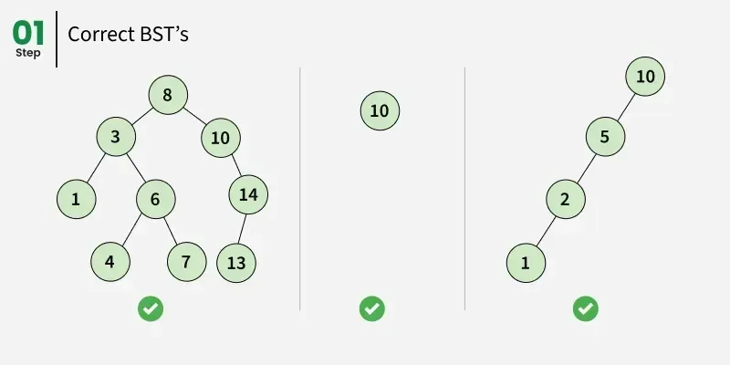

### Binary Search Tree (BST)

A **Binary Search Tree (BST)** is a binary tree data structure where:
- The left subtree of a node contains only nodes with values **less than** the node's value
- The right subtree of a node contains only nodes with values **greater than** the node's value
- Both left and right subtrees are also binary search trees
- **No duplicate values** (typically)

**Key Property:** In-order traversal of BST gives sorted sequence.

### Binary Search Tree Representation

```
        50
       /  \
     30    70
    /  \   / \
   20  40 60  80
```



*Image Credit: [GeeksforGeeks - Binary Search Tree Data Structure](https://www.geeksforgeeks.org/binary-search-tree-data-structure/)*

**Example:** All nodes in left subtree of 50 are < 50, all in right subtree are > 50.

### Basic Operations on Binary Search Tree

#### 1. Binary Search Tree - Inserting Element

Insert a new node while maintaining BST property:

```cpp
#include <iostream>
using namespace std;

class Node {
public:
    int data;
    Node* left;
    Node* right;
    
    Node(int val) {
        data = val;
        left = right = nullptr;
    }
};

class BST {
private:
    Node* root;
    
    Node* insertUtil(Node* node, int val) {
        // If tree is empty, create new node
        if (node == nullptr) {
            return new Node(val);
        }
        
        // Otherwise, recur down the tree
        if (val < node->data) {
            node->left = insertUtil(node->left, val);
        }
        else if (val > node->data) {
            node->right = insertUtil(node->right, val);
        }
        // Equal values not allowed (or handle as needed)
        
        return node; // Return unchanged node pointer
    }
    
public:
    BST() : root(nullptr) {}
    
    void insert(int val) {
        root = insertUtil(root, val);
    }
    
    // Iterative insertion
    void insertIterative(int val) {
        Node* newNode = new Node(val);
        
        if (root == nullptr) {
            root = newNode;
            return;
        }
        
        Node* current = root;
        while (true) {
            if (val < current->data) {
                if (current->left == nullptr) {
                    current->left = newNode;
                    return;
                }
                current = current->left;
            }
            else if (val > current->data) {
                if (current->right == nullptr) {
                    current->right = newNode;
                    return;
                }
                current = current->right;
            }
            else {
                // Value already exists
                delete newNode;
                return;
            }
        }
    }
};
```

- **Time Complexity:** O(h) where h is height, O(log n) for balanced BST, O(n) for skewed
- **Space Complexity:** O(h) for recursion, O(1) for iterative

#### 2. Binary Search Tree - Searching Element

Search for a value in BST:

```cpp
class BST {
private:
    Node* root;
    
    bool searchUtil(Node* node, int val) {
        if (node == nullptr) {
            return false;
        }
        
        if (val == node->data) {
            return true;
        }
        else if (val < node->data) {
            return searchUtil(node->left, val);
        }
        else {
            return searchUtil(node->right, val);
        }
    }
    
public:
    bool search(int val) {
        return searchUtil(root, val);
    }
    
    // Iterative search
    bool searchIterative(int val) {
        Node* current = root;
        
        while (current != nullptr) {
            if (val == current->data) {
                return true;
            }
            else if (val < current->data) {
                current = current->left;
            }
            else {
                current = current->right;
            }
        }
        
        return false;
    }
};
```

- **Time Complexity:** O(h)
- **Space Complexity:** O(h) for recursion, O(1) for iterative

#### 3. Binary Search Tree - Removing Element

Delete a node from BST. Three cases:
1. **Node is leaf:** Simply remove it
2. **Node has one child:** Replace node with its child
3. **Node has two children:** Replace with inorder successor/predecessor

```cpp
class BST {
private:
    Node* root;
    
    // Find minimum value node (leftmost node)
    Node* findMin(Node* node) {
        while (node->left != nullptr) {
            node = node->left;
        }
        return node;
    }
    
    Node* deleteUtil(Node* node, int val) {
        if (node == nullptr) {
            return node;
        }
        
        // Find node to delete
        if (val < node->data) {
            node->left = deleteUtil(node->left, val);
        }
        else if (val > node->data) {
            node->right = deleteUtil(node->right, val);
        }
        else {
            // Node to delete found
            
            // Case 1: Node with only right child or no child
            if (node->left == nullptr) {
                Node* temp = node->right;
                delete node;
                return temp;
            }
            // Case 2: Node with only left child
            else if (node->right == nullptr) {
                Node* temp = node->left;
                delete node;
                return temp;
            }
            
            // Case 3: Node with two children
            // Get inorder successor (smallest in right subtree)
            Node* temp = findMin(node->right);
            
            // Copy successor's data to this node
            node->data = temp->data;
            
            // Delete the inorder successor
            node->right = deleteUtil(node->right, temp->data);
        }
        
        return node;
    }
    
public:
    void deleteNode(int val) {
        root = deleteUtil(root, val);
    }
};
```

- **Time Complexity:** O(h)
- **Space Complexity:** O(h)

#### 4. Binary Search Tree - Traversal

All standard tree traversals work on BST:

```cpp
class BST {
private:
    Node* root;
    
    void inorderUtil(Node* node) {
        if (node == nullptr) return;
        inorderUtil(node->left);
        cout << node->data << " ";
        inorderUtil(node->right);
    }
    
    void preorderUtil(Node* node) {
        if (node == nullptr) return;
        cout << node->data << " ";
        preorderUtil(node->left);
        preorderUtil(node->right);
    }
    
    void postorderUtil(Node* node) {
        if (node == nullptr) return;
        postorderUtil(node->left);
        postorderUtil(node->right);
        cout << node->data << " ";
    }
    
public:
    void inorder() {
        inorderUtil(root);
        cout << endl;
    }
    
    void preorder() {
        preorderUtil(root);
        cout << endl;
    }
    
    void postorder() {
        postorderUtil(root);
        cout << endl;
    }
};
```

**Note:** Inorder traversal of BST gives **sorted sequence**.

### Binary Search Tree Properties

1. **Ordering Property:** Left child < Parent < Right child
2. **Unique Values:** Typically no duplicates
3. **Sorted Inorder:** Inorder traversal gives sorted sequence
4. **Search Efficiency:** O(log n) for balanced BST
5. **Height:** Minimum height = ⌊log₂(n)⌋, Maximum height = n-1 (skewed)

### Important BST Operations

#### Find Minimum and Maximum

```cpp
int findMin() {
    if (root == nullptr) return -1;
    Node* current = root;
    while (current->left != nullptr) {
        current = current->left;
    }
    return current->data;
}

int findMax() {
    if (root == nullptr) return -1;
    Node* current = root;
    while (current->right != nullptr) {
        current = current->right;
    }
    return current->data;
}
```

#### Find Inorder Successor and Predecessor

```cpp
Node* inorderSuccessor(Node* node, int val) {
    Node* successor = nullptr;
    Node* current = node;
    
    while (current != nullptr) {
        if (val < current->data) {
            successor = current;
            current = current->left;
        }
        else {
            current = current->right;
        }
    }
    
    return successor;
}

Node* inorderPredecessor(Node* node, int val) {
    Node* predecessor = nullptr;
    Node* current = node;
    
    while (current != nullptr) {
        if (val > current->data) {
            predecessor = current;
            current = current->right;
        }
        else {
            current = current->left;
        }
    }
    
    return predecessor;
}
```

#### Check if Tree is Valid BST

```cpp
bool isValidBST(Node* node, int min, int max) {
    if (node == nullptr) return true;
    
    if (node->data <= min || node->data >= max) {
        return false;
    }
    
    return isValidBST(node->left, min, node->data) &&
           isValidBST(node->right, node->data, max);
}

// Call with: isValidBST(root, INT_MIN, INT_MAX)
```

#### Find Kth Smallest Element

```cpp
int kthSmallest(Node* node, int& k) {
    if (node == nullptr) return -1;
    
    // Inorder traversal
    int left = kthSmallest(node->left, k);
    if (left != -1) return left;
    
    k--;
    if (k == 0) return node->data;
    
    return kthSmallest(node->right, k);
}
```

### Binary Search Tree Types

#### 1. Balanced BST
- **AVL Tree:** Height-balanced (difference between left and right subtrees ≤ 1)
- **Red-Black Tree:** Self-balancing with color properties
- **B-Tree:** Multi-way search tree

#### 2. Self-Balancing BST
- Automatically maintain balance during insertions/deletions
- Ensure O(log n) operations

### Advantages of BST

1. **Fast Search:** O(log n) for balanced BST
2. **Ordered Data:** Maintains sorted order
3. **Flexible:** Easy to insert/delete
4. **Range Queries:** Efficient range searches

### Disadvantages of BST

1. **Skewed Tree:** Can degrade to O(n) if not balanced
2. **No Guarantee:** No automatic balancing (unless self-balancing)
3. **Memory:** Extra pointers for left/right children

### Time Complexity Summary

| Operation | Average Case | Worst Case |
|-----------|--------------|------------|
| Search | O(log n) | O(n) |
| Insert | O(log n) | O(n) |
| Delete | O(log n) | O(n) |
| Traversal | O(n) | O(n) |
| Find Min/Max | O(log n) | O(n) |

**Space Complexity:** O(n) for storing n nodes

### Applications of BST

1. **Searching:** Fast lookup operations
2. **Sorting:** Inorder traversal gives sorted sequence
3. **Priority Queues:** Can be used to implement
4. **Database Indexing:** B-trees for database indices
5. **Expression Evaluation:** Expression trees
6. **Range Queries:** Find all values in range efficiently

**More Details on this Topic:**
> [Binary Search Tree on GeeksforGeeks](https://www.geeksforgeeks.org/binary-search-tree-data-structure/)    
> [Binary Search Tree on JavaTpoint](https://www.javatpoint.com/binary-search-tree)    
> [Binary Search Tree on Programiz](https://www.programiz.com/dsa/binary-search-tree)    
> [Binary Search Tree on TutorialPoint](https://www.tutorialspoint.com/data_structures_algorithms/binary_search_tree.htm)    
> [Binary Search Tree on FreeCodeCamp](https://www.freecodecamp.org/news/data-structures-101-binary-search-tree-398267b6bff0/)    