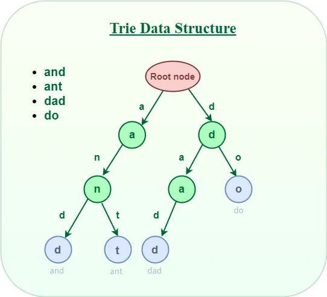

### Trie (Prefix Tree)

A **Trie** (pronounced "try") is a tree-like data structure used to store strings. It's also called a **Prefix Tree** because it efficiently stores strings with common prefixes. Each node represents a character, and paths from root to leaves represent strings.

**Key Properties:**
- Root node is empty
- Each node contains a character
- Paths from root represent strings
- Nodes can be marked as end of word
- Efficient for prefix matching and autocomplete

### Trie Representation

**Example:** Storing words: "cat", "car", "cart", "dog"

```
        (root)
       /      \
      c        d
     /          \
    a            o
   / \            \
  t   r            g
      |
      t
```



*Image Credit: [GeeksforGeeks - Trie Data Structure](https://www.geeksforgeeks.org/trie-insert-and-search/)*

### Basic Trie Implementation

```cpp
#include <iostream>
#include <unordered_map>
#include <string>
using namespace std;

class TrieNode {
public:
    unordered_map<char, TrieNode*> children;
    bool isEndOfWord;
    
    TrieNode() {
        isEndOfWord = false;
    }
};

class Trie {
private:
    TrieNode* root;
    
public:
    Trie() {
        root = new TrieNode();
    }
    
    // Insert a word into trie
    void insert(string word) {
        TrieNode* current = root;
        
        for (char c : word) {
            // If character doesn't exist, create new node
            if (current->children.find(c) == current->children.end()) {
                current->children[c] = new TrieNode();
            }
            current = current->children[c];
        }
        
        // Mark end of word
        current->isEndOfWord = true;
    }
    
    // Search for a word in trie
    bool search(string word) {
        TrieNode* current = root;
        
        for (char c : word) {
            if (current->children.find(c) == current->children.end()) {
                return false;
            }
            current = current->children[c];
        }
        
        return current->isEndOfWord;
    }
    
    // Check if prefix exists
    bool startsWith(string prefix) {
        TrieNode* current = root;
        
        for (char c : prefix) {
            if (current->children.find(c) == current->children.end()) {
                return false;
            }
            current = current->children[c];
        }
        
        return true;
    }
    
    // Delete a word from trie
    bool deleteWord(string word) {
        return deleteUtil(root, word, 0);
    }
    
private:
    bool deleteUtil(TrieNode* node, string word, int index) {
        if (index == word.length()) {
            // Word found, but check if it's end of word
            if (!node->isEndOfWord) {
                return false; // Word doesn't exist
            }
            
            node->isEndOfWord = false;
            // Return true if node has no children (can be deleted)
            return node->children.empty();
        }
        
        char c = word[index];
        if (node->children.find(c) == node->children.end()) {
            return false; // Word doesn't exist
        }
        
        TrieNode* child = node->children[c];
        bool shouldDeleteChild = deleteUtil(child, word, index + 1);
        
        if (shouldDeleteChild) {
            node->children.erase(c);
            delete child;
            // Return true if current node can be deleted
            return node->children.empty() && !node->isEndOfWord;
        }
        
        return false;
    }
};
```

### Array-Based Trie (for lowercase letters only)

More memory efficient when dealing with only lowercase letters:

```cpp
class TrieNode {
public:
    TrieNode* children[26]; // For 26 lowercase letters
    bool isEndOfWord;
    
    TrieNode() {
        isEndOfWord = false;
        for (int i = 0; i < 26; i++) {
            children[i] = nullptr;
        }
    }
};

class Trie {
private:
    TrieNode* root;
    
    int charToIndex(char c) {
        return c - 'a';
    }
    
public:
    Trie() {
        root = new TrieNode();
    }
    
    void insert(string word) {
        TrieNode* current = root;
        
        for (char c : word) {
            int index = charToIndex(c);
            
            if (current->children[index] == nullptr) {
                current->children[index] = new TrieNode();
            }
            current = current->children[index];
        }
        
        current->isEndOfWord = true;
    }
    
    bool search(string word) {
        TrieNode* current = root;
        
        for (char c : word) {
            int index = charToIndex(c);
            
            if (current->children[index] == nullptr) {
                return false;
            }
            current = current->children[index];
        }
        
        return current->isEndOfWord;
    }
    
    bool startsWith(string prefix) {
        TrieNode* current = root;
        
        for (char c : prefix) {
            int index = charToIndex(c);
            
            if (current->children[index] == nullptr) {
                return false;
            }
            current = current->children[index];
        }
        
        return true;
    }
};
```

### Advanced Trie Operations

#### Count Words with Given Prefix

```cpp
int countWordsWithPrefix(string prefix) {
    TrieNode* current = root;
    
    // Navigate to prefix
    for (char c : prefix) {
        if (current->children.find(c) == current->children.end()) {
            return 0;
        }
        current = current->children[c];
    }
    
    // Count all words from this node
    return countWords(current);
}

int countWords(TrieNode* node) {
    if (node == nullptr) return 0;
    
    int count = 0;
    if (node->isEndOfWord) {
        count++;
    }
    
    for (auto& [ch, child] : node->children) {
        count += countWords(child);
    }
    
    return count;
}
```

#### Get All Words with Given Prefix (Autocomplete)

```cpp
vector<string> getWordsWithPrefix(string prefix) {
    TrieNode* current = root;
    
    // Navigate to prefix
    for (char c : prefix) {
        if (current->children.find(c) == current->children.end()) {
            return {};
        }
        current = current->children[c];
    }
    
    vector<string> words;
    string currentWord = prefix;
    getAllWords(current, currentWord, words);
    
    return words;
}

void getAllWords(TrieNode* node, string& currentWord, vector<string>& words) {
    if (node == nullptr) return;
    
    if (node->isEndOfWord) {
        words.push_back(currentWord);
    }
    
    for (auto& [ch, child] : node->children) {
        currentWord.push_back(ch);
        getAllWords(child, currentWord, words);
        currentWord.pop_back(); // Backtrack
    }
}
```

#### Longest Common Prefix

```cpp
string longestCommonPrefix(vector<string>& words) {
    if (words.empty()) return "";
    
    Trie* trie = new Trie();
    for (string word : words) {
        trie->insert(word);
    }
    
    TrieNode* current = trie->root;
    string prefix = "";
    
    while (current->children.size() == 1 && !current->isEndOfWord) {
        auto it = current->children.begin();
        prefix += it->first;
        current = it->second;
    }
    
    return prefix;
}
```

### Time Complexity Summary

| Operation | Time Complexity | Space Complexity |
|-----------|----------------|------------------|
| Insert | O(m) where m is word length | O(m) |
| Search | O(m) | O(1) |
| Delete | O(m) | O(1) |
| Prefix Search | O(m) | O(1) |
| Autocomplete | O(m + k) where k is number of words | O(k) |

### Advantages of Trie

1. **Fast Prefix Matching:** O(m) time for prefix search
2. **Space Efficient:** Shares common prefixes
3. **Autocomplete:** Perfect for autocomplete features
4. **Flexible:** Can handle any character set
5. **Sorted:** Can maintain lexicographical order

### Disadvantages of Trie

1. **Memory:** Can use significant memory for sparse tries
2. **Cache Performance:** Not cache-friendly (pointer chasing)
3. **Complexity:** More complex than hash tables for simple lookups

### Applications of Trie

1. **Autocomplete:** Search engines, IDEs, mobile keyboards
2. **Spell Checkers:** Dictionary lookups
3. **IP Routing:** Longest prefix matching in routers
4. **Search Engines:** Indexing and searching
5. **Phone Directory:** Contact search
6. **DNA Sequencing:** Pattern matching in bioinformatics
7. **Auto-correct:** Word suggestions

### Example: Implement Autocomplete System

```cpp
class AutocompleteSystem {
private:
    Trie* trie;
    string currentQuery;
    
public:
    AutocompleteSystem(vector<string>& words, vector<int>& times) {
        trie = new Trie();
        // Insert words with frequency
        for (int i = 0; i < words.size(); i++) {
            trie->insert(words[i]);
        }
    }
    
    vector<string> input(char c) {
        if (c == '#') {
            // Save current query
            trie->insert(currentQuery);
            currentQuery = "";
            return {};
        }
        
        currentQuery += c;
        return trie->getWordsWithPrefix(currentQuery);
    }
};
```

**More Details on this Topic:**
> [Trie on GeeksforGeeks](https://www.geeksforgeeks.org/trie-insert-and-search/)
> [Trie on Programiz](https://www.programiz.com/dsa/trie)
> [Trie on HackerEarth](https://www.hackerearth.com/practice/data-structures/advanced-data-structures/trie-keyword-tree/tutorial/)