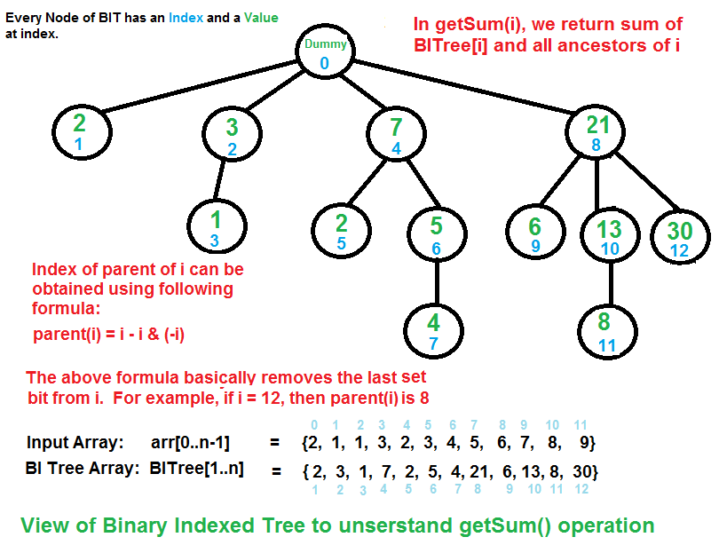
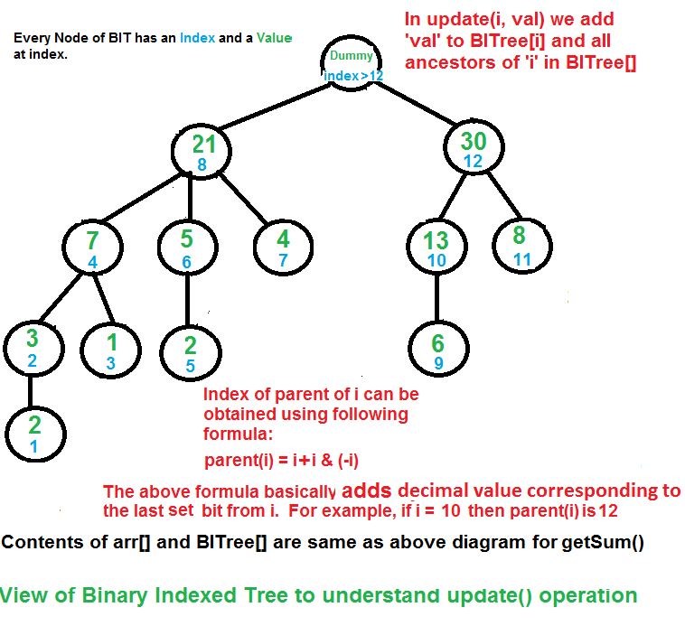

### Binary Indexed Tree (Fenwick Tree)

A **Binary Indexed Tree (BIT)** or **Fenwick Tree** is a data structure that efficiently supports:
- **Point Updates:** Update a single element in O(log n) time
- **Range Queries:** Query prefix sum in O(log n) time

It's more space-efficient than Segment Tree and easier to implement, making it ideal for range sum queries with point updates.

**Key Properties:**
- Uses binary representation to index elements
- Each node stores sum of a range
- Supports prefix sum queries efficiently
- Space: O(n), Time: O(log n) for both update and query

### Binary Indexed Tree Representation

The BIT uses the property that any number can be represented as sum of powers of 2. Each index in BIT stores sum of elements from a specific range.

**Example:** Array `[1, 2, 3, 4, 5]` represented as BIT

```
Index:  1   2   3   4   5
Array:  1   2   3   4   5
BIT:    1   3   3  10   5
```



*Image Credit: [GeeksforGeeks - Binary Indexed Tree or Fenwick Tree](https://www.geeksforgeeks.org/binary-indexed-tree-or-fenwick-tree-2/)*

### Basic Operations

#### 1. Get Least Significant Bit (LSB)

The key operation in BIT is finding the least significant bit:

```cpp
int getLSB(int index) {
    return index & (-index);
}

// Example:
// getLSB(12) = 12 & (-12) = 12 & (1111111111110100) = 4
// Binary: 12 = 1100, -12 = ...0100, result = 0100 = 4
```

#### 2. Update Operation

Update an element and propagate changes:

```cpp
#include <iostream>
#include <vector>
using namespace std;

class BinaryIndexedTree {
private:
    vector<int> bit;
    int n;
    
    void updateUtil(int index, int delta) {
        // Traverse all ancestors and add delta
        while (index <= n) {
            bit[index] += delta;
            index += index & (-index); // Move to parent
        }
    }
    
public:
    BinaryIndexedTree(vector<int>& arr) {
        n = arr.size();
        bit.resize(n + 1, 0);
        
        // Build BIT by updating each element
        for (int i = 0; i < n; i++) {
            updateUtil(i + 1, arr[i]);
        }
    }
    
    // Update value at position 'pos' by adding 'delta'
    void update(int pos, int delta) {
        updateUtil(pos + 1, delta); // BIT uses 1-indexed
    }
    
    // Update value at position 'pos' to 'newValue'
    void updateValue(int pos, int newValue, vector<int>& arr) {
        int delta = newValue - arr[pos];
        arr[pos] = newValue;
        update(pos, delta);
    }
};
```

- **Time Complexity:** O(log n)
- **Space Complexity:** O(n)

#### 3. Query Operation (Prefix Sum)

Get sum of elements from index 0 to index:

```cpp
class BinaryIndexedTree {
private:
    vector<int> bit;
    int n;
    
    int queryUtil(int index) {
        int sum = 0;
        
        // Traverse ancestors and accumulate sum
        while (index > 0) {
            sum += bit[index];
            index -= index & (-index); // Move to parent
        }
        
        return sum;
    }
    
public:
    // Get prefix sum from 0 to index
    int prefixSum(int index) {
        return queryUtil(index + 1); // BIT uses 1-indexed
    }
    
    // Get sum of range [l, r]
    int rangeSum(int l, int r) {
        return prefixSum(r) - prefixSum(l - 1);
    }
};
```

- **Time Complexity:** O(log n)
- **Space Complexity:** O(1)

### Complete Implementation

```cpp
#include <iostream>
#include <vector>
using namespace std;

class FenwickTree {
private:
    vector<int> bit;
    int n;
    
    int getLSB(int index) {
        return index & (-index);
    }
    
public:
    FenwickTree(vector<int>& arr) {
        n = arr.size();
        bit.resize(n + 1, 0);
        
        // Build BIT
        for (int i = 0; i < n; i++) {
            update(i, arr[i]);
        }
    }
    
    // Update: Add delta to element at position 'pos'
    void update(int pos, int delta) {
        pos++; // Convert to 1-indexed
        while (pos <= n) {
            bit[pos] += delta;
            pos += getLSB(pos);
        }
    }
    
    // Query: Get prefix sum from 0 to 'pos'
    int prefixSum(int pos) {
        pos++; // Convert to 1-indexed
        int sum = 0;
        while (pos > 0) {
            sum += bit[pos];
            pos -= getLSB(pos);
        }
        return sum;
    }
    
    // Range Query: Get sum from 'l' to 'r'
    int rangeSum(int l, int r) {
        if (l == 0) {
            return prefixSum(r);
        }
        return prefixSum(r) - prefixSum(l - 1);
    }
    
    // Get value at position 'pos'
    int getValue(int pos) {
        return rangeSum(pos, pos);
    }
};

// Example usage
int main() {
    vector<int> arr = {1, 2, 3, 4, 5};
    FenwickTree ft(arr);
    
    cout << "Prefix sum [0-2]: " << ft.prefixSum(2) << endl; // 6
    cout << "Range sum [1-3]: " << ft.rangeSum(1, 3) << endl; // 9
    
    ft.update(2, 5); // Add 5 to element at index 2
    cout << "After update, prefix sum [0-2]: " << ft.prefixSum(2) << endl; // 11
    
    return 0;
}
```

### How BIT Works

**Understanding the Indexing:**

For index `i` in BIT:
- It stores sum of elements from `i - LSB(i) + 1` to `i`
- `LSB(i)` is the least significant bit of `i`

**Example:** For index 12 (binary: 1100)
- LSB(12) = 4
- BIT[12] stores sum of elements from index 9 to 12

**Visual Representation:**

```
Array:  [1, 2, 3, 4, 5, 6, 7, 8]
Index:   0  1  2  3  4  5  6  7

BIT Structure:
BIT[1] = arr[0]
BIT[2] = arr[0] + arr[1]
BIT[3] = arr[2]
BIT[4] = arr[0] + arr[1] + arr[2] + arr[3]
BIT[5] = arr[4]
BIT[6] = arr[4] + arr[5]
BIT[7] = arr[6]
BIT[8] = arr[0] + arr[1] + arr[2] + arr[3] + arr[4] + arr[5] + arr[6] + arr[7]
```



*Image Credit: [GeeksforGeeks - Binary Indexed Tree or Fenwick Tree](https://www.geeksforgeeks.org/binary-indexed-tree-or-fenwick-tree-2/)*

### 2D Binary Indexed Tree

For 2D arrays, BIT can be extended:

```cpp
class FenwickTree2D {
private:
    vector<vector<int>> bit;
    int rows, cols;
    
    int getLSB(int index) {
        return index & (-index);
    }
    
public:
    FenwickTree2D(vector<vector<int>>& matrix) {
        rows = matrix.size();
        cols = matrix[0].size();
        bit.resize(rows + 1, vector<int>(cols + 1, 0));
        
        // Build 2D BIT
        for (int i = 0; i < rows; i++) {
            for (int j = 0; j < cols; j++) {
                update(i, j, matrix[i][j]);
            }
        }
    }
    
    void update(int row, int col, int delta) {
        row++; col++;
        for (int i = row; i <= rows; i += getLSB(i)) {
            for (int j = col; j <= cols; j += getLSB(j)) {
                bit[i][j] += delta;
            }
        }
    }
    
    int prefixSum(int row, int col) {
        row++; col++;
        int sum = 0;
        for (int i = row; i > 0; i -= getLSB(i)) {
            for (int j = col; j > 0; j -= getLSB(j)) {
                sum += bit[i][j];
            }
        }
        return sum;
    }
    
    int rangeSum(int r1, int c1, int r2, int c2) {
        return prefixSum(r2, c2) - prefixSum(r1-1, c2) - 
               prefixSum(r2, c1-1) + prefixSum(r1-1, c1-1);
    }
};
```

- **Time Complexity:** O(log n × log m) for 2D operations
- **Space Complexity:** O(n × m)

### Applications of Binary Indexed Tree

1. **Range Sum Queries:** Efficient prefix sum and range sum
2. **Inversion Count:** Count inversions in array
3. **2D Range Queries:** Sum queries in 2D matrices
4. **Frequency Arrays:** Count frequency of elements in range
5. **Order Statistics:** Kth smallest element queries
6. **Competitive Programming:** Fast range update/query problems

### Example: Count Inversions

```cpp
int countInversions(vector<int>& arr) {
    int n = arr.size();
    int maxVal = *max_element(arr.begin(), arr.end());
    
    FenwickTree ft(vector<int>(maxVal + 1, 0));
    int inversions = 0;
    
    // Traverse from right to left
    for (int i = n - 1; i >= 0; i--) {
        // Count elements smaller than arr[i] that appear after it
        inversions += ft.prefixSum(arr[i] - 1);
        ft.update(arr[i], 1);
    }
    
    return inversions;
}
```

### Advantages of BIT

1. **Space Efficient:** O(n) space vs O(4n) for Segment Tree
2. **Simple Implementation:** Easier to code than Segment Tree
3. **Fast:** O(log n) for both update and query
4. **Cache Friendly:** Better cache performance

### Disadvantages of BIT

1. **Limited Operations:** Only supports sum queries (not min/max)
2. **Point Updates Only:** Can't do range updates efficiently
3. **Less Flexible:** Segment Tree is more versatile

### Time Complexity Summary

| Operation | Time Complexity | Space Complexity |
|-----------|----------------|------------------|
| Build | O(n log n) | O(n) |
| Update | O(log n) | O(1) |
| Prefix Sum Query | O(log n) | O(1) |
| Range Sum Query | O(log n) | O(1) |
| 2D Update | O(log n × log m) | O(1) |
| 2D Query | O(log n × log m) | O(1) |

**More Details on this Topic:**
> [Binary Indexed Tree on GeeksforGeeks](https://www.geeksforgeeks.org/binary-indexed-tree-or-fenwick-tree-2/)
> [Fenwick Tree on CP Algorithms](https://cp-algorithms.com/data_structures/fenwick.html)
> [Binary Indexed Tree Tutorial on TopCoder](https://www.topcoder.com/thrive/articles/Binary%20Indexed%20Trees)